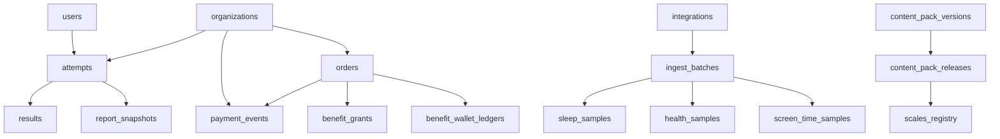

# Fermat 全局数据库架构白皮书 v0.4（Migration Truth）

Status: Active
Last Updated: 2026-02-18
Scope: Database architecture and dataflow documentation only (no runtime change)

---

## 1. 真理源与口径

### 1.1 Schema 真理源
本白皮书仅以以下信息为准：
- `backend/database/migrations/*.php`
- 当前迁移后 schema（以 `php artisan migrate` 结果为基线）

以下文档仅作参考，不作为 schema 真理：
- 历史阶段文档（Stage1/Stage2）
- 旧版 MBTI v0.2 设计稿

### 1.2 表数量口径
- 物理表总数：`79`
- 业务表（本白皮书主口径）：`66`
- 系统基础表（排除项）：`13`

系统基础表（不纳入业务域）：
- `cache`
- `cache_locks`
- `jobs`
- `job_batches`
- `failed_jobs`
- `migrations`
- `password_reset_tokens`
- `sessions`
- `migration_backfills`
- `migration_index_audits`
- `ops_deploy_events`
- `ops_healthz_snapshots`
- `queue_dlq_replays`

---

## 2. 全量业务域 ER 分组（66 表）

### 2.1 核心测评域 Assessment（17）
- `assessments`
- `assessment_assignments`
- `attempts`
- `attempt_drafts`
- `attempt_answer_sets`
- `attempt_answer_rows`
- `attempt_quality`
- `results`
- `report_jobs`
- `report_snapshots`
- `shares`
- `validity_feedbacks`
- `scales_registry`
- `scale_slugs`
- `scale_norms_versions`
- `norms_versions`
- `norms_table`

### 2.2 商业交易域 Commerce（9）
- `orders`
- `payment_events`
- `payment_reconcile_snapshots`
- `skus`
- `benefit_wallets`
- `benefit_wallet_ledgers`
- `benefit_consumptions`
- `benefit_grants`
- `idempotency_keys`

### 2.3 组织与权限域 Org/Auth（13）
- `users`
- `fm_tokens`
- `identities`
- `organizations`
- `organization_members`
- `organization_invites`
- `roles`
- `permissions`
- `role_user`
- `permission_role`
- `admin_users`
- `admin_user_totp_recovery_codes`
- `admin_user_password_histories`

### 2.4 运营中台与内容/数据域 Ops/Content（27）
- `content_pack_versions`
- `content_pack_releases`
- `audit_logs`
- `archive_audits`
- `admin_approvals`
- `data_lifecycle_requests`
- `email_outbox`
- `events`
- `experiment_assignments`
- `feature_flags`
- `integrations`
- `integration_user_bindings`
- `ingest_batches`
- `health_samples`
- `sleep_samples`
- `screen_time_samples`
- `lookup_events`
- `ai_insights`
- `ai_insight_feedback`
- `memories`
- `embeddings`
- `embeddings_index`
- `agent_triggers`
- `agent_decisions`
- `agent_messages`
- `agent_feedback`
- `user_agent_settings`

---

## 3. 域间关系总览（逻辑 ER）



说明：
- 关系主要由应用层与索引约束维护。
- 当前 schema 未全面落地 DB-level foreign key（详见第 7 章）。

---

## 4. 关键表透视（字段/索引/语义）

## 4.1 `attempts`

### 4.1.1 核心字段
| 字段名 | 类型 | Nullable | 默认值 | 索引/唯一约束 | 业务语义 |
|---|---|---|---|---|---|
| `id` | `varchar` | No | - | PK | attempt 主键（UUID） |
| `org_id` | `INTEGER` | No | `0` | `attempts_org_id_idx` | 组织隔离主键之一 |
| `anon_id` | `varchar` | No | - | `attempts_org_anon_idx`, `idx_attempts_anon_scale` | 匿名身份 |
| `user_id` | `varchar` | Yes | - | `attempts_org_user_idx` | 登录后用户身份 |
| `scale_code` | `varchar` | No | - | `attempts_org_scale_pack_dir_idx`, `attempts_scale_region_locale_idx` | 量表代码 |
| `scale_version` | `varchar` | No | - | - | 量表版本 |
| `pack_id` | `varchar` | Yes | - | `attempts_org_scale_pack_dir_idx` | 内容包 pack_id |
| `dir_version` | `varchar` | Yes | - | `attempts_org_scale_pack_dir_idx` | 内容目录版本 |
| `content_package_version` | `varchar` | Yes | - | - | 内容包业务版本 |
| `scoring_spec_version` | `varchar` | Yes | - | - | 计分协议版本 |
| `question_count` | `INTEGER` | No | - | - | 题目数量 |
| `answers_summary_json` | `TEXT(JSON)` | No | - | - | 答案聚合摘要 |
| `answers_json` | `TEXT(JSON)` | Yes | - | - | 提交答案原始快照 |
| `answers_hash` | `varchar` | Yes | - | `attempts_answers_hash_index` | 答案摘要 hash |
| `answers_storage_path` | `varchar` | Yes | - | - | 外部持久化路径（可选） |
| `result_json` | `TEXT(JSON)` | Yes | - | - | 计算结果快照 |
| `type_code` | `varchar` | Yes | - | - | 类型结果（如 ENFJ-A） |
| `duration_ms` | `INTEGER` | No | `0` | - | 作答耗时 |
| `answers_digest` | `varchar` | Yes | - | - | 提交幂等/完整性摘要 |
| `ticket_code` | `varchar` | Yes | - | `attempts_ticket_code_unique` | 找回票据码 |
| `region` | `varchar` | No | `CN_MAINLAND` | `attempts_scale_region_locale_idx` | 区域 |
| `locale` | `varchar` | No | `zh-CN` | `attempts_scale_region_locale_idx` | 语言 |
| `started_at` | `datetime` | Yes | - | - | 开始时间 |
| `submitted_at` | `datetime` | Yes | - | `attempts_org_scale_submitted_idx` | 提交时间 |
| `resume_expires_at` | `datetime` | Yes | - | `attempts_resume_expires_idx` | Resume token 过期时间 |
| `paid_at` | `datetime` | Yes | - | - | 付费完成时间（报告解锁） |
| `device_key_hash` | `varchar` | Yes | - | - | 设备标识 hash |

### 4.1.2 关键 JSON 结构示例
- `answers_summary_json`
```json
{
  "EI": {"A": 12, "B": 8},
  "SN": {"A": 10, "B": 10},
  "TF": {"A": 9, "B": 11},
  "JP": {"A": 13, "B": 7},
  "AT": {"A": 7, "B": 13}
}
```

- `answers_json`
```json
[
  {"question_id": "Q1", "option_code": "A", "question_type": "single"},
  {"question_id": "Q2", "option_code": "B", "question_type": "single"}
]
```

- `result_json`
```json
{
  "type_code": "ENFJ-A",
  "scores": {"EI": 62, "SN": 55, "TF": 48, "JP": 71, "AT": 66},
  "scores_pct": {"EI": 0.62, "SN": 0.55, "TF": 0.48, "JP": 0.71, "AT": 0.66},
  "meta": {"pack_id": "MBTI.cn-mainland.zh-CN.v0.2.2", "scoring_spec_version": "v1"}
}
```

## 4.2 `results`

### 4.2.1 核心字段
| 字段名 | 类型 | Nullable | 默认值 | 索引/唯一约束 | 业务语义 |
|---|---|---|---|---|---|
| `id` | `varchar` | No | - | PK | result 主键 |
| `org_id` | `INTEGER` | No | `0` | `results_org_id_idx`, `results_org_id_attempt_id_unique` | 组织隔离 |
| `attempt_id` | `varchar` | No | - | `idx_results_attempt_id`, `results_org_id_attempt_id_unique` | 关联 attempt |
| `scale_code` | `varchar` | No | - | - | 量表代码 |
| `scale_version` | `varchar` | No | - | - | 量表版本 |
| `type_code` | `varchar` | No | - | `idx_results_type_code` | 类型输出 |
| `scores_json` | `TEXT(JSON)` | No | - | - | 维度分数 |
| `scores_pct` | `TEXT(JSON)` | Yes | - | - | 百分比/百分位分布 |
| `axis_states` | `TEXT(JSON)` | Yes | - | - | 维度状态标签 |
| `result_json` | `TEXT(JSON)` | Yes | - | - | 报告输入快照 |
| `content_package_version` | `varchar` | Yes | - | - | 内容包版本 |
| `pack_id` | `varchar` | Yes | - | - | 内容包 ID |
| `dir_version` | `varchar` | Yes | - | - | 目录版本 |
| `scoring_spec_version` | `varchar` | Yes | - | - | 计分协议版本 |
| `report_engine_version` | `varchar` | No | `v1.2` | - | 报告引擎版本 |

### 4.2.2 关键 JSON 结构示例
- `scores_json`
```json
{"EI": 62, "SN": 55, "TF": 48, "JP": 71, "AT": 66}
```

- `scores_pct`
```json
{"EI": 0.62, "SN": 0.55, "TF": 0.48, "JP": 0.71, "AT": 0.66}
```

- `axis_states`
```json
{"EI": "leaning_E", "SN": "balanced", "TF": "leaning_F", "JP": "strong_J"}
```

- `result_json`
```json
{
  "type_code": "ENFJ-A",
  "scores": {"EI": 62, "SN": 55, "TF": 48, "JP": 71, "AT": 66},
  "highlights": [{"code": "leadership", "score": 0.81}]
}
```

## 4.3 `orders`

### 4.3.1 核心字段
| 字段名 | 类型 | Nullable | 默认值 | 索引/唯一约束 | 业务语义 |
|---|---|---|---|---|---|
| `id` | `varchar` | No | - | PK | 订单主键 |
| `order_no` | `varchar` | Yes | - | `orders_order_no_unique`, `orders_org_order_no_idx`, `orders_order_no_updated_at_idx` | 业务订单号 |
| `org_id` | `INTEGER` | No | `0` | `orders_org_created_idx`, `orders_org_order_no_idx`, `orders_org_provider_idempotency_key_unique` | 组织隔离 |
| `user_id` | `varchar` | Yes | - | `orders_user_id_index`, `orders_user_created_idx` | 用户归属 |
| `anon_id` | `varchar` | Yes | - | `orders_anon_id_index` | 匿名归属 |
| `sku` | `varchar` | Yes | - | - | 商品 SKU |
| `quantity` | `INTEGER` | No | `1` | - | 下单数量 |
| `target_attempt_id` | `varchar` | Yes | - | `orders_attempt_updated_at_idx` | 目标 attempt |
| `amount_cents` | `INTEGER` | No | `0` | - | 金额（分） |
| `currency` | `varchar` | No | - | - | 货币 |
| `status` | `varchar` | No | `pending` | `orders_status_index`, `orders_status_created_idx` | 订单状态 |
| `provider` | `varchar` | No | `internal` | `orders_org_provider_idempotency_key_unique` | 支付渠道 |
| `idempotency_key` | `varchar` | Yes | - | `orders_org_provider_idempotency_key_unique` | 幂等键 |
| `external_trade_no` | `varchar` | Yes | - | `orders_external_trade_no_idx` | 渠道流水号 |
| `paid_at` | `datetime` | Yes | - | - | 支付时间 |
| `fulfilled_at` | `datetime` | Yes | - | - | 履约时间 |
| `refunded_at` | `datetime` | Yes | - | - | 退款时间 |
| `meta_json` | `TEXT(JSON)` | Yes | - | - | 扩展字段 |

### 4.3.2 `meta_json` 结构示例
```json
{
  "modules_included": ["report_full", "career", "growth"],
  "campaign": "spring-launch",
  "channel": "wechat"
}
```

## 4.4 `payment_events`

### 4.4.1 核心字段
| 字段名 | 类型 | Nullable | 默认值 | 索引/唯一约束 | 业务语义 |
|---|---|---|---|---|---|
| `id` | `varchar` | No | - | PK | 支付事件主键 |
| `provider` | `varchar` | No | - | `payment_events_provider_provider_event_id_unique`, `idx_payment_events_provider_status_received` | 渠道 |
| `provider_event_id` | `varchar` | No | - | `payment_events_provider_provider_event_id_unique` | 渠道事件唯一 ID |
| `org_id` | `INTEGER` | No | `0` | `payment_events_org_provider_event_idx`, `payment_events_org_order_no_idx` | 组织隔离 |
| `order_id` | `varchar` | No | - | `payment_events_order_id_index`, `payment_events_provider_order_idx` | 订单主键关联 |
| `order_no` | `varchar` | Yes | - | `payment_events_org_order_no_idx`, `payment_events_order_received_idx` | 订单号关联 |
| `event_type` | `varchar` | No | - | - | 渠道事件类型 |
| `status` | `varchar` | No | `received` | `payment_events_status_idx`, `idx_pay_status_time` | 事件处理状态 |
| `handle_status` | `varchar` | Yes | - | - | 处理结论 |
| `signature_ok` | `tinyint(1)` | No | `0` | - | 签名验证是否通过 |
| `attempts` | `INTEGER` | No | `0` | - | 处理重试次数 |
| `received_at` | `datetime` | Yes | - | `idx_pay_status_time`, `payment_events_order_received_idx` | 接收时间 |
| `processed_at` | `datetime` | Yes | - | - | 处理完成时间 |
| `payload_json` | `TEXT(JSON)` | No | - | - | 原始回调载荷 |
| `payload_sha256` | `varchar` | Yes | - | `idx_payment_events_payload_sha256` | payload 摘要 |

### 4.4.2 `payload_json` 结构示例
```json
{
  "event": "charge.succeeded",
  "provider": "stripe",
  "provider_event_id": "evt_xxx",
  "order_no": "ord_xxx",
  "amount": 19900,
  "currency": "CNY",
  "paid_at": "2026-02-18T04:37:00Z",
  "raw": {"...": "provider specific payload"}
}
```

## 4.5 `content_pack_versions`

### 4.5.1 核心字段
| 字段名 | 类型 | Nullable | 默认值 | 索引/唯一约束 | 业务语义 |
|---|---|---|---|---|---|
| `id` | `varchar` | No | - | PK | 版本记录主键 |
| `region` | `varchar` | No | - | `content_pack_versions_region_index` | 区域 |
| `locale` | `varchar` | No | - | `content_pack_versions_locale_index` | 语言 |
| `pack_id` | `varchar` | No | - | `content_pack_versions_pack_id_index` | 包 ID（manifest 内） |
| `content_package_version` | `varchar` | No | - | `content_pack_versions_content_package_version_index` | 包版本号 |
| `dir_version_alias` | `varchar` | No | - | - | 目录别名 |
| `source_type` | `varchar` | No | - | - | 来源类型（upload/s3） |
| `source_ref` | `TEXT` | No | - | - | 来源引用（s3 key/本地相对路径） |
| `sha256` | `varchar` | No | - | `content_pack_versions_sha256_index` | 包摘要 |
| `manifest_json` | `TEXT(JSON)` | No | - | - | manifest 快照 |
| `extracted_rel_path` | `TEXT` | No | - | - | 解包后相对路径 |
| `created_by` | `varchar` | Yes | - | - | 操作人 |

### 4.5.2 `manifest_json` 结构示例
```json
{
  "pack_id": "MBTI.cn-mainland.zh-CN.v0.2.2",
  "content_package_version": "v0.2.2",
  "region": "CN_MAINLAND",
  "locale": "zh-CN",
  "scale_code": "MBTI",
  "dir_version": "MBTI-CN-v0.2.2"
}
```

## 4.6 `content_pack_releases`

### 4.6.1 核心字段
| 字段名 | 类型 | Nullable | 默认值 | 索引/唯一约束 | 业务语义 |
|---|---|---|---|---|---|
| `id` | `varchar` | No | - | PK | 发布流水主键 |
| `action` | `varchar` | No | - | `content_pack_releases_action_index` | 动作（publish/rollback） |
| `region` | `varchar` | No | - | `content_pack_releases_region_index` | 区域 |
| `locale` | `varchar` | No | - | `content_pack_releases_locale_index` | 语言 |
| `dir_alias` | `varchar` | No | - | `content_pack_releases_dir_alias_index` | 目录别名 |
| `from_version_id` | `varchar` | Yes | - | `content_pack_releases_from_version_id_index` | 前版本 |
| `to_version_id` | `varchar` | Yes | - | `content_pack_releases_to_version_id_index` | 目标版本 |
| `from_pack_id` | `varchar` | Yes | - | - | 前 pack |
| `to_pack_id` | `varchar` | Yes | - | - | 目标 pack |
| `status` | `varchar` | No | - | `content_pack_releases_status_index` | 发布结果 |
| `message` | `TEXT` | Yes | - | - | 备注/错误 |
| `probe_ok` | `tinyint(1)` | Yes | - | `content_pack_releases_probe_ok_run_idx` | 探针是否通过 |
| `probe_json` | `TEXT(JSON)` | Yes | - | - | 探针详情 |
| `probe_run_at` | `datetime` | Yes | - | `content_pack_releases_probe_ok_run_idx` | 探针执行时间 |

### 4.6.2 `probe_json` 结构示例
```json
{
  "health": true,
  "questions": true,
  "content_packs": true,
  "latency_ms": 182,
  "base_url": "https://api.example.com"
}
```

## 4.7 `ingest_batches`

### 4.7.1 核心字段
| 字段名 | 类型 | Nullable | 默认值 | 索引/唯一约束 | 业务语义 |
|---|---|---|---|---|---|
| `id` | `varchar` | No | - | PK | 批次主键 |
| `provider` | `varchar` | No | - | `ingest_batches_provider_user_idx` | 数据来源渠道 |
| `user_id` | `INTEGER` | Yes | - | `ingest_batches_provider_user_idx` | 归属用户 |
| `range_start` | `datetime` | Yes | - | - | 数据窗口开始 |
| `range_end` | `datetime` | Yes | - | - | 数据窗口结束 |
| `raw_payload_hash` | `varchar` | Yes | - | - | 原始批次 payload hash |
| `status` | `varchar` | No | `received` | - | 批次状态 |
| `actor_user_id` | `INTEGER` | Yes | - | - | 操作人（审计） |
| `auth_mode` | `varchar/enum` | Yes | - | - | 认证模式 |
| `signature_ok` | `tinyint(1)` | No | `0` | - | 签名结果 |
| `source_ip` | `varchar` | Yes | - | - | 来源 IP |

### 4.7.2 与 JSON 样本表的关系
`ingest_batches` 不直接持有样本 JSON；样本 JSON 在下游表：
- `sleep_samples.value_json`
- `screen_time_samples.value_json`
- `health_samples.value_json`

详见：`docs/data/ingestion.md` 与 `backend/docs/data/ingestion.md`。

---

## 5. SoftDeletes（软删除）策略

当前 schema 中启用了 `deleted_at` 的表：
- `memories.deleted_at`

说明：
- `memories` 采用软删除语义（状态与 `deleted_at` 共同表达）。
- 本白皮书核心表（attempts/results/orders/payment_events/content_pack*/ingest_batches）均未使用 `deleted_at`。

---

## 6. 状态机映射（数据库字段级）

## 6.1 `orders.status`

### 6.1.1 状态枚举
- `created`
- `pending`
- `paid`
- `fulfilled`
- `failed`
- `canceled`
- `refunded`

### 6.1.2 合法迁移（基于 `OrderManager`）
- `created -> pending | paid | failed | canceled | refunded`
- `pending -> paid | failed | canceled | refunded`
- `paid -> fulfilled`
- `fulfilled -> refunded`

## 6.2 `payment_events.status` + `handle_status`
- `status` 默认：`received`
- `handle_status` 用于表达处理结论，如：
  - `ok`
  - `already_processed`
  - `signature_invalid`
  - `reprocess_failed`

## 6.3 `report_snapshots.status`
- 状态值：`pending | ready | failed`
- 用于报告快照异步生成与读取门控。

---

## 7. 外键策略现状

当前 schema 以应用层一致性 + 唯一约束 + 复合索引为主，未全面启用 DB-level foreign key。  
因此文档不虚构 FK 约束，关系表达采用“逻辑关联字段”（如 `attempt_id`, `order_no`, `org_id`, `user_id`）。

---

## 8. `content_pack_versions` 与文件系统关系（认知纠偏）

## 8.1 纠偏结论
- 不存在 `content_packs` 物理表。
- 内容包元数据与发布流水的数据库真相是：
  - `content_pack_versions`
  - `content_pack_releases`

## 8.2 文件实体位置
内容包实体文件存在于文件系统/对象存储，而不是 DB 行本身：
- local: `content_packages/*`
- s3/cos: 由 `FAP_PACKS_DRIVER=s3`, `FAP_S3_PREFIX` 指向
- 运行时读取经 cache 落盘：`FAP_PACKS_CACHE_DIR`

## 8.3 DB 与文件映射
- `content_pack_versions.source_ref`：来源定位（上传或对象存储路径）
- `content_pack_versions.extracted_rel_path`：解包后的相对路径
- `content_pack_versions.manifest_json`：manifest 快照
- `content_pack_releases`：记录 publish/rollback/probe 操作历史

---

## 9. 附录：66 业务表全集（按域）

### Assessment（17）
`assessments, assessment_assignments, attempts, attempt_drafts, attempt_answer_sets, attempt_answer_rows, attempt_quality, results, report_jobs, report_snapshots, shares, validity_feedbacks, scales_registry, scale_slugs, scale_norms_versions, norms_versions, norms_table`

### Commerce（9）
`orders, payment_events, payment_reconcile_snapshots, skus, benefit_wallets, benefit_wallet_ledgers, benefit_consumptions, benefit_grants, idempotency_keys`

### Org/Auth（13）
`users, fm_tokens, identities, organizations, organization_members, organization_invites, roles, permissions, role_user, permission_role, admin_users, admin_user_totp_recovery_codes, admin_user_password_histories`

### Ops/Content（27）
`content_pack_versions, content_pack_releases, audit_logs, archive_audits, admin_approvals, data_lifecycle_requests, email_outbox, events, experiment_assignments, feature_flags, integrations, integration_user_bindings, ingest_batches, health_samples, sleep_samples, screen_time_samples, lookup_events, ai_insights, ai_insight_feedback, memories, embeddings, embeddings_index, agent_triggers, agent_decisions, agent_messages, agent_feedback, user_agent_settings`
