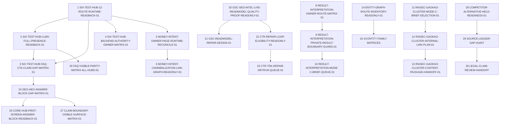

# Dependency Graph

Date-window observations are independent but blocked by calendar:

- `MBTI-MAIN-FAQ-D7-OBSERVATION-01`: 2026-07-12
- `MBTI-MAIN-FAQ-D28-OBSERVATION-01`: 2026-08-02

RIASEC FAQ parity is independent but operator-held.
