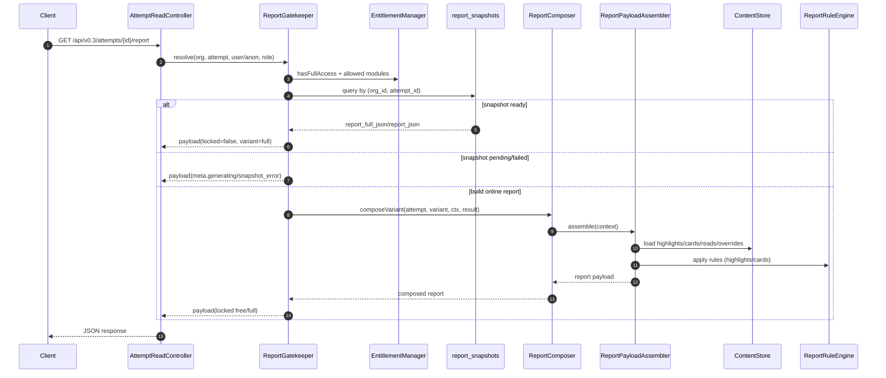

> Status: Active
> Last Updated: 2026-02-18
> Version: Fermat Report Engine v2.0
> Truth Sources:
> - app/Services/Report/ReportComposer.php
> - app/Services/Report/Composer/ReportPayloadAssembler*.php
> - app/Services/Content/ContentStore.php
> - app/Services/RuleEngine/ReportRuleEngine.php
> - app/Services/Report/ReportGatekeeper.php
> - app/Services/Report/ReportAccess.php

# Fermat 报告生成引擎 v2.0（Assembler / Composer / Gatekeeper）

## 1. 真理边界与职责切分
- `AttemptReadController@report` 是 HTTP 入口，负责组织上下文、身份提取、事件打点与响应封装。
- `ReportGatekeeper` 是访问控制与报告变体决策层，决定 `locked`、`variant`、`modules_*` 与 snapshot 读写策略。
- `ReportComposer` 是组合门面层，负责把 `Attempt + Result + ctx` 转成可渲染报告，内部委托 `ReportPayloadAssembler`。
- `ReportPayloadAssembler` 是“报告工厂”核心，完成内容加载、规则筛选、卡片装配、覆盖层合并与最终 payload 归档。
- `ContentStore` 是内容读取门面，按 `features.content_store_v2` 委托 `ContentStoreV2`，对上游保持稳定 API。
- `ReportRuleEngine` + `SectionAssembler` 是规则与结构收敛层，确保卡片/高亮/分区输出满足 policy。

## 2. 运行时流水线（AttemptReadController -> Gatekeeper -> Composer -> Assembler）
1. `GET /api/v0.3/attempts/{id}/report` 进入 `AttemptReadController@report`。
2. 控制器先用 `ownedAttemptQuery` 和 `Result` 查询做资源存在性校验。
3. 控制器调用 `ReportGatekeeper::resolve(orgId, attemptId, userId, anonId, role)`。
4. Gatekeeper 计算 `hasFullAccess`、`modules_allowed`、`modules_offered`，确定 `variant=free|full`。
5. 若满足 snapshot 条件则优先读取 `report_snapshots`；否则进入在线组装。
6. 在线组装时调用 `ReportComposer::composeVariant()`。
7. `ReportComposer` 组装 `ReportComposeContext`，执行 `ReportPayloadAssembler::assemble()`。
8. Assembler 产出 `report` 后，`TemplateEngine` 渲染模板文本；若 `persist=true`，再由 `ReportPersistence` 落盘副本。
9. Gatekeeper 返回标准 payload：`ok/locked/access_level/variant/offers/modules_*/view_policy/meta/report`。

## 3. ContentStore 取数链（ContentPackResolver + fallback chain）
- Assembler 入口在 `ReportPayloadAssemblerComposeEntryTrait::composeInternal()`。
- 先从 DB 重读 attempt/result，按 `org_id + attempt_id` 固定作用域。
- 通过 `ContentPackResolver::resolve(scaleCode, region, locale, contentPackageVersion, dirVersion)` 获取 `ResolvedPack`。
- `toContentPackChain()` 把主包与 fallback 包转换为 `ContentPack[]`，形成有序链。
- `new ContentStore($chain, $ctx, $contentPackageDir)` 建立读取门面。
- 读取素材包含：
  - highlights 模板与规则（`loadHighlights`, `loadSelectRules`）
  - cards/section policies（`loadCards*`, `loadSectionPolicies`）
  - overrides/report rules（`loadOverrides`, `loadReportOverrides`）
  - reads（`loadReads`）
- `ReportPayloadAssemblerPackDocsTrait` 提供 pack-chain 级 JSON 装载，并在必要时走 legacy loader 兜底。

## 4. RuleEngine/SectionAssembler 装配阶段（highlights/cards/sections）
- `TagBuilder` 基于 `scores + type_code + role/strategy` 产出上下文 tags。
- `SectionCardGenerator` 按 section (`traits/career/growth/relationships`) 选卡，并注入 module 访问信息。
- `ReportRuleEngine::apply()` 对 `highlights` 与各 section cards 执行 keep/drop 规则。
- `HighlightBuilder` 先 `buildFromTemplatesDoc()` 再 `finalize()`，得到最终 highlights 列表。
- `ReportOverridesApplier` / `HighlightsOverridesApplier` 合并运营覆盖策略。
- `SectionAssembler::apply()` 对 section 结构二次收敛，补充 `_meta.sections.*.assembler`。

## 5. Gatekeeper 权限与变体语义
- variant: `free|full`
- report_access_level: `free|full`
- modules: `core_free/core_full/career/relationships`
- SECTION_TO_MODULE: `traits/growth/stress_recovery->core_full`, `career->career`, `relationships->relationships`

补充语义（`ReportGatekeeper`）：
- 访问主体先过 attempt 所有权过滤：`owner/admin` 全量，`member/viewer` 仅 user 维度，public 走 `user_id|anon_id`。
- `hasFullAccess` 来自 entitlement；即使有 entitlement，也要检查模块是否覆盖 offered modules。
- `locked=true` 对应 free 变体；`locked=false` 对应 full 变体。
- 输出统一带：`modules_allowed/modules_offered/modules_preview`，前端可直接渲染模块权限。

## 6. Snapshot 优先读取策略
- `shouldUseSnapshot = hasFullAccess && modulesCoverOffered(modulesAllowed, modulesOffered)`。
- snapshot 状态机：`pending|failed|ready`。
- `retry_after_seconds: 3`（常量 `SNAPSHOT_RETRY_AFTER_SECONDS`）。

读取规则：
- `pending`：返回 `ok=true` 且 `meta.generating=true`，report 为空。
- `failed`：返回 `ok=true` 且 `meta.snapshot_error=true`，report 为空。
- `ready`：优先读 `report_full_json`，缺失时回退 `report_json`。
- 无 snapshot 或不满足条件：在线 compose；若为 full 且满足快照条件，可回写 `report_snapshots` 变体。

## 7. Free/Full 响应差异与 paywall 字段
公共字段（两种变体都有）：
- `ok`
- `locked`
- `access_level`
- `variant`
- `upgrade_sku`
- `upgrade_sku_effective`
- `offers`
- `modules_allowed/modules_offered/modules_preview`
- `view_policy`
- `meta`
- `report`

差异点：
- free 变体：
  - `locked=true`
  - `access_level=free`
  - `modules_allowed` 默认至少含 `core_free`
  - 非 MBTI 且 locked 时会执行 teaser 模糊化
- full 变体：
  - `locked=false`
  - `access_level=full`
  - `modules_allowed` 覆盖付费模块
  - 优先走 snapshot，避免历史结果漂移

## 8. 错误与降级路径（RESULT_NOT_FOUND / REPORT_FAILED / TEMPLATE_RENDER_FAILED）
- `ATTEMPT_NOT_FOUND`：attempt 不存在或权限不匹配。
- `RESULT_NOT_FOUND`：结果未生成，不进入报告拼装。
- `SCALE_NOT_FOUND` / `SCALE_REQUIRED`：量表注册信息缺失。
- `REPORT_FAILED`：composer/assembler 失败或返回非数组报告。
- `REPORT_TEMPLATE_RENDER_FAILED`：`TemplateEngine` 渲染失败（Composer 显式返回 500）。
- 快照降级：
  - `pending`/`failed` 不是 HTTP 错误，而是 `ok=true` 的“生成态/错误态元信息”响应。

## 9. Mermaid 时序图（必须）

