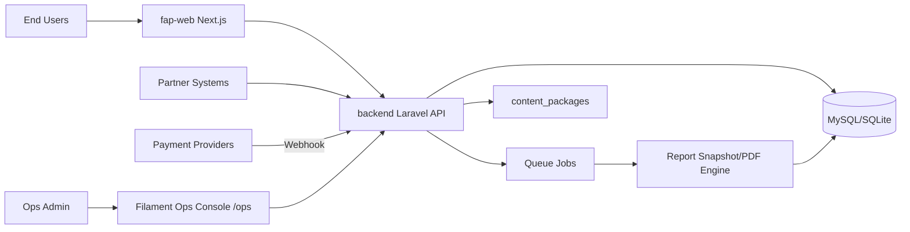
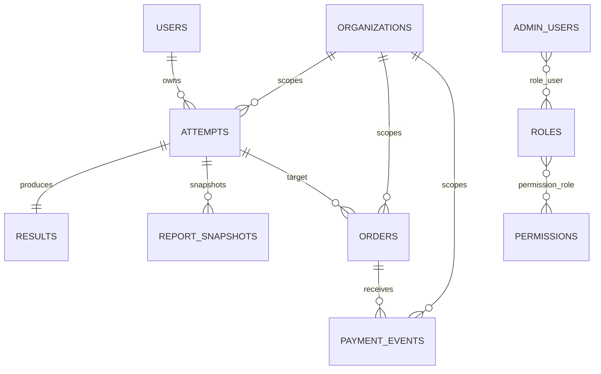

# FermatMind Architecture Audit Report

- Audit date: 2026-03-05
- Audit scope root: `/Users/rainie/Desktop/GitHub/fap-api`
- Scope included: `backend/`, `fap-web/`, `content_packages/`, `content_baselines/`, `docs/`, `scripts/`

## 1. 项目总体结构

### 1.1 仓库结构概览

当前仓库是单仓多模块结构，顶层关键目录如下：

- `backend`: Laravel API + Ops（Filament）
- `fap-web`: Next.js 前端（当前快照为极简 SEO 壳）
- `content_packages`: 量表内容包（默认 + 历史归档）
- `content_baselines`: 内容基线素材
- `scripts`: 运维/验收脚本
- `docs`: 设计、运行与验收文档

### 1.2 整体架构定位

### 1.3 前后端与 Ops 职责

- 后端（`backend`）
  - 承担核心业务：认证、测评流程、报告生成、支付与 webhook、组织与权限、审计与实验治理。
- 前端（`fap-web`）
  - 当前仓库快照仅包含 `app/robots.ts` 与 `app/sitemap.ts`，未看到完整页面路由与组件层。
- Ops 后台（Filament）
  - 统一管理组织、订单、支付事件、内容发布、权限、审计、健康检查与运维工具。

## 2. Laravel 后端结构

### 2.1 Backend Architecture

- Controller 结构
  - `app/Http/Controllers/API/V0_3/*`
  - `app/Http/Controllers/API/V0_4/*`
  - web/integration/webhook 控制器分层清晰。
- Service 层
  - `app/Services/*` 体量大，按业务域拆分（Attempts、Commerce、Report、Content、SEO、Org、Experiments 等）。
- Repository
  - 仅少量专用仓储类（如 legacy content、psychometrics 统计）；总体为 Service 驱动架构。
- Domain 逻辑
  - 有 `app/Domain/Score/*`（如 `MbtiScorer`），领域层存在但规模较小。
- 队列系统
  - `config/queue.php` 支持 `database`、`database_reports`、`database_commerce`、`redis` 等连接。
  - Jobs 包含报告、支付、提交异步化、ops 回填、内容探测。
- Report Engine
  - `ReportComposerRegistry` 按量表分派（MBTI/BIG5/CLINICAL/SDS/EQ60/Generic）。
  - `ReportSnapshotStore` 负责快照持久化与变体（free/full）生成。
  - `GenerateReportSnapshotJob`/`GenerateReportPdfJob` 支持异步链路。

### 2.2 主要模块

- Attempts: 开始测评、进度保存、提交（sync+async）
- Results/Reports: 结果计算、快照、PDF
- Commerce: 下单、权益发放、回执与补偿
- Webhooks: 多支付提供商签名校验与幂等处理
- Org/B2B: 组织、邀请、钱包、实验治理
- Content: 内容包解析、发布、探针、缓存
- Ops/Admin: Filament 资源与页面

### 2.3 主要服务

- `App\Services\Attempts\AttemptStartService`
- `App\Services\Attempts\AttemptSubmissionService`
- `App\Services\Commerce\PaymentWebhookProcessor`
- `App\Internal\Commerce\PaymentWebhookHandlerCore`
- `App\Services\Report\ReportSnapshotStore`
- `App\Services\Report\ReportComposerRegistry`
- `App\Services\SEO\SitemapGenerator`

### 2.4 关键业务逻辑

- Attempt 主链路
  - `start` 建立测评上下文与内容版本绑定。
  - `submit` 支持同步返回与异步 `attempt_submissions` 任务化处理。
- 支付与权益链路
  - webhook 签名校验 -> 状态转换 -> 权益发放 -> 报告快照/PDF任务。
- 报告链路
  - 按量表路由不同 composer，写入 `report_snapshots`，并可产出 PDF。

## 3. API 设计结构

扫描文件：

- `backend/routes/api.php`
- `backend/routes/web.php`

路由现状（`php artisan route:list --except-vendor`）：

- 总路由数：127
- API 主版本：`v0.3`、`v0.4`
- 兼容层：`v0.2` 已统一 410 退役响应

### 3.1 API endpoint 列表（按模块）

- Auth
  - `/api/v0.3/auth/guest`
  - `/api/v0.3/auth/phone/send_code`
  - `/api/v0.3/auth/phone/verify`
  - `/api/v0.3/auth/wx_phone`
- Boot & Flags
  - `/api/v0.3/boot`
  - `/api/v0.3/flags`
  - `/api/v0.3/experiments`
  - `/api/v0.4/boot`
- Scales
  - `/api/v0.3/scales`
  - `/api/v0.3/scales/lookup`
  - `/api/v0.3/scales/sitemap-source`
  - `/api/v0.3/scales/{scale_code}`
- Attempts & Results
  - `/api/v0.3/attempts/start`
  - `/api/v0.3/attempts/submit`
  - `/api/v0.3/attempts/{id}`
  - `/api/v0.3/attempts/{id}/result`
  - `/api/v0.3/attempts/{id}/report`
  - `/api/v0.3/attempts/{id}/report.pdf`
  - `/api/v0.3/me/attempts`
- Shares
  - `/api/v0.3/attempts/{id}/share`
  - `/api/v0.3/shares/{id}`
  - `/api/v0.3/shares/{shareId}/click`
- Commerce
  - `/api/v0.3/skus`
  - `/api/v0.3/orders`
  - `/api/v0.3/orders/checkout`
  - `/api/v0.3/orders/lookup`
  - `/api/v0.3/orders/{order_no}`
  - `/api/v0.3/orders/{order_no}/pay/alipay`
  - `/api/v0.3/orders/{order_no}/resend`
- Payment Webhooks
  - `/api/v0.3/webhooks/payment/{provider}`
- Org & Compliance
  - `/api/v0.3/orgs`
  - `/api/v0.3/orgs/me`
  - `/api/v0.3/orgs/{org_id}/invites`
  - `/api/v0.3/orgs/invites/accept`
  - `/api/v0.3/compliance/dsar/requests`
- v0.4 Partner & Governance
  - `/api/v0.4/partners/sessions`
  - `/api/v0.4/partners/sessions/{attempt_id}/status`
  - `/api/v0.4/partners/webhooks/sign`
  - `/api/v0.4/orgs/{org_id}/experiments/rollouts/*`
  - `/api/v0.4/orgs/{org_id}/compliance/rotation/audits*`
  - `/api/v0.4/orgs/{org_id}/assessments*`

### 3.2 接口用途与模块划分结论

- 模块边界总体清晰：认证、测评、报告、支付、组织、合规、合作方能力分层明确。
- 存在版本并行（v0.3 + v0.4），治理成本可控但需持续维护协议一致性。

## 4. 数据库结构

扫描目录：`backend/database/migrations`（当前约 180 个迁移文件）

### 4.1 Database Schema（核心表）

- `users`: C 端用户与基础身份
- `attempts`: 测评实例主表（问卷会话）
- `results`: 测评结果
- `events`: 行为事件埋点
- `orders`: 订单主表
- `payment_events`: 支付回调事件与处理状态
- `report_snapshots`: 报告快照存储
- `organizations`: 组织主体
- `admin_users`: Ops 管理员
- `roles`: 角色
- `permissions`: 权限

### 4.2 核心关系与主业务流

- 关系（逻辑上）
  - `attempts (1) -> (1) results`
  - `orders (1) -> (n) payment_events`
  - `orders (n) -> (1) attempts`（`target_attempt_id`）
  - `organizations (1) -> (n) attempts/orders/...`
  - `admin_users (n) <-> (n) roles <-> (n) permissions`
- 主业务流
  - 用户/匿名身份 -> 创建 attempt -> 提交生成 result
  - 需要付费时创建 order -> 接收 payment_event -> 发放权益 -> 生成 report_snapshot/PDF
  - 行为事件落 `events` 支撑分析与审计

### 4.3 数据库 ER 结构总结

### 4.4 数据层观察

- 迁移策略以 forward-only 为主，符合生产保守策略。
- 存在收敛型迁移与历史双份建表（如 `orders`、`payment_events`），说明项目经历过快速迭代与兼容期，技术债主要在 schema 收敛复杂度上。

## 5. Ops 后台结构

扫描范围：

- `backend/resources/views`
- `backend/resources/js`
- `backend/routes`
- `backend/app/Filament/Ops/*`

### 5.1 Ops 模块

- 控制台与监控
  - Dashboard、HealthChecks、QueueMonitor、WebhookMonitor
- 组织与权限
  - Organizations、AdminUsers、Roles、Permissions、SelectOrg
- 订单与支付
  - Orders、PaymentEvents、BenefitGrants、OrderLookup
- 内容与发布
  - ContentPackVersions、ContentPackReleases、ContentReleases、Deploys、GoLiveGate
- 审计与工具
  - AuditLogs、GlobalSearch、SecureLink、DeliveryTools

### 5.2 后台权限系统与角色系统

- 权限模型：`admin_users` + `roles` + `permissions` + pivot 表（`role_user`、`permission_role`）。
- 安全中间件链：
  - `EnsureAdminTotpVerified`（TOTP）
  - `RequireOpsOrgSelected`（组织上下文强制）
  - `OpsAccessControl`（host/ip allowlist + 登录限流）

### 5.3 管理入口

- Ops 入口：`/ops`
- `/admin` 永久重定向到 `/ops`（当 admin 面板启用）

## 6. 前端 Next.js 结构

扫描范围：

- `fap-web/app`
- `fap-web/components`
- `fap-web/lib`

### 6.1 当前仓库快照结果

- 仅发现：
  - `fap-web/app/robots.ts`
  - `fap-web/app/sitemap.ts`
- 未发现：
  - `fap-web/components/*`
  - `fap-web/lib/*`
  - 业务页面路由（如 `/tests`、`/result`、`/report`、`/orders`）

### 6.2 结论

- 该仓库中的 `fap-web` 更像 SEO 占位壳，不是完整前端工程。
- 目前无法在本仓库内完成完整的 Next.js 页面级审计，需要补充完整前端代码或子仓映射。

## 7. SEO 与内容系统现状

扫描范围：

- `content_packages`
- `content_baselines`
- `backend/app/Services/SEO/*`

### 7.1 内容系统

- `content_packages/default/CN_MAINLAND/zh-CN/*` 存在多量表内容目录。
- `_deprecated` 存在旧版内容归档。
- 后端提供内容编译/校验/发布/探针能力（`Content*Service`, `Publisher/*`）。

### 7.2 报告模板能力

- 报告由后端 composer 体系动态装配（MBTI、BIG5、SDS、EQ60、Clinical 等）。
- `report_snapshots` 保存可审计快照，支持 free/full 模块化访问策略。

### 7.3 SEO 结构

- 后端 `SitemapController + SitemapGenerator + SitemapCache` 已成型。
- 站点地图来源依赖 `scales_registry` 的公开/可索引项。
- `fap-web/app/robots.ts` 已声明 sitemap URL；`sitemap.ts` 当前返回空数组。

### 7.4 CMS/文章系统判断

- 目前未见独立 CMS 数据模型（如 articles/categories/tags）与对应前台路由。
- 未见完整文章系统与运营发布工作流。
- SEO 能力目前偏“量表详情页索引”，非内容营销型 SEO。

## 8. 安全与架构风险

### 8.1 身份验证与 Token 系统

- 优点
  - `FmTokenAuth` 使用 `token_hash`（SHA-256）查表，校验撤销/过期并注入 `fm_user_id` 与 `fm_org_id`。
  - `auth_tokens` 迁移包含到期、撤销、最近使用时间与索引。
- 风险
  - API 认证中间件链较复杂（`FmTokenAuth/FmTokenOptional/ResolveOrgContext/RequireOrgRole`），对新接口接入有认知成本。

### 8.2 Webhook 与支付

- 优点
  - `PaymentWebhookController` 对 payload 大小限制、签名校验、重试都有实现。
  - `PaymentWebhookHandlerCore` 分阶段处理（precheck/transition/entitlement/post-commit）。
- 风险
  - 支付 provider 分支多、状态机复杂，回归测试覆盖压力较大。

### 8.3 数据保护与加密

- 优点
  - 已引入 PII 加密列（`email_enc`、`phone_e164_enc` 等）与 hash 索引。
  - 邮件出站亦有加密字段。
- 风险
  - 存在老结构兼容迁移，线上数据一致性依赖持续 backfill 与运维纪律。

### 8.4 架构复杂度与技术债

- 中高复杂度来源
  - 多版本 API 并行（v0.3/v0.4）
  - 多量表报告引擎 + 内容包版本系统
  - 大量 forward-only 收敛迁移
- 主要技术债
  - schema 收敛迁移较多，历史字段兼容逻辑分散
  - `fap-web` 在本仓库中不完整，端到端可见性不足

## 9. CMS 扩展可行性

目标模块：`Articles`、`Career`、`Personality`、`SEO Pages`

### 9.1 可行性结论

- 后端具备较好扩展基础（组织、权限、内容发布、审计、SEO 基础组件现成）。
- 评估结论：可行，建议走“独立 CMS 领域 + 与量表内容解耦”的方案。

### 9.2 新增模块位置建议

- Backend
  - `app/Http/Controllers/API/V0_5/Cms/*`
  - `app/Services/Cms/*`
  - `app/Filament/Ops/Resources/*Article*`
- Routes
  - `routes/api.php` 新增 `/api/v0.5/cms/*`
- 前端
  - 在完整 `fap-web` 中新增 `/articles`、`/career`、`/personality`、`/[slug]`

### 9.3 数据库设计建议

建议新增：

- `articles`（主内容）
- `article_categories`
- `article_tags`
- `article_tag_map`
- `article_seo_meta`
- `article_revisions`
- `article_publish_jobs`

关键字段建议：

- 多语言：`locale`
- 多组织：`org_id`
- 发布控制：`status`、`published_at`
- SEO：`slug`、`meta_title`、`meta_description`、`canonical_url`、`noindex`

### 9.4 API 建议

- Public
  - `GET /api/v0.5/cms/articles`
  - `GET /api/v0.5/cms/articles/{slug}`
- Ops
  - `POST /api/v0.5/cms/articles`
  - `PUT /api/v0.5/cms/articles/{id}`
  - `POST /api/v0.5/cms/articles/{id}/publish`

### 9.5 Ops 后台扩展点

- 复用现有 RBAC 与 TOTP 安全链路。
- 新增 Filament Resource：Article、Category、Tag、PublishQueue、SEO Review。
- 与 `SitemapGenerator` 对接，把 `articles` 纳入站点地图。

## 10. 最终技术评估

### 10.1 评分（0-100）

- 架构成熟度: 82
- 扩展能力: 84
- 可维护性: 72
- 性能潜力: 80
- 安全等级: 81

综合评估分: 80

### 10.2 总体评价

该仓库后端工程化程度较高，尤其在测评、支付、报告、Ops 管理与审计方面具备较完整基础。当前主要短板不是后端能力，而是“前端代码在本仓库中的缺失”和“迁移收敛复杂度”带来的维护成本。

### 10.3 主要优点

- 业务域拆分清晰，Service 层组织完整。
- 支付 webhook、报告快照、队列任务链路较成熟。
- Ops 后台具备 RBAC、2FA、组织上下文等生产级能力。
- 内容包与量表体系可支持持续扩展。

### 10.4 主要问题

- `fap-web` 当前仓库快照不完整，导致前后端一体化审计受限。
- migration 收敛与兼容逻辑较多，长期可维护性压力增大。
- API 版本并行带来协议与测试维护成本。

---

## 审计备注

- 本报告基于当前工作区实际可见文件与路由/迁移扫描结果。
- 若补充完整 `fap-web` 代码后，建议追加一次“页面路由 + 渲染性能 + SEO 实际落地”专项审计。
