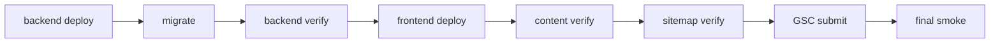

# CMS 上线检查清单（Launch Checklist）

基线时间：2026-03-06  
后端仓库：`/Users/rainie/Desktop/GitHub/fap-api`  
前端仓库：`/Users/rainie/Desktop/GitHub/fap-web`

说明：本文件只做真实仓库盘点，不代表能力补齐；不对不存在的页面、Topic 能力、导入流程做任何假设。

## 1. Launch Scope

- [x] 已完成：后端已落地 CMS article tables，包含 `article_categories`、`article_tags`、`articles`、`article_revisions`、`article_seo_meta`、`article_tag_map`。
- [x] 已完成：后端已落地 v0.5 article API，包括 `GET /api/v0.5/articles`、`GET /api/v0.5/articles/{slug}`、`GET /api/v0.5/articles/{slug}/seo`、`POST /api/v0.5/cms/articles`、`PUT /api/v0.5/cms/articles/{id}`、`POST /api/v0.5/cms/articles/{id}/publish`、`POST /api/v0.5/cms/articles/{id}/unpublish`、`POST /api/v0.5/cms/articles/{id}/seo`。
- [x] 已完成：后端已落地 SEO meta API 与 sitemap integration，`/sitemap.xml` 由 `SitemapGenerator` 动态生成。
- [x] 已完成：后端 `/ops` 已具备 Filament Ops panel、登录、TOTP、组织选择、RBAC、Go-Live Gate，以及 `ArticleResource`、`ArticleCategoryResource`、`ArticleTagResource`。
- [x] 已完成：前端真实存在文章、职业、人格、主题页面，以及 `robots.txt`、`sitemap.xml` 生成链路；页面文件在 `/{locale}` 作用域下，不是缺页状态。
- [ ] 上线前人工确认：生产站点主域名当前以前端 `NEXT_PUBLIC_SITE_URL` 和 `public/robots.txt` 为准，仓库可见值指向 `https://fermatmind.com`；staging 域名/路径未在仓库中固化，需人工确认。
- [ ] 上线前人工确认：本次上线究竟是“后端 Articles CMS 内部可用”还是“前后端打通后的 full-scope CMS launch”，必须先定 scope。
- [ ] blocker：当前 full-scope 目标范围是 `articles / career / personality / topics / ops / sitemap / seo`，但前端 `articles / career / personality / topics` 现在主要来自本地 Velite/MDX 与代码派生数据，不依赖后端 v0.5 article CMS。
- [ ] blocker：后端未发现 `TopicResource`、topics schema、topic model、topic migration；topics 只在前端本地 `lib/topics.ts` 存在。
- [ ] blocker：当前存在两套 sitemap authority。前端 `next-sitemap` 生成静态 `public/sitemap.xml`，后端同时提供动态 `/sitemap.xml`；上线前必须选定唯一对外权威来源。

影响范围盘点：

| 范围 | 当前真实状态 | 结论 |
| --- | --- | --- |
| `articles` | 后端有 CMS 与 API；前端有文章页，但内容源是本地 MDX | 已实现但未打通 |
| `career` | 前端有完整页面族；后端无对应 CMS schema/resource | 前端已实现，CMS 未实现 |
| `personality` | 前端页面存在，内容由 MBTI 推荐数据派生 | 前端已实现，CMS 未实现 |
| `topics` | 前端页面存在，topic cluster 定义写在代码里 | 前端已实现，后端 CMS 缺失 |
| `ops` | `/ops` 面板、RBAC、TOTP、org selection、Go-Live Gate 存在 | 已实现 |
| `sitemap` | 前后端都在产出 sitemap | 需选唯一权威源 |
| `seo` | 前端 metadata/JSON-LD 与后端 SEO API 都存在 | 已实现但未统一 |

## 2. Pre-Deploy Checklist

- [x] 已完成：前端仓库真实存在 `package.json`、`next.config.mjs`、`tsconfig.json`、`app/`、`components/`、`lib/`、`public/`。
- [x] 已完成：前端 `pnpm build` 可成功构建；前端 contract tests 已通过。
- [x] 已完成：后端 `php artisan route:list --path=api/v0.5 --except-vendor`、`bash scripts/export_openapi.sh --check`、`php artisan test --filter='(OpenApiDiffTest|SitemapXmlTest|SitemapGeneratorTest)'` 已通过。
- [ ] 上线前人工确认：前端 build 会执行 `next-sitemap`，随后执行 `postbuild` 上传脚本；需确认 `COS_UPLOAD_ENABLED`、`.env.production.local`、发布机权限与目标桶配置。
- [ ] 上线前人工确认：后端发布前确认 `APP_URL`、`SEO_ARTICLES_PREFIX`、缓存、队列、ops 域名与 `/ops` 入口是否一致。
- [ ] 上线前人工确认：数据库上线前必须准备逻辑备份或快照，且明确 forward-only migration 的修复流程。
- [ ] 上线前人工确认：branch / release 状态必须干净，禁止带未知脏改上线。
- [ ] blocker：后端 `v0.5/cms/articles*` 写接口当前公开暴露在 `api` middleware 下，未做 auth/RBAC，不应进入公网发布状态。

### Env Matrix

| 环境 | `APP_URL` | `SEO_ARTICLES_PREFIX` | `NEXT_PUBLIC_API_BASE` | `APP_ENV` | `APP_DEBUG` | 结论 |
| --- | --- | --- | --- | --- | --- | --- |
| local | 后端当前 `.env` 为 `http://127.0.0.1:18010` | 未在 `.env.example` 中显式声明，默认回退到 `APP_URL/articles` | 前端 `.env.example` 为 `/api` | 后端 `.env.example` / `.env` 为 `local` | 后端 `.env.example=false`、当前 `.env=true` | 本地仅作开发参考，不可直接映射 staging/prod |
| staging | 人工确认 | 人工确认，且必须与最终 canonical 路径一致 | 人工确认 | 应为 `staging` 或团队约定值 | 应为 `false` | 未在仓库固化，必须人工确认 |
| production | 人工确认；如后端仅提供 API，通常应是 API 域名而不是站点域名 | 人工确认；若采用前端 locale canonical，则不能继续默认 `/articles/{slug}` | 预期仍为 `/api` 或前端 rewrite 策略 | 应为 `production` | 应为 `false` | 必须在上线前逐项核对 |

补充检查：

- [ ] 上线前人工确认：前端 `NEXT_PUBLIC_SITE_URL` 必须指向真实生产站点，不能是 localhost。
- [ ] 上线前人工确认：后端 `.env.example` 未显式提供 `SEO_ARTICLES_PREFIX`，如果最终保留后端 article sitemap/canonical，需在 staging/prod 手动校准。
- [ ] blocker：当前未发现 staging 专用 indexing guard env；仅靠现状无法保证 staging 全站 `noindex`。

## 3. Database Checklist

- [x] 已完成：真实存在的 CMS 相关 migration 为：
  - `2026_03_05_154120_create_article_categories_table.php`
  - `2026_03_05_154120_create_article_tags_table.php`
  - `2026_03_05_154120_create_articles_table.php`
  - `2026_03_05_154121_create_article_revisions_table.php`
  - `2026_03_05_154121_create_article_seo_meta_table.php`
  - `2026_03_05_154121_create_article_tag_map_table.php`
- [x] 已完成：真实存在的 CMS 相关表为 `article_categories`、`article_tags`、`articles`、`article_revisions`、`article_seo_meta`、`article_tag_map`。
- [ ] 上线前人工确认：执行 `php artisan migrate:status` 前，确认 staging/prod 数据库连接、备份点、锁表窗口、回滚联系人。
- [ ] 上线前人工确认：`articles` 发布链路依赖 `status`、`is_public`、`is_indexable`、`published_at`；上线前应抽样确认至少 1 篇文章满足上线门槛。
- [ ] 上线前人工确认：如需多组织内容，必须确认 `org_id` 的写入策略与 tenant 数据隔离。
- [ ] blocker：未发现任何 article/topic 专用 seeder、内容导入器或初始化脚本；`backend/database/seeders` 现有 seeder 与 CMS 首批内容无直接关系。
- [ ] blocker：未发现 topics 相关表、schema、migration；若 topics 仍在 CMS scope 内，则数据库能力未完成。

sqlite / mysql 差异注意点：

- [x] 已完成：`article_revisions.payload_json` 在 sqlite 用 `text`，在 mysql 用 `json`。
- [x] 已完成：`article_seo_meta.schema_json` 在 sqlite 用 `text`，在 mysql 用 `json`。
- [ ] 上线前人工确认：如 staging 使用 sqlite、production 使用 mysql，需验证 JSON 字段读写、一致性与索引表现。

forward-only migration 风险：

- [x] 已完成：6 个 article 相关 migration 的 `down()` 都明确禁用，属于 forward-only。
- [ ] 上线前人工确认：禁止把 `php artisan migrate:rollback` 作为默认回滚方案。
- [ ] blocker：如 migration 出错，只能走 forward fix migration、数据修复脚本或数据库恢复，不能依赖自动回退。

验证命令：

```bash
cd /Users/rainie/Desktop/GitHub/fap-api/backend

php artisan migrate:status
php artisan migrate --force
```

## 4. Backend Checklist

- [x] 已完成：`route:list` 基线已确认，v0.5 article routes 共 8 条，`/sitemap.xml` 由 `GET /sitemap.xml` 提供。
- [x] 已完成：CMS API 真实存在：
  - `GET /api/v0.5/articles`
  - `GET /api/v0.5/articles/{slug}`
  - `GET /api/v0.5/articles/{slug}/seo`
  - `POST /api/v0.5/cms/articles`
  - `PUT /api/v0.5/cms/articles/{id}`
  - `POST /api/v0.5/cms/articles/{id}/publish`
  - `POST /api/v0.5/cms/articles/{id}/unpublish`
  - `POST /api/v0.5/cms/articles/{id}/seo`
- [x] 已完成：SEO API 存在，`ArticleSeoService` 可生成 canonical、meta title/description、OG、Twitter、JSON-LD payload。
- [x] 已完成：sitemap integration 已接入 `SitemapGenerator`，当前会合并 `scales_registry` 与 `articles`。
- [x] 已完成：Ops Resource 已落地 `ArticleResource`、`ArticleCategoryResource`、`ArticleTagResource`。
- [x] 已完成：`backend/docs/contracts/openapi.snapshot.json` 已覆盖 v0.5 article routes。
- [x] 已完成：自动化测试已覆盖 OpenAPI diff、sitemap XML、sitemap generator。
- [ ] 上线前人工确认：后端 `APP_URL`、`SEO_ARTICLES_PREFIX`、前端 canonical 策略是否一致。
- [ ] 上线前人工确认：若保留后端 `/sitemap.xml` 对外发布，需确认它与前端 sitemap 不会互相冲突。
- [ ] 上线前人工确认：目前未发现 article API / article resource 的专门 feature tests，建议上线前补人工验收。
- [ ] blocker：`/api/v0.5/cms/articles*` 写接口当前只有 `api` middleware，没有 auth、没有 RBAC、没有 tenant 级别写保护。
- [ ] blocker：`ArticleController::store()` 允许请求体直接传 `org_id`，存在越权写入风险。
- [ ] blocker：后端 article canonical 与 sitemap 默认按 `/articles/{slug}` 生成，但前端真实 canonical 路径是 `/{locale}/articles/{slug}`，两端 URL 规则未统一。

验证命令：

```bash
cd /Users/rainie/Desktop/GitHub/fap-api/backend

php artisan route:list --path=api/v0.5 --except-vendor
php artisan route:list --path=sitemap.xml --except-vendor
bash scripts/export_openapi.sh --check
php artisan test --filter='(OpenApiDiffTest|SitemapXmlTest|SitemapGeneratorTest)'

curl -i http://127.0.0.1:8000/sitemap.xml
curl -sS "http://127.0.0.1:8000/api/v0.3/scales/sitemap-source?locale=en"
curl -sS "http://127.0.0.1:8000/api/v0.5/articles?org_id=0"
curl -sS "http://127.0.0.1:8000/api/v0.5/articles/<slug>?org_id=0&locale=en"
curl -sS "http://127.0.0.1:8000/api/v0.5/articles/<slug>/seo?org_id=0&locale=en"
```

staging-only，且仅在 auth/RBAC 修复后执行：

```bash
curl -X POST "https://<staging-api-host>/api/v0.5/cms/articles" \
  -H "Authorization: Bearer <token>" \
  -H "Content-Type: application/json" \
  -d '{"title":"Launch check","content_md":"# draft","locale":"en"}'
```

## 5. Frontend Checklist

全局前提：

- [x] 已完成：真实前端仓库为 `/Users/rainie/Desktop/GitHub/fap-web`，不是后端仓库内子目录。
- [x] 已完成：实际页面挂在 `app/(localized)/[locale]/*`；`/articles`、`/career`、`/topics`、`/personality` 通过 `middleware.ts` 自动重定向到 locale 版本。
- [x] 已完成：全局 layout 存在 `app/(localized)/[locale]/layout.tsx`；导航存在 `components/layout/SiteHeader.tsx`；breadcrumb 组件存在 `components/breadcrumb/Breadcrumb.tsx`。
- [x] 已完成：前端可构建，`pnpm build` 成功。
- [ ] blocker：下列内容页虽然都存在，但当前内容源不是后端 CMS；full-scope CMS launch 仍未达成。

逐项检查：

- [x] `/articles`：页面存在 = 是（`/articles` 经 `middleware.ts` 重定向到 `/{locale}/articles`，真实页面文件为 `app/(localized)/[locale]/articles/page.tsx`）；内容源 = `local MDX`；已接 backend CMS = 否。有 layout/nav/breadcrumb 和 metadata。blocker：后端 CMS 发布不会自动反映到该页。
- [x] `/articles/[slug]`：页面存在 = 是（真实页面文件为 `app/(localized)/[locale]/articles/[slug]/page.tsx`）；内容源 = `local MDX`；已接 backend CMS = 否。有 layout/nav/breadcrumb、canonical、Article JSON-LD、Breadcrumb JSON-LD。blocker：后端 SEO API 与前端文章页未打通。
- [x] `/career`：页面存在 = 是（`/career` 经 `middleware.ts` 重定向到 `/{locale}/career`，真实页面文件为 `app/(localized)/[locale]/career/page.tsx`）；内容源 = `local content`；已接 backend CMS = 否。有 layout/nav/breadcrumb、metadata、WebPage JSON-LD。
- [x] `/career/[slug]`：页面存在 = 是（真实页面文件为 `app/(localized)/[locale]/career/[slug]/page.tsx`）；内容源 = `local content`；已接 backend CMS = 否。该路径是 alias redirect page，会基于本地 career slug 索引跳转到 `/career/jobs/{slug}`、`/career/guides/{slug}`、`/career/industries/{slug}` 或 404；上线前需按“别名跳转页”验收。
- [x] `/personality`：页面存在 = 是（真实页面文件为 `app/(localized)/[locale]/personality/page.tsx`）；内容源 = `code-derived`；已接 backend CMS = 否。有 layout/nav/breadcrumb、metadata、WebPage JSON-LD。内容由 `lib/personality.ts` 与 recommendation 数据派生。
- [x] `/personality/[type]`：页面存在 = 是（真实页面文件为 `app/(localized)/[locale]/personality/[type]/page.tsx`）；内容源 = `code-derived`；已接 backend CMS = 否。有 layout/nav/breadcrumb、canonical、Person JSON-LD、Breadcrumb JSON-LD。
- [x] `/topics`：页面存在 = 是（真实页面文件为 `app/(localized)/[locale]/topics/page.tsx`）；内容源 = `code-derived`；已接 backend CMS = 否。有 layout/nav/breadcrumb、metadata、WebPage JSON-LD。topic 列表来自 `lib/topics.ts`。
- [x] `/topics/[slug]`：页面存在 = 是（真实页面文件为 `app/(localized)/[locale]/topics/[slug]/page.tsx`）；内容源 = `code-derived`；已接 backend CMS = 否。有 layout/nav/breadcrumb、canonical、WebPage JSON-LD、Breadcrumb JSON-LD。
- [x] `/robots.txt`：真实存在 `public/robots.txt`，是静态文件，不经过 page/layout。当前内容为 `Allow: /`，并指向 `https://fermatmind.com/sitemap.xml`。
- [x] `/sitemap.xml`：真实存在，构建时由 `next-sitemap` 生成；`next.config.mjs` 还定义了 `/sitemap-en.xml` 与 `/sitemap-zh.xml` 重定向到 `/sitemap.xml`。内容来源是本地 Velite 内容与 hardcoded topic/personality/career path。

前端 build / runtime / env 检查：

- [x] 已完成：`package.json`、`next.config.mjs`、`tsconfig.json` 均存在。
- [x] 已完成：仓库 policy 为 pnpm-only，推荐命令是 `pnpm build`、`pnpm dev`。
- [ ] 上线前人工确认：`postbuild` 会执行 `next-sitemap` 与静态资源上传脚本，需确认生产机是否允许。
- [ ] 上线前人工确认：`NEXT_PUBLIC_SITE_URL`、`NEXT_PUBLIC_API_URL`、`NEXT_PUBLIC_API_BASE`、CDN/COS 配置要按环境区分。
- [ ] blocker：当前前端内容栈和后端 CMS 内容栈是两套独立系统。

验证命令：

```bash
cd /Users/rainie/Desktop/GitHub/fap-web

pwd
find app -maxdepth 6 -type f | sort
ls
ls -la
cat package.json
cat tsconfig.json
pnpm build
pnpm dev
pnpm test:contract
pnpm release:gate
```

## 6. SEO Checklist

- [x] 已完成：前端 `buildPageMetadata()` 已统一生成 canonical、meta title / description、OpenGraph、Twitter card、robots。
- [x] 已完成：前端文章、职业、人格、主题页面存在 JSON-LD 注入逻辑。
- [x] 已完成：后端 `ArticleSeoService` 已支持 article canonical、meta、OG、Twitter、JSON-LD payload 生成。
- [x] 已完成：后端 `/sitemap.xml` 已动态生成；前端 `next-sitemap` 也会产出静态 `public/sitemap.xml`。
- [ ] 上线前人工确认：到底由“前端 sitemap”还是“后端 sitemap”作为搜索引擎提交入口，必须二选一。
- [ ] 上线前人工确认：如果对外站点是 locale canonical，则后端 `SEO_ARTICLES_PREFIX` 不能继续默认 `/articles` 根路径。
- [ ] 上线前人工确认：Google Search Console 提交必须在确定最终 sitemap authority 后手工执行。
- [ ] blocker：`public/robots.txt` 当前是静态 allow-all，未发现按环境切换的 staging `noindex` 保护。
- [ ] blocker：前端 `shouldNoindex()` 与 middleware 只做路径级 noindex，不做 staging / production 环境级 noindex 切换。
- [ ] blocker：当前无法证明 staging 一定是 `noindex`，也无法证明 production 一定是 `index,follow`。
- [ ] blocker：前后端 canonical 路径规则不一致，容易出现 sitemap / canonical 冲突。

### Search Engine Indexing Guard

- [ ] staging 必须 `noindex`。
- [ ] production 必须 `index,follow`。
- [ ] staging 不可提交到 Google Search Console。
- [ ] robots / canonical / sitemap host 必须与实际环境一致。
- [ ] `OPS_GATE_GSC_SITEMAP_OK=true` 只能作为 ops gate，不等同于前端 indexing guard 已经正确生效。

### Sitemap Authority Launch Gate

- [ ] go-live 前必须确定唯一 sitemap authority，只能在“前端 `public/sitemap.xml`”与“后端 `/sitemap.xml`”之间二选一。
- [ ] 未被选中的另一套 sitemap 出口必须关闭、下线、改内网验证用途，或至少保证不作为对外公开 authority 暴露。
- [ ] 最终 canonical host / path 规则必须与唯一 sitemap authority 完全一致，不能出现 sitemap 指向一种 URL、页面 canonical 指向另一种 URL 的情况。
- [ ] Google Search Console 只能提交最终唯一 authority 对应的 sitemap，不能同时提交两套。
- [ ] 若以上 4 项任一未满足，则视为 launch gate 未通过，不进入 go-live。

Google Search Console 提交步骤：

1. 确认唯一对外 sitemap URL。
2. 确认 production `robots.txt`、canonical、X-Robots-Tag、页面 metadata 一致。
3. 在 production 上抽查 `/articles`、`/career`、`/personality`、`/topics` 页面源码中的 canonical / JSON-LD。
4. 提交 sitemap 到 Google Search Console。
5. 将 `OPS_GATE_GSC_SITEMAP_OK=true` 作为 ops 收口条件之一。

验证命令：

```bash
curl -i https://<frontend-host>/robots.txt
curl -i https://<frontend-host>/sitemap.xml
curl -i https://<frontend-host>/en/articles
curl -i https://<frontend-host>/en/articles/<slug>
curl -i https://<backend-host>/sitemap.xml
curl -sS "https://<backend-host>/api/v0.5/articles/<slug>/seo?org_id=0&locale=en"
```

## 7. Ops Checklist

- [x] 已完成：`/ops` 面板存在；`/admin` 永久重定向到 `/ops`。
- [x] 已完成：Ops 登录、TOTP、org selection、RBAC、Go-Live Gate 均存在。
- [x] 已完成：`ArticleResource`、`ArticleCategoryResource`、`ArticleTagResource` 存在。
- [ ] 上线前人工确认：`ArticleResource` 的真实操作流要做人工验收，包括创建 draft、编辑内容、编辑 SEO、切换发布状态、查看列表过滤。
- [ ] 上线前人工确认：当前未看到显式 “SEO 生成” Filament action；SEO 生成更多依赖 API `POST /api/v0.5/cms/articles/{id}/seo` 或表单字段编辑。
- [ ] 上线前人工确认：当前未看到显式 “发布” 快捷动作；主要通过 `status`、`is_public`、`is_indexable`、`published_at` 字段控制。
- [ ] 上线前人工确认：资源删除策略是禁删，`ArticleResource` / `ArticleCategoryResource` / `ArticleTagResource` 均 `canDelete() === false`，需确认是否符合运营流程。
- [ ] blocker：`TopicResource` 未实现，topic 资源、topic 表、topic 表单、topic 页面验收链路不存在。
- [ ] blocker：虽然 `/ops` 有 RBAC，但对应的公开 CMS 写接口没有 auth/RBAC，后台权限不能替代 API 权限。

权限 / RBAC 基线：

- [x] 已完成：内容资源至少依赖 `admin.content.read`、`admin.content.publish`、`admin.owner`。
- [x] 已完成：Go-Live Gate 已有 `OPS_GATE_GSC_SITEMAP_OK` 配套配置位。

验证命令或人工验收步骤：

```bash
cd /Users/rainie/Desktop/GitHub/fap-api/backend

php artisan admin:bootstrap-owner --email=owner@example.com --password='ChangeMe123!' --name='Owner'
```

人工验收步骤：

1. 登录 `/ops/login`。
2. 完成 TOTP challenge。
3. 完成 org 选择。
4. 打开 Articles / Categories / Tags 列表，确认可见性与租户隔离。
5. 创建 1 篇 draft article，保存后编辑 SEO、tags、category。
6. 将文章改为 `published`，同时打开 `is_public`、`is_indexable`。
7. 抽查 `/api/v0.5/articles`、`/api/v0.5/articles/{slug}`、`/api/v0.5/articles/{slug}/seo` 返回是否一致。

## Content Source Unification Decision

- [x] 已完成：当前状态 = 双系统并行，无同步。前端 `articles / career / personality / topics` 使用本地内容或代码派生内容，后端另有 article CMS、article API、article SEO API、backend sitemap。
- [x] 已完成：方案 A = 继续以前端 local content 为主，backend CMS 仅内部预览。前台仍由 `local MDX`、`local content`、`code-derived` 驱动，`/ops` 只作为内容后台预览和运营验证入口。
- [x] 已完成：方案 B = 将 articles 切换到 backend CMS，前端改为 API 驱动。此时 `/articles` 与 `/articles/[slug]` 需要从 `backend CMS API` 读取内容，并统一 canonical / sitemap / publish gate。
- [x] 已完成：方案 C = 保留双系统，但建立同步管线。需要定义从 backend CMS 到前端内容仓或构建产物的同步规则、冲突规则、失败回滚策略。
- [ ] 上线前人工确认：当前仓库状态最接近方案 A，而不是方案 B 或方案 C。原因是前端内容站已经完整存在并可构建，但内容真实来源仍是本地内容和代码派生，backend CMS 还没有接入前台。
- [ ] 上线前人工确认：这直接影响上线结论。若选择方案 A，则“现有前端内容站 + backend CMS internal preview”可以形成缩小范围上线面；若目标是方案 B 或方案 C，则当前仓库还不满足 full-scope CMS launch 条件。
- [ ] blocker：在没有明确选定 A / B / C 之前，full-scope CMS launch 的 ready 结论无法成立，因为发布动作、内容源、sitemap authority、canonical 规则和 GSC 提交流程都依赖这个决策。

## 8. Content Readiness Checklist

- [x] 已完成：前端 `articles` 首批内容真实存在于 `content/blog/**/*.mdx`。
- [x] 已完成：前端 `career` 首批内容真实存在于 `content/career/jobs/**/*.mdx`、`content/career/industries/**/*.mdx`、`content/career/guides/**/*.mdx`、`content/career/recommendations/**/*.mdx`。
- [x] 已完成：前端 `personality` 页面真实存在，但内容是由 `lib/personality.ts` 与 career recommendation 数据派生，不是独立 CMS 实体。
- [x] 已完成：前端 `topics` 页面真实存在，但内容定义写死在 `lib/topics.ts`，不是 CMS 表驱动。
- [ ] 上线前人工确认：若上线目标是“现有前端静态内容上线”，首批内容基本具备；若上线目标是“后端 CMS 驱动内容上线”，则必须先定义导入/同步方案。
- [ ] 上线前人工确认：internal links 现状主要由前端 related content / topic cluster / personality recommendations 维持；切换到 CMS 内容后要重做连通性抽检。
- [ ] 上线前人工确认：至少确认 1 篇 article、1 个 career page、1 个 personality page、1 个 topic page 在 production 可正常访问、可索引、可进入 sitemap。
- [ ] blocker：未发现 CMS 内容 seed/import 管线；backend article tables 目前没有首批内容导入方案。
- [ ] blocker：若 topics 仍属于 CMS 上线范围，则 backend topics 能力缺失。
- [ ] blocker：当前前端内容已存在，但 backend CMS 内容不会自动覆盖前端页面；“CMS 发布成功”不等于“前台内容已更新”。

最低可上线内容要求：

- [ ] 至少 1 个可公开 article category。
- [ ] 至少 3 个可公开 tags。
- [ ] 至少 3 篇已发布、已生成 SEO 的 backend articles。
- [ ] 若 topics 仍在 scope 内，必须先补齐 topics 后端能力或明确 de-scope。

internal links 检查：

- [x] 已完成：前端文章、职业、人格、主题页已有 related links / breadcrumb / topic cluster。
- [ ] 上线前人工确认：若使用 backend CMS 替换内容源，必须重新验证相关文章、相关文章到 career、personality、topics 的链路是否还成立。

内容为空时的风险提示：

- [ ] blocker：若 backend CMS 上线但无内容导入，ops 侧可看到空数据，前台仍可能显示旧的本地内容，造成“后台与前台不一致”。
- [ ] blocker：若错误切换 sitemap authority，搜索引擎可能继续索引旧内容路径或空 sitemap。

### Content Publish Gate

- [ ] `article.status=published`
- [ ] `article.is_public=true`
- [ ] `article.is_indexable=true`
- [ ] `seo_meta` 已生成
- [ ] 至少 1 篇 backend article 出现在最终对外的 `/sitemap.xml`

## 9. Smoke Test Checklist

staging 冒烟步骤：

1. 先验 backend route / api / sitemap。
2. 再验 `/ops` 登录、org selection、Article/Category/Tag 资源。
3. 再验 content publish gate 是否成立。
4. 最后验 frontend 页面、canonical、robots、sitemap。

production 冒烟步骤：

1. 先验 deploy 后的 backend route / api / sitemap。
2. 再验 frontend 页面、robots、sitemap、canonical。
3. 再验 GSC 提交前后的 sitemap 可访问性。
4. 再做 final smoke 与回归命令。

检查项：

- [x] 已完成：后端 OpenAPI / sitemap 相关自动化测试存在。
- [x] 已完成：前端 contract tests 存在并已通过指定子集。
- [ ] 上线前人工确认：staging API smoke test 需要至少覆盖 `/api/v0.5/articles`、`/api/v0.5/articles/{slug}`、`/api/v0.5/articles/{slug}/seo`、`/sitemap.xml`。
- [ ] 上线前人工确认：staging page smoke test 需要至少覆盖 `/en/articles`、`/en/articles/<slug>`、`/en/career`、`/en/personality/intj`、`/en/topics/mbti`、`/robots.txt`、`/sitemap.xml`。
- [ ] 上线前人工确认：ops smoke test 需要覆盖登录、TOTP、org selection、Articles list、draft create、publish edit。
- [ ] 上线前人工确认：seo smoke test 需要覆盖 canonical、robots、JSON-LD、sitemap inclusion、Search Engine Indexing Guard。
- [ ] blocker：在 CMS 写接口鉴权与内容源统一之前，production smoke 不能把“CMS 上线完成”作为通过条件。

回归测试命令：

```bash
cd /Users/rainie/Desktop/GitHub/fap-api/backend
php artisan test --filter='(OpenApiDiffTest|SitemapXmlTest|SitemapGeneratorTest)'

cd /Users/rainie/Desktop/GitHub/fap-web
pnpm test:contract
pnpm build
pnpm release:gate

cd /Users/rainie/Desktop/GitHub/fap-api
bash backend/scripts/ci_verify_mbti.sh
```

## 10. Rollback Plan

- [x] 已完成：前端仓库已有 `deploy/`、`ecosystem.config.cjs`、PM2/systemd/nginx 部署基线，可用于版本回滚。
- [x] 已完成：后端可做代码版本回滚与服务重启。
- [ ] 上线前人工确认：前端回滚要明确是回滚到上一个构建产物、上一个 PM2 release，还是上一个静态资源版本。
- [ ] 上线前人工确认：后端回滚要明确是否只回代码，不回数据库。
- [ ] blocker：article migrations 是 forward-only，不能把 `php artisan migrate:rollback` 当成回滚方案。
- [ ] blocker：若 migration 已执行且数据已写入，只能用 forward fix migration、数据修复脚本或数据库备份恢复。

回滚时的人工核对项：

1. 前端实际对外 sitemap 与 robots 是否恢复到上一版本。
2. canonical 是否回到上一版本路径策略。
3. 后端 `/api/v0.5/articles*`、`/sitemap.xml` 是否与回滚版本一致。
4. `/ops` 是否仍可登录，组织上下文是否正常。
5. 如发生数据写入，确认 `articles`、`article_revisions`、`article_seo_meta` 是否需要手工修复。

## 11. Final Go-Live Sequence



推荐上线顺序与验收标准：

1. backend deploy  
负责人动作：后端负责人发布代码。  
验收标准：服务可启动，`php artisan route:list --path=api/v0.5 --except-vendor` 与 `/sitemap.xml` 路由存在。

2. migrate  
负责人动作：后端负责人执行 migration。  
验收标准：`php artisan migrate:status` 全部为 Ran，无异常锁表或失败 migration。

3. backend verify  
负责人动作：后端负责人验证 OpenAPI、article GET API、SEO API、backend sitemap。  
验收标准：`bash scripts/export_openapi.sh --check`、sitemap tests、基础 curl 检查通过。

4. frontend deploy  
负责人动作：前端负责人发布 Next.js 站点并确认 build/postbuild。  
验收标准：`pnpm build` 成功，目标环境 `/robots.txt`、`/sitemap.xml`、核心页面可访问。

5. content verify  
负责人动作：内容/运营负责人进入 `/ops` 与前台页面做双向核对。  
验收标准：至少 1 篇文章满足 Content Publish Gate；若仍未打通 CMS 与前台，则该步不通过。

6. sitemap verify  
负责人动作：SEO / 前后端共同确认唯一对外 sitemap authority。  
验收标准：robots、canonical、sitemap host 一致，且至少 1 篇上线文章可在最终 sitemap 中找到。

7. GSC submit  
负责人动作：SEO / Ops 提交 production sitemap 到 Google Search Console。  
验收标准：GSC 提交完成，`OPS_GATE_GSC_SITEMAP_OK=true` 已满足。

8. final smoke  
负责人动作：全链路负责人做最终冒烟。  
验收标准：API、页面、ops、seo 四类 smoke 均通过，无新增 blocker。

## Final Readiness Verdict

- `READY FOR STAGING`: `NO (full-scope CMS launch)`
- `READY FOR PRODUCTION`: `NO`

### BLOCKERS

- [ ] `v0.5/cms/articles*` 写接口未做 auth / RBAC，且 `store()` 允许客户端传 `org_id`。
- [ ] 前端 `articles / career / personality / topics` 页面真实存在，但当前不是后端 CMS 驱动；full-scope CMS launch 未打通。
- [ ] 前后端同时产出 sitemap，canonical / sitemap authority 未统一。
- [ ] `public/robots.txt` 为静态 allow-all，未发现 staging `noindex` 的环境级保护。
- [ ] `TopicResource`、topics schema、topic migration、topic model 未实现。
- [ ] 未发现 backend CMS 初始内容导入 / seed 流程。

### CURRENT SAFE LAUNCH SCOPE

- [ ] 当前可安全上线的范围不是 full-scope CMS launch，而是“frontend existing content site”。
- [ ] 当前可安全上线的后端范围是“backend article CMS internal preview in ops”，前提是仅作为内部运营预览，不把未鉴权的 CMS 写接口公开暴露。
- [ ] 当前可安全上线的验证范围还包括“backend sitemap / seo verification”，即在 staging 或内网验证后端 article read API、SEO API、backend sitemap 的正确性。
- [ ] 当前不在安全上线范围内的是“前端 articles 已接 backend CMS”“topics backend CMS”“双 sitemap 并行对外暴露”“未经鉴权的 CMS 写接口”。

### REQUIRED NEXT ACTIONS

1. 先给 `v0.5/cms/articles*` 写接口补 auth / RBAC，并去掉客户端可控 `org_id`。
2. 明确前端内容源方案：继续本地 MDX，还是切换到 backend CMS；不能保持“双系统并行但无同步”。
3. 明确唯一对外 sitemap authority，并把 canonical / robots / GSC 提交流程统一到同一策略。
4. 为 staging 增加环境级 `noindex` 防护，确保不会误提交到 GSC。
5. 决定 topics 是否仍在本次 CMS scope 内；若是，必须补齐 topics 后端能力；若否，需正式 de-scope。
6. 准备 backend CMS 内容导入方案，并验证至少 1 篇 backend article 进入最终 sitemap。

条件化说明：

- 若 scope 暂时缩减为“backend Articles CMS internal preview + `/ops` + backend sitemap verification”，且先修复 CMS 写接口鉴权问题，则可以进入 staging 预演。

## 12. Appendix

### 可直接复制执行的命令列表

```bash
cd /Users/rainie/Desktop/GitHub/fap-api

git status --short
git branch --show-current
git log --oneline -5
```

```bash
cd /Users/rainie/Desktop/GitHub/fap-api/backend

php artisan route:list --path=api/v0.5 --except-vendor
php artisan route:list --path=sitemap.xml --except-vendor
php artisan migrate:status
php artisan migrate --force
bash scripts/export_openapi.sh --check
php artisan test --filter='(OpenApiDiffTest|SitemapXmlTest|SitemapGeneratorTest)'
```

### curl 检查命令

```bash
curl -i http://127.0.0.1:8000/sitemap.xml
curl -sS "http://127.0.0.1:8000/api/v0.3/scales/sitemap-source?locale=en"
curl -sS "http://127.0.0.1:8000/api/v0.5/articles?org_id=0"
curl -sS "http://127.0.0.1:8000/api/v0.5/articles/<slug>?org_id=0&locale=en"
curl -sS "http://127.0.0.1:8000/api/v0.5/articles/<slug>/seo?org_id=0&locale=en"
```

staging-only，且仅在 auth fixed 后执行：

```bash
curl -X POST "https://<staging-api-host>/api/v0.5/cms/articles" \
  -H "Authorization: Bearer <token>" \
  -H "Content-Type: application/json" \
  -d '{"title":"Launch check","content_md":"# draft","locale":"en"}'
```

### php artisan 检查命令

```bash
cd /Users/rainie/Desktop/GitHub/fap-api/backend

php artisan admin:bootstrap-owner --email=owner@example.com --password='ChangeMe123!' --name='Owner'
php artisan route:list --path=api/v0.5 --except-vendor
php artisan route:list --path=sitemap.xml --except-vendor
php artisan migrate:status
php artisan test --filter='(OpenApiDiffTest|SitemapXmlTest|SitemapGeneratorTest)'
```

### npm / build / check 命令

前端仓库标准命令：

```bash
cd /Users/rainie/Desktop/GitHub/fap-web

pwd
find app -maxdepth 6 -type f | sort
ls
ls -la
cat package.json
cat tsconfig.json
pnpm build
pnpm dev
pnpm test:contract
pnpm release:gate
```

非标准兼容命令，不作为团队正式门禁，仅在你明确接受偏离仓库 policy 时使用：

```bash
cd /Users/rainie/Desktop/GitHub/fap-web

npm run build
npm run dev
```

后端总回归：

```bash
cd /Users/rainie/Desktop/GitHub/fap-api

bash backend/scripts/ci_verify_mbti.sh
```

### 推荐截图清单（用于验收留档）

- `/ops/login`
- `/ops/two-factor-challenge`
- `/ops/select-org`
- `/ops` Dashboard
- `/ops/articles`
- `/ops/articles/{id}/edit`
- `/ops/article-categories`
- `/ops/article-tags`
- 前端 `/en/articles`
- 前端 `/en/articles/<slug>`
- 前端 `/en/career`
- 前端 `/en/personality/intj`
- 前端 `/en/topics/mbti`
- `robots.txt` 响应头与正文
- `sitemap.xml` 响应头与正文
- 页面源码中的 canonical / robots / JSON-LD
