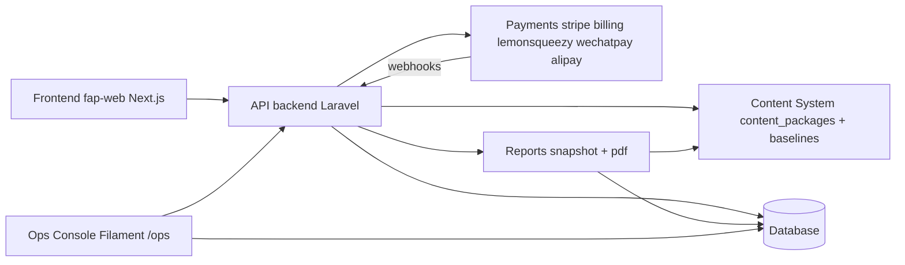
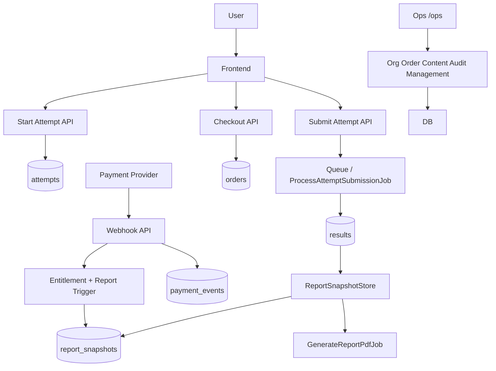

# FermatMind 系统模块图

- Scope: `/Users/rainie/Desktop/GitHub/fap-api`
- Generated: 2026-03-05

## 1) Core Module Map

## 2) Runtime Flow Map

## 3) Module Responsibility Summary

- Frontend
  - C 端入口与 SEO 出口（当前仓库仅见 robots/sitemap 壳）。
- API
  - 统一承载认证、测评、结果、报告、支付、组织与合规。
- Ops
  - 组织治理、订单/支付审计、内容发布、运维监控。
- Database
  - 业务主数据、事件、权限、快照与审计。
- Content
  - 量表题库、报告卡片、规则资产。
- Payments
  - 多支付渠道接入与回调处理。
- Reports
  - 分量表报告组合、free/full 变体、PDF 产出。
