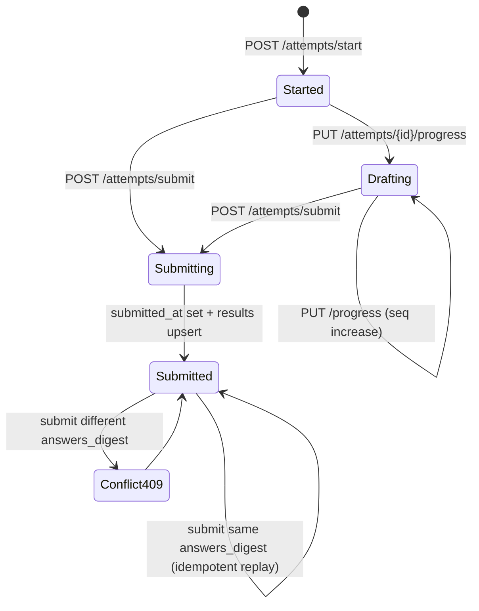

# Assessment Engine v0.3（Attempts / Results Code Truth）

## 1. 真理源（Controller + Request + Service + Migration）
- 路由：`backend/routes/api.php` (`/api/v0.3/attempts/*`)
- 控制器：
  - `app/Http/Controllers/API/V0_3/AttemptWriteController.php`
  - `app/Http/Controllers/API/V0_3/AttemptReadController.php`
  - `app/Http/Controllers/API/V0_3/AttemptProgressController.php`
- 请求校验：
  - `app/Http/Requests/V0_3/StartAttemptRequest.php`
  - `app/Http/Requests/V0_3/SubmitAttemptRequest.php`
- 服务：
  - `app/Services/Attempts/AttemptStartService.php`
  - `app/Services/Attempts/AttemptSubmitService.php`
  - `app/Services/Attempts/AttemptProgressService.php`
  - `app/Services/Assessment/AssessmentRunner.php`
  - `app/Services/Attempts/AttemptSubmitSideEffects.php`
- 迁移：attempts/results/attempt_drafts/attempt_answer_sets/attempt_answer_rows 相关 migration 集合。

## 2. 接口与鉴权
- `POST /api/v0.3/attempts/start` (Public)
- `POST /api/v0.3/attempts/submit` (FmTokenAuth)
- `PUT/GET /api/v0.3/attempts/{attempt_id}/progress`
- `GET /api/v0.3/attempts/{id}/result`
- `GET /api/v0.3/attempts/{id}/report`

鉴权补充：
- `start` 在 `ResolveAnonId + ResolveOrgContext` 下可匿名启动 attempt。
- `submit` 强制 `FmTokenAuth`，并把 `fm_user_id/fm_anon_id` 注入 DTO。
- `progress` 不强制 FmToken，但要求 `X-Resume-Token` 或可解析 user 身份，否则直接 404。
- `result/report` 通过 attempt ownership 约束，跨主体访问统一 not found。

## 3. 请求校验真值
- StartAttemptRequest rules 全量列出
  - `scale_code`: `required|string|max:64`
  - `region`: `nullable|string|max:32`
  - `locale`: `nullable|string|max:16`
  - `anon_id`: `nullable|string|max:64`
  - `client_platform`: `nullable|string|max:32`
  - `client_version`: `nullable|string|max:32`
  - `channel`: `nullable|string|max:32`
  - `referrer`: `nullable|string|max:255`
  - `meta`: `sometimes|array`
- SubmitAttemptRequest rules 全量列出
  - `attempt_id`: `required|string|max:64`
  - `answers`: `nullable|array`
  - `answers.*.question_id`: `required_with:answers|string|max:128`
  - `answers.*.code`: `nullable`
  - `answers.*.question_type`: `nullable|string|max:32`
  - `answers.*.question_index`: `nullable|integer|min:0`
  - `duration_ms`: `required|integer|min:0`
  - `invite_token`: `nullable|string|max:64`

Progress（控制器内联校验）：
- `seq`: `required|integer|min:0`
- `cursor`: `nullable|string|max:255`
- `duration_ms`: `required|integer|min:0`
- `answers`: `nullable|array`
- `answers.*.question_id`: `required_with:answers|string|max:128`
- `answers.*.question_type`: `nullable|string|max:32`
- `answers.*.question_index`: `nullable|integer|min:0`
- `answers.*.code`: `nullable|string|max:64`
- `answers.*.answer`: `nullable|array`

## 4. Attempts 状态流（基于字段而非 status 枚举）
该链路不使用 `attempts.status` 枚举，而以关键字段驱动：
- `started_at`：启动时间，`start` 时写入。
- `submitted_at`：提交完成时间，`submit` 事务内写入。
- `answers_digest`：提交幂等指纹，计算公式为 `sha256(scale|pack|dir|canonical_answers_json)`。

幂等规则：
- submitted + same digest => 幂等回放（返回已有 result，`idempotent=true`）
- submitted + different digest => 409 冲突（`CONFLICT`）
- submitted + digest 为空且已有 result => 兼容回放（历史数据兜底）

## 5. Submit 事务链路
1. 基于 org + 身份 ownership 获取并 `lockForUpdate` 锁定 attempt。
2. 读取 draft answers，与本次请求 answers 合并（question_id 维度覆盖）。
3. 计算 `answers_digest`，执行提交幂等分支判断。
4. 调用 `AssessmentRunner::run()` 评分。
5. 更新 attempt：`pack_id/dir_version/content_package_version/scoring_spec_version/submitted_at/duration_ms/answers_digest`。
6. 持久化答案：
   - `AnswerSetStore::storeFinalAnswers`
   - `AnswerRowWriter::writeRows`
7. upsert results (`org_id + attempt_id` 唯一约束)：
   - 核心字段：`type_code/scores_json/scores_pct/axis_states/result_json/report_engine_version`
8. 事务提交后执行 side effects：
   - 绑定 invite assignment（可选）
   - 钱包消费/权益发放（按 benefit code）
   - `seedPendingSnapshot`（trigger submit）
   - `GenerateReportSnapshotJob::dispatch(...)->afterCommit()`
9. 清理 progress 草稿并附加 gatekeeper report payload 到 submit 响应。

## 6. Results 写入契约（scores_json/scores_pct/axis_states/result_json）
- `scores_json`：轴向分数明细（优先来自 `axisScoresJson.scores_json`）。
- `scores_pct`：百分位/百分比分布。
- `axis_states`：轴状态（如 moderate/strong）。
- `result_json`：结构化结果快照（含 `type_code/pack_id/dir_version/content_package_version/scoring_spec_version/computed_at`）。
- `report_engine_version`：当前提交链写 `v1.2`。

## 7. 错误码与失败模式矩阵
- Start 阶段：
  - 400 `VALIDATION_FAILED`：`scale_code` 缺失
  - 404 `NOT_FOUND`：scale 未注册
  - 500 `CONTENT_PACK_ERROR`：pack/题库不可用
- Submit 阶段：
  - 400 `VALIDATION_FAILED`：attempt_id 缺失/attempt scale 缺失
  - 404 `NOT_FOUND`：attempt 或 scale 不存在
  - 422 `VALIDATION_FAILED`：answers 为空
  - 409 `CONFLICT`：重复提交且 digest 不一致
  - 500 `SCORING_FAILED` 或 `INTERNAL_ERROR`
- Progress 阶段：
  - 404 `DRAFT_NOT_FOUND`
  - 410 `RESUME_EXPIRED`
  - 409 `SEQ_OUT_OF_ORDER`
- Report 附加阶段：
  - Gatekeeper 异常时 submit 仍返回主结果，但 report 降级为 locked/free 占位。

## 8. Mermaid 状态图（必须）

