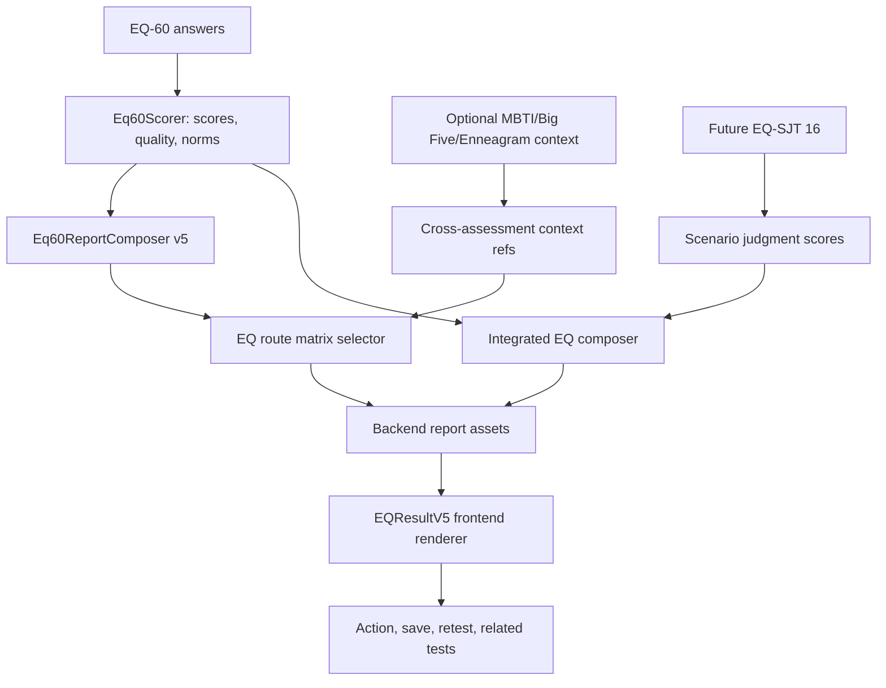

# EQ Personalization and English First-Tier Upgrade Scan

Date: 2026-05-31

Scope:
- Backend: `/Users/rainie/Desktop/GitHub/fap-api`
- Frontend: `/Users/rainie/Desktop/GitHub/fap-web`
- External research: Chrome/Computer Use observation plus public benchmark pages
- Output type: technical and product architecture report

Non-goals:
- No code implementation.
- No EQ question, scoring, reverse-item, norm, SJT, route, or payment changes.
- No frontend content hardcoding recommendation.
- No claim that EQ-60 or future EQ-SJT is an ability test, MSCEIT, clinical diagnostic tool, or hiring screen.

## 1. Executive Summary

1. FermatMind EQ has already completed the first critical platform step: EQ-60 is now an all-free self-report result path with backend v5 payload, backend report assets, frontend EQ-specific renderer, canonical fixtures, and delivery fallback tests.
2. The current EQ module is stronger than a generic C-end quiz, but it is not yet "English first-tier" because personalization is still mostly deterministic by one formulation path, not a full route matrix, journey state, cross-assessment synthesis, or English editorial system.
3. MBTI is currently the richest FermatMind personalization reference: it has adaptive selection, longitudinal memory, personalization service, Big Five synthesis, relationship/career continuity, and a more mature public result ecosystem.
4. Big Five is the strongest backend governance reference: it has a larger content-pack/service footprint, selector/composer/runtime patterns, CMS governance, norms foundation, and route-driven public pilot discipline.
5. Enneagram is the best pattern for "result resonance and iterative self-confirmation": type confirmation, observation state, and localized assets are useful models for EQ journey state.
6. EQ's differentiator should not be "another high/low EQ score." It should become an Emotional and Relational Pattern OS: self-perception evidence, mechanism explanation, real-life translation, career-environment lens, action prescription, and later scenario-judgment contrast.
7. "千人千面" should be implemented as deterministic personalization, not free-form AI-generated prose. The input should be score profile, quality, mechanism gaps, selected scenarios, locale, user state, optional cross-assessment context, and later SJT gap signals.
8. The next platform gap is an EQ route matrix. Big Five already demonstrates how a governed route matrix can avoid frontend inference; EQ needs the same idea for formulations, mechanisms, scenes, career variables, action prescriptions, and copy variants.
9. There are still old EQ premium/paid references in compatibility content and fixtures. Even if the v5 renderer avoids showing them, they are a P1 governance risk for an all-free EQ product and must be cleaned in a dedicated backend content-contract PR.
10. Chrome/Computer Use observation of the live EQ landing showed correct 60-question positioning, but also old "free preview / paid unlock not open" messaging. That conflicts with the current all-free strategy and should be fixed before serious English-market acquisition.
11. The future EQ-SJT should stay separate from EQ-60. It should be positioned as scenario-based emotional judgment, not ability EI, MSCEIT, certified EQ, clinical assessment, or hiring suitability.
12. To become English first-tier, EQ needs three layers beyond the current v5 page: English-native copy governance, SEO/GEO topic authority, and a privacy-safe personalization state model.
13. The recommended next PR is not SJT implementation. It is `PR-EQ-PER-01`: EQ all-free copy and contract cleanup, alias hardening, and smoke/readiness guardrails.
14. After that, build `PR-EQ-PER-02`: backend EQ personalization route matrix foundation. Frontend should only consume backend-selected asset refs/resolved assets.
15. SJT implementation should remain a later train after EQ-60 personalization has enough quality, confidence, and route-matrix governance.

## 2. Methodology

### 2.1 Repository Scan

Backend scan covered:
- EQ docs under `/Users/rainie/Desktop/GitHub/fap-api/docs/audits/eq`
- EQ content packs under `/Users/rainie/Desktop/GitHub/fap-api/backend/content_packs/EQ_60` and `/Users/rainie/Desktop/GitHub/fap-api/backend/content_packs/EQ_EMOTIONAL_INTELLIGENCE`
- EQ report composer and tests under `/Users/rainie/Desktop/GitHub/fap-api/backend/app/Services/Report` and `/Users/rainie/Desktop/GitHub/fap-api/backend/tests/Feature/Report`
- MBTI services under `/Users/rainie/Desktop/GitHub/fap-api/backend/app/Services/Mbti`
- Big Five content/services under `/Users/rainie/Desktop/GitHub/fap-api/backend/content_packs/BIG5_OCEAN` and `/Users/rainie/Desktop/GitHub/fap-api/backend/app/Services/BigFive`
- Enneagram content/services under `/Users/rainie/Desktop/GitHub/fap-api/backend/content_packs/ENNEAGRAM` and `/Users/rainie/Desktop/GitHub/fap-api/backend/app/Services/Enneagram`

Frontend scan covered:
- EQ renderer under `/Users/rainie/Desktop/GitHub/fap-web/components/result/eq`
- Result routing under `/Users/rainie/Desktop/GitHub/fap-web/app/(localized)/[locale]/(app)/result/[id]/ResultClient.tsx`
- API/result types and fixtures under `/Users/rainie/Desktop/GitHub/fap-web/lib`, `/Users/rainie/Desktop/GitHub/fap-web/tests/contracts`, `/Users/rainie/Desktop/GitHub/fap-web/tests/e2e`, and `/Users/rainie/Desktop/GitHub/fap-web/tests/fixtures/eq/v5`
- MBTI/Big Five/Enneagram result components and personalization libraries

### 2.2 Chrome and Computer Use Research

Chrome tabs were used to inspect public benchmark surfaces:
- Truity Emotional Intelligence Test: https://www.truity.com/test/eq-emotional-intelligence-test
- 16Personalities: https://www.16personalities.com/
- Truity Big Five: https://www.truity.com/test/big-five-personality-test
- Enneagram Institute: https://www.enneagraminstitute.com/
- MHS EQ-i 2.0: https://storefront.mhs.com/collections/eq-i-2-0
- Six Seconds SEI: https://www.6seconds.org/tools/sei/

Computer Use was used read-only on Chrome to inspect FermatMind production EQ landing:
- `https://fermatmind.com/zh/tests/eq-test-emotional-intelligence-assessment`

Observed FermatMind production EQ landing signals:
- The page is visible and positions EQ as `60 题 • 10 分钟 • EQ_60`.
- The start flow links to the EQ take route.
- The page still contains a message equivalent to "currently only free report preview; paid unlock not open." This conflicts with the current all-free EQ strategy.
- The page exposes raw `EQ_60` metadata in a user-facing hero/metadata area. This is acceptable for internal/methodology context, but too raw for an English first-tier public product surface.
- The global/top CTA observed through Chrome accessibility tree appeared to point to MBTI rather than the current EQ test. This needs a navigation audit before being classified as a production bug.

No account creation, purchase, paid report access, private data access, or permission bypass was performed.

## 3. Existing FermatMind EQ Technical Documentation

Current EQ documentation already exists and should remain the implementation baseline:

- `/Users/rainie/Desktop/GitHub/fap-api/docs/audits/eq/eq_v5_result_page_pr_split_scan_2026-05-21.md`
  - Full-chain scan and PR split for EQ result page v5.
  - Identified the original P0: report-access/report still tied to old paid/locked/free-section/SKU contracts.

- `/Users/rainie/Desktop/GitHub/fap-api/docs/audits/eq/eq_v5_smoke_qa_2026-05-21.md`
  - Smoke QA evidence.
  - Recorded the staging split-brain issue where `report-access` was ready but `/report` initially returned `generating=true, report=[]`.
  - Later notes show the delivery fallback direction: if EQ scoring result exists, `/report` can compose the v5 payload even when snapshot is missing.

- `/Users/rainie/Desktop/GitHub/fap-api/docs/audits/eq/eq_sjt_16_module_design_2026-05-21.md`
  - EQ-SJT 16 module design.
  - Correctly states that EQ-SJT is scenario-based emotional judgment and not MSCEIT, not certified ability EI, not clinical, and not hiring.

This report should be treated as the next strategic layer: how EQ moves from "v5 result page" to "personalized first-tier English product."

## 4. External Benchmark Findings

### 4.1 C-End EQ Benchmarks

Public English EQ products are still dominated by self-report or trait/mixed EI presentation:

- Truity EQ: consumer-friendly, quick-access public test, strong SEO and approachable report positioning. It is a useful benchmark for English clarity and conversion flow, not for scientific depth.
- Psychology Today / PsychTests / 123test / IDRlabs / MindTools-style products: generally present user-facing EQ as accessible quizzes with scores, categories, and limited free result surfaces. These are useful for onboarding friction and result scannability, but not enough for FermatMind's long-term OS positioning.
- TalentSmartEQ and similar products are more commercial/professional, with stronger workplace framing and paid assessment/report positioning.

Implication:
- FermatMind should keep EQ-60 as self-report core.
- The free EQ result page should give real value instead of using old paid-preview language.
- Differentiation should come from mechanism-level explanation and cross-context action, not just total score.

### 4.2 Professional EQ Benchmarks

MHS EQ-i 2.0, MHS MSCEIT, Six Seconds SEI, Genos, Korn Ferry ESCI, and similar providers set stronger expectations around:
- validated assessment systems,
- professional administration,
- certification/training,
- organizational reporting,
- norm or benchmark language,
- strict claim boundaries.

Implication:
- FermatMind should borrow their boundary discipline, not their certification claims.
- EQ-SJT must not be presented as MSCEIT-like unless it has the required ability-test design, validation, and scoring evidence.
- English-market trust depends on explicit methodology, non-clinical boundaries, and norm-status honesty.

### 4.3 Personality Product Benchmarks

16Personalities is not a scientific gold standard, but it is a product benchmark:
- strong narrative identity,
- memorable public UX,
- localized content,
- shareable labels,
- career/relationship/life-domain continuation,
- lightweight personalization that feels specific.

Truity Big Five and Enneagram Institute are useful references for:
- stable model naming,
- report/product tiering,
- SEO authority,
- dimension/type education,
- trusted public entry pages.

Implication:
- FermatMind EQ needs better English-native story architecture.
- It should not mimic type labels too aggressively; EQ should use formulation and mechanism language.
- The product must translate evidence into action faster than traditional personality reports.

## 5. Current FermatMind EQ State

### 5.1 Backend

Completed foundation:
- EQ-60 all-free runtime contract.
- `eq_report_mode=self_report`.
- `measurement_type=self_report_trait_mixed_ei`.
- `scores.global`.
- `scores.dimensions`.
- `dimension_summary`.
- `quality.confidence_label`.
- `interpretation`.
- `asset_refs`.
- resolved `assets`.
- `next_module.available=false`, `next_module.status=planned`.
- `methodology`.
- canonical fixtures for balanced, high-empathy/low-recovery, and low-confidence cases.
- `/report` delivery fallback test so ready access can produce deliverable v5 payload when scoring result exists.

Backend asset packs under EQ-60:
- `scientific_contract.json`
- `score_system.json`
- `core_formulations.json`
- `mechanism_map.json`
- `reality_translation.json`
- `career_environment.json`
- `action_prescriptions.json`
- `sjt_bridge.json`

Current limitation:
- EQ still has only a modest deterministic selector inside `Eq60ReportComposer`.
- It does not yet have a Big-Five-style route matrix, dedicated personalization engine, or journey state.
- Legacy compatibility report sections and fixtures still contain paid/premium language. This should not be user-visible through v5, but it is a governance risk.

### 5.2 Frontend

Completed foundation:
- EQ-specific renderer: `/Users/rainie/Desktop/GitHub/fap-web/components/result/eq/EQResultV5.tsx`
- Components:
  - `EQResultHero`
  - `EQEvidenceSnapshot`
  - `EQQualityBanner`
  - `EQEmotionalMatrix`
  - `EQMechanismCard`
  - `EQRealitySceneCards`
  - `EQCareerEnvironmentLens`
  - `EQActionPrescription`
  - `EQSJTBridgeCTA`
  - `EQScientificBoundary`
  - `EQSaveShareRelated`
- `ResultClient.tsx` routes EQ v5 payloads to `EQResultV5`.
- Contract/e2e tests assert no paywall/SKU/raw tag leakage.
- Canonical fixtures are synced from backend semantics.

Current limitation:
- EQ frontend is a deterministic renderer, not yet a personalization journey.
- English UX polish, visual hierarchy, screenshot QA, and production landing copy still need hardening.
- EQ must not grow frontend-authored official report explanations; formal explanations must stay backend/CMS/content-pack authoritative.

## 6. Comparison: EQ vs MBTI vs Enneagram vs Big Five

| Area | EQ current | MBTI current | Enneagram current | Big Five current | What EQ should learn |
|---|---|---|---|---|---|
| Core model | 4 EQ dimensions + global score + formulation | Type-based identity and journeys | Type/tritype/instinct-style confirmation and resonance | Trait/dimension/facet route system | Keep EQ as signal/mechanism model, not type label clone |
| Result renderer | Dedicated v5 renderer | Richest productized result ecosystem | Smaller but specialized renderer/assets | Specialized result assembly | EQ needs MBTI-level continuation and Big Five-level governance |
| Personalization | Formulation/mechanism/scene/action selector | Adaptive, memory, synthesis, user state | Observation/confirmation state | Route matrix and selector/composer discipline | Build deterministic EQ route matrix and journey state |
| Content authority | Backend content pack/report assets | Hybrid historical content authority | Backend content assets | Backend content pack/CMS governance | Keep EQ report copy backend-owned |
| Cross-test use | Not yet materially integrated | Big Five synthesis exists | Can inform identity resonance | Can inform stable trait context | Add EQ cross-assessment context only as optional evidence, not hidden inference |
| Free/paid model | All-free EQ v5 strategy | Existing paid/locked surfaces in product | Product dependent | Product dependent | EQ must remain free for current strategy; remove residual paid copy |
| English first-tier readiness | Medium | Higher product maturity | Medium | High governance maturity | EQ needs English copy QA, SEO/GEO authority, and trust methodology |
| Risk profile | Overclaiming EQ/SJT, old paid copy, weak personalization | Type essentialism | Type labeling overreach | Trait determinism/career overclaim | EQ must use formulation, confidence, and claim boundary language |

## 7. What "千人千面" Should Mean for EQ

EQ personalization should not mean:
- generating uncontrolled AI prose per user;
- pretending EQ-60 measures objective emotional ability;
- creating thousands of opaque profile labels;
- blending EQ-60 and EQ-SJT into one unclean "true EQ" number;
- inferring hiring suitability, clinical status, or job performance.

EQ personalization should mean:

1. Evidence-specific:
   - The report changes because the user's score structure, quality flags, dimension gaps, and norm bands differ.

2. Mechanism-specific:
   - The report explains which dimension pairs matter, for example `EM x ER`, `SA x ER`, `ER x RM`, instead of only explaining isolated scores.

3. Scenario-specific:
   - The report selects the most relevant scenes: feedback, conflict, boundaries, teamwork, pressure recovery, career environment.

4. Action-specific:
   - The report selects one primary prescription, one script, and one short practice path, not a generic advice dump.

5. State-aware:
   - The product remembers whether the user is low-confidence, first-time, returning, retesting, comparing with MBTI/Big Five, or preparing for career decisions.

6. Locale-aware:
   - English copy is written as English-native product language, not direct translation from Chinese.

7. Cross-assessment aware:
   - MBTI, Big Five, and Enneagram may provide optional context, but EQ remains its own evidence channel.

8. SJT-ready:
   - Once EQ-SJT exists, the system can explain self-perception vs scenario-judgment alignment/gap without claiming certified ability.

## 8. Target Product Architecture

Recommended architecture:



### 8.1 Backend Components to Add

Future backend services/assets:
- `EqPersonalizationContextBuilder`
- `EqRouteMatrixSelector`
- `EqJourneyStateService`
- `EqCrossAssessmentContextService`
- `EqEnglishCopyQualityGate`
- `EQ_60/v1/raw/personalization_routes/*.json`
- `EQ_60/v1/raw/cross_scale_synthesis/*.json`

### 8.2 Frontend Components to Extend

Future frontend behavior:
- Keep `EQResultV5` as renderer.
- Add support for backend-selected `route_id`, `variant_ids`, and `personalization_context`.
- Add analytics/test IDs for section exposure, action selection, SJT planned exposure, and retest intent.
- Do not add official report prose in frontend code.

### 8.3 Data Contract Draft

```json
{
  "eq_report_mode": "self_report",
  "personalization": {
    "version": "eq_personalization_v1",
    "route_id": "eq60.EM_high_ER_low.quality_A.self_report",
    "signal_signature": {
      "strongest_dimension": "EM",
      "development_lever": "ER",
      "largest_gap": "EM_ER",
      "quality_level": "A"
    },
    "selected_asset_ids": {
      "formulation": "high_empathy_low_recovery",
      "mechanisms": ["EM_ER_high_low"],
      "scenes": ["feedback", "conflict", "relationship_boundary"],
      "career_environment": ["emotional_labor_high", "autonomy_recovery_medium"],
      "action_prescription": "empathy_boundary"
    },
    "state": {
      "is_first_result": true,
      "has_sjt": false,
      "confidence_policy": "normal"
    },
    "cross_assessment_context_refs": []
  }
}
```

Rules:
- `personalization.route_id` should be deterministic and testable.
- Long copy remains in backend content packs/CMS.
- Frontend may render layout, labels, and UI chrome only.
- If cross-assessment context is used, it should be explicit, optional, and referenced as context, not hidden profile inference.

## 9. English First-Tier Gap Analysis

### 9.1 Product Gaps

1. Landing and result copy still expose old paid-preview language in some surfaces.
2. Production landing exposes raw `EQ_60` as a public product metadata cue.
3. EQ has a good v5 report structure, but not yet a public English narrative moat comparable to 16Personalities-style readability.
4. EQ does not yet have post-result journeys: retest reflection, action completion, related-test continuation, or saved insight memory.
5. EQ-SJT is planned but unavailable. The bridge must stay informational until route/take/scorer/report all exist.

### 9.2 Technical Gaps

1. No EQ route matrix comparable to Big Five route governance.
2. No EQ-specific personalization service comparable to MBTI.
3. No EQ journey/observation state comparable to Enneagram's confirmation/resonance pattern.
4. EQ alias handling should be hardened for both `EQ_60` and `EQ_EMOTIONAL_INTELLIGENCE`.
5. Cross-repository fixtures exist, but production smoke should remain part of release readiness after deployment.

### 9.3 Content and SEO/GEO Gaps

1. EQ needs English-native definitions for self-awareness, emotion regulation, empathy, and relationship management.
2. EQ needs claim-boundary pages or sections: self-report, non-clinical, non-hiring, provisional norms, not ability EI.
3. EQ needs SEO/GEO assets around:
   - emotional intelligence test,
   - emotional intelligence self-assessment,
   - empathy and emotion regulation,
   - EQ vs personality tests,
   - EQ at work without hiring claims,
   - EQ and career environment variables.
4. These assets should be backend CMS/content-authoritative, not frontend static fallback copy.

## 10. Risk Matrix

| Severity | Risk | Why it matters | Mitigation |
|---|---|---|---|
| P0 | `/report` not deliverable after `report-access=ready` | Blocks actual EQResultV5 rendering | Keep delivery fallback tests and staging smoke gate |
| P0 | EQ paywall/SKU/locked leakage | Breaks all-free product strategy | Contract tests, fixture scans, content cleanup PR |
| P0 | EQ-SJT described as MSCEIT/ability/certified | Scientific and legal credibility risk | Claim-boundary tests and copy review |
| P1 | Legacy premium copy in EQ compatibility sections | Can leak through fallback, fixtures, SEO, or future renderer | Dedicated content-contract cleanup |
| P1 | Frontend adds official report copy | Breaks authority layer and localization governance | Backend/CMS asset refs only |
| P1 | English copy reads like translation | Weakens first-tier market perception | Native English copy review and content QA |
| P1 | Route matrix combinatorial explosion | Hard to test and maintain | Start with bounded high-value routes, not all combinations |
| P2 | Cross-assessment synthesis overreaches | Users may read correlations as destiny/prediction | Use optional context refs and disclaimers |
| P2 | Low-confidence path still feels like strong typing | Undermines quality system | Low-confidence-specific renderer and fixture tests |
| P2 | Raw internal tags exposed | Reduces polish and trust | Renderer/tag leakage tests |
| P3 | Public hero shows internal scale code | Looks less consumer-grade | Move scale code to methodology/details |

## 11. Recommended Upgrade PR Train

This PR train assumes future user authorization. Do not modify `docs/codex/pr-train.yaml` or `docs/codex/pr-train-state.json` without explicit approval.

### PR-EQ-PER-01: EQ All-Free Copy and Contract Cleanup

Repo: `fap-api`, with possible small `fap-web` follow-up if landing consumes frontend copy.

Goal:
- Remove residual paid/premium/free-preview semantics from EQ user-visible content and canonical fixtures.
- Preserve all-free v5 strategy.
- Harden `EQ_60` / `EQ_EMOTIONAL_INTELLIGENCE` alias behavior.

Likely scope:
- `/Users/rainie/Desktop/GitHub/fap-api/backend/content_packs/EQ_60/v1/raw/blocks`
- `/Users/rainie/Desktop/GitHub/fap-api/backend/content_packs/EQ_60/v1/compiled`
- `/Users/rainie/Desktop/GitHub/fap-api/backend/content_packs/EQ_EMOTIONAL_INTELLIGENCE/v1`
- `/Users/rainie/Desktop/GitHub/fap-api/backend/tests/Fixtures/eq/v5`
- `/Users/rainie/Desktop/GitHub/fap-api/backend/tests/Feature/Report/*Eq60*`
- landing/API metadata if it owns the production "free preview / paid unlock" message

Non-goals:
- No SJT implementation.
- No score changes.
- No frontend official report prose.

Checks:
```bash
cd /Users/rainie/Desktop/GitHub/fap-api/backend
php artisan test --filter=Eq60V5ReportContractTest
php artisan test --filter=Eq60V5ReportDeliveryTest
php artisan test --filter=Eq60ReportPaywallTest
php artisan test --filter=Eq60GoldenCasesTest
cd /Users/rainie/Desktop/GitHub/fap-api
git diff --check
```

Acceptance:
- No EQ v5 user-visible payload contains paid/premium/unlock/SKU semantics.
- `next_module.available=false` remains unchanged.
- Compatibility sections no longer say paid report is required for core EQ value.

### PR-EQ-PER-02: Backend EQ Personalization Route Matrix Foundation

Repo: `fap-api`

Goal:
- Introduce deterministic EQ personalization route selection comparable to Big Five governance.

Likely scope:
- New `EQ_60/v1/raw/personalization_routes`
- New selector/service near EQ report composer
- Composer outputs `personalization.route_id`, `signal_signature`, selected asset IDs
- Golden cases for high-empathy/low-recovery, balanced, aware-but-unregulated, low-confidence

Non-goals:
- No frontend layout changes.
- No SJT.
- No AI-generated report prose.

Checks:
```bash
cd /Users/rainie/Desktop/GitHub/fap-api/backend
php artisan test --filter=Eq60V5ReportContractTest
php artisan test --filter=Eq60GoldenCasesTest
php artisan test --filter=Eq60V5ReportDeliveryTest
cd /Users/rainie/Desktop/GitHub/fap-api
git diff --check
```

Acceptance:
- Route IDs are deterministic.
- Route assets are locale-complete for zh-CN and en.
- Frontend can render without adding official copy.

### PR-EQ-PER-03: Frontend EQ v5.1 Personalization Renderer

Repo: `fap-web`

Goal:
- Make `EQResultV5` consume `personalization` route data and render more specific route-driven variants.

Likely scope:
- `/Users/rainie/Desktop/GitHub/fap-web/components/result/eq/*`
- `/Users/rainie/Desktop/GitHub/fap-web/tests/contracts/eq-result-v5-renderer.contract.test.tsx`
- `/Users/rainie/Desktop/GitHub/fap-web/tests/e2e/iq-eq-result-regression.spec.ts`
- EQ fixtures only if generated from backend canonical payloads

Non-goals:
- No official report copy hardcoded in frontend.
- No SJT route.
- No paid CTA.

Checks:
```bash
cd /Users/rainie/Desktop/GitHub/fap-web
git diff --check
pnpm typecheck
pnpm test:contract
pnpm exec playwright test tests/e2e/iq-eq-result-regression.spec.ts
```

Acceptance:
- EQ renders route-specific hero/mechanism/action variants from backend assets.
- Missing route data has safe fallback.
- No raw tags, no paywall, no SJT clickable entry.

### PR-EQ-PER-04: EQ Journey State and Resonance Feedback

Repo: `fap-api` first; `fap-web` follow-up if UI is needed.

Goal:
- Add privacy-safe state for EQ result resonance, retest intent, action completion, and read-depth.
- Use Enneagram-style observation/confirmation patterns without turning EQ into a fixed type identity.

Likely backend scope:
- New EQ journey state service/table or reusable state envelope if one already exists.
- Consent-aware telemetry.
- Contract tests for no sensitive inference and no hiring/clinical use.

Non-goals:
- No hidden profiling without consent.
- No AI narrative generation.
- No SJT.

Checks:
```bash
cd /Users/rainie/Desktop/GitHub/fap-api/backend
php artisan test --filter=Eq60
php artisan test --filter=Privacy
cd /Users/rainie/Desktop/GitHub/fap-api
git diff --check
```

Acceptance:
- EQ can remember safe product state.
- State does not alter score truth.
- Users can understand what is being saved.

### PR-EQ-PER-05: EQ Cross-Assessment Context Guard

Repo: `fap-api`

Goal:
- Let EQ reports reference optional context from MBTI, Big Five, and Enneagram without overclaiming.

Design:
- Big Five can contextualize emotional stability/social energy patterns.
- MBTI can contextualize communication and decision style.
- Enneagram can contextualize motivation/defense patterns.
- EQ remains the authority for emotional/relational self-report signals.

Non-goals:
- No "because you are INFJ, your EQ is..." deterministic claims.
- No job-performance prediction.
- No clinical or hiring claims.

Checks:
```bash
cd /Users/rainie/Desktop/GitHub/fap-api/backend
php artisan test --filter=Eq60
php artisan test --filter=Mbti
php artisan test --filter=BigFive
php artisan test --filter=Enneagram
cd /Users/rainie/Desktop/GitHub/fap-api
git diff --check
```

Acceptance:
- Cross-assessment context is optional, explainable, and asset-ref based.
- No frontend inference required.

### PR-EQ-PER-06: EQ English First-Tier Content and SEO/GEO Authority Pack

Repo: `fap-api`; frontend only if rendering support is missing.

Goal:
- Build English-native EQ authority content around methodology, dimensions, self-report boundary, scenario-judgment future, and career-environment lens.

Likely scope:
- Backend CMS/content page seeds or governed content packs.
- SEO metadata/FAQ/topic pages through CMS/public APIs.
- No static frontend editorial fallback.

Non-goals:
- No copied competitor report text.
- No ability-test or certified-EQ claims.

Checks:
```bash
cd /Users/rainie/Desktop/GitHub/fap-api/backend
php artisan test --filter=Content
php artisan test --filter=Seo
cd /Users/rainie/Desktop/GitHub/fap-api
git diff --check
```

Acceptance:
- English public EQ pages are CMS/backend-authoritative.
- Search pages use clear boundaries and do not overclaim.
- Content can support GEO/LLM extraction without hidden frontend copy.

### PR-EQ-SJT-01 to PR-EQ-SJT-05: Future SJT Train

Only after EQ-60 personalization is stable:

1. `PR-EQ-SJT-01`: `EQ_SJT_16/v1` content-pack skeleton and schema.
2. `PR-EQ-SJT-02`: scorer, rubric, strategy tags, and golden cases.
3. `PR-EQ-SJT-03`: frontend SJT take flow.
4. `PR-EQ-SJT-04`: integrated EQ report composer.
5. `PR-EQ-SJT-05`: validation, telemetry, QA, and claim-boundary review.

Hard constraints:
- EQ-SJT remains scenario-based emotional judgment.
- It is not MSCEIT.
- It is not certified ability EI.
- It is not hiring or clinical assessment.

## 12. Manifest Draft Guidance

If these PRs are added to a PR train, each item should include:
- explicit repo,
- dependency on all merged EQ v5 PRs,
- exact scope,
- checks,
- no frontend content hardcoding,
- no SJT implementation until the SJT train,
- no `docs/codex/pr-train.yaml` or state updates without user authorization.

Suggested dependency order:

```text
PR-EQ-PER-01
  -> PR-EQ-PER-02
  -> PR-EQ-PER-03
  -> PR-EQ-PER-04
  -> PR-EQ-PER-05
  -> PR-EQ-PER-06
  -> PR-EQ-SJT-01+
```

## 13. Open Questions

1. Should EQ remain fully free permanently, or only until the integrated SJT report exists?
2. Should EQ landing copy be governed by content pack, CMS landing surfaces, or another backend page-block authority?
3. Should EQ personalization state require explicit user consent before saving journey/resonance data?
4. Should cross-assessment synthesis be available only when the user has completed the other assessment, or can it be previewed as "complete Big Five/MBTI to compare"?
5. What is the English product name: "Emotional Intelligence Test", "Emotional & Relational Pattern Report", or both by context?
6. Should raw scale code `EQ_60` ever be visible outside methodology/debug contexts?
7. What is the minimum validation bar before EQ-SJT can be shown as more than "planned"?

## 14. Final Recommendation

Do not jump directly to SJT implementation.

The next correct implementation sequence is:

1. `PR-EQ-PER-01`: clean all remaining EQ paid/premium/free-preview copy and alias contract risk.
2. `PR-EQ-PER-02`: add backend route-matrix personalization.
3. `PR-EQ-PER-03`: upgrade frontend EQ renderer to consume personalization routes.
4. `PR-EQ-PER-04`: add safe journey/resonance state.
5. `PR-EQ-PER-05`: add optional MBTI/Big Five/Enneagram context guard.
6. `PR-EQ-PER-06`: build English-native SEO/GEO authority content.
7. Only then start `PR-EQ-SJT-*`.

This path keeps FermatMind EQ scientifically defensible and commercially stronger:
- EQ-60 remains the self-report core.
- EQ-SJT remains a separate scenario module.
- Backend/CMS stays the authority layer.
- Frontend remains a deterministic renderer.
- Personalization is testable, explainable, and safe.

## 15. Implementation Closeout: 11 PR Train Summary

This section records the implementation result of the 11-PR train that followed this scan. It should be read as the technical closeout for the EQ personalization and EQ-SJT upgrade phase.

### 15.1 Technical Documentation Index

Backend technical documents now relevant to the EQ program:

- `/Users/rainie/Desktop/GitHub/fap-api/docs/audits/eq/eq_v5_result_page_pr_split_scan_2026-05-21.md`
  - Baseline EQ v5 full-chain scan and PR split.
  - Established the first P0: report-access/report must be all-free and must not be controlled by old locked/SKU/free-section contracts.

- `/Users/rainie/Desktop/GitHub/fap-api/docs/audits/eq/eq_v5_smoke_qa_2026-05-21.md`
  - Smoke QA evidence for the real EQ-60 v5 path.
  - Captured and later closed the report-access ready vs `/report` generating split-brain risk.

- `/Users/rainie/Desktop/GitHub/fap-api/docs/audits/eq/eq_sjt_16_module_design_2026-05-21.md`
  - EQ-SJT 16 module design.
  - Defines EQ-SJT as scenario-based emotional judgment, not MSCEIT, certified EI, clinical assessment, or hiring suitability.

- `/Users/rainie/Desktop/GitHub/fap-api/docs/audits/eq/eq_personalization_first_tier_pr_split_2026-05-31.md`
  - This report.
  - Original scan for making EQ personalized, comparable to MBTI/Big Five/Enneagram maturity, and competitive in the English market.

- `/Users/rainie/Desktop/GitHub/fap-api/docs/audits/eq/eq_sjt_16_validation_telemetry_qa_2026-05-31.md`
  - Validation, telemetry, QA, and claim-boundary contract for the EQ-SJT and future integrated EQ phase.
  - Keeps public release closed until expert calibration, localization review, pilot statistics, reliability review, and rendered QA evidence exist.

Frontend technical and test assets now relevant to the EQ program:

- `/Users/rainie/Desktop/GitHub/fap-web/components/result/eq/`
  - EQ-specific result renderer and v5 component set.

- `/Users/rainie/Desktop/GitHub/fap-web/tests/contracts/eq-result-v5-renderer.contract.test.tsx`
  - Frontend contract coverage for EQ v5 rendering, no paywall leakage, no raw tags, low-confidence path, and SJT planned state.

- `/Users/rainie/Desktop/GitHub/fap-web/tests/fixtures/eq/v5/`
  - Canonical EQ v5 fixtures aligned with backend payload semantics.

- `/Users/rainie/Desktop/GitHub/fap-web/app/(localized)/[locale]/tests/[slug]/take/EqSjtTakeClient.tsx`
  - EQ-SJT take-flow implementation introduced later in the train.
  - It is still governed by backend/content-pack availability and the SJT release boundary.

### 15.2 Final PR Train Status

All 11 requested PRs have been implemented and merged. The fap-api ledger was later reconciled by PR `#1825` so `origin/main` now records the correct merged state for `PR-EQ-SJT-05`.

| PR | Repo | PR URL | Merge SHA | Merged At | Status |
|---|---|---|---|---|---|
| PR-EQ-PER-01 | fap-api | https://github.com/fermatmind/fap-api/pull/1785 | `ff4347e2d95ca74f381221bd4d48fe59ed910d24` | 2026-05-31T07:58:48Z | merged |
| PR-EQ-PER-02 | fap-api | https://github.com/fermatmind/fap-api/pull/1791 | `c4edabaae9045af89349b2ecbd5a7a347e86cfe2` | 2026-05-31T08:14:19Z | merged |
| PR-EQ-PER-03 | fap-web | https://github.com/fermatmind/fap-web/pull/938 | `7444f70581ff781b9efca68d9ffd9b4841a3b451` | 2026-05-31T08:32:43Z | merged_external in fap-api ledger |
| PR-EQ-PER-04 | fap-api | https://github.com/fermatmind/fap-api/pull/1797 | `392e8841670093f673d5a2f0141797330e0ce30e` | 2026-05-31T09:17:00Z | merged |
| PR-EQ-PER-05 | fap-api | https://github.com/fermatmind/fap-api/pull/1801 | `ad5dc761ee46b3e4600f6d1fe37712a6ddcf12ab` | 2026-05-31T14:33:13Z | merged |
| PR-EQ-PER-06 | fap-api | https://github.com/fermatmind/fap-api/pull/1808 | `aa15ca1a31494fbfd12697aae343f11a76a0e26e` | 2026-05-31T15:25:44Z | merged |
| PR-EQ-SJT-01 | fap-api | https://github.com/fermatmind/fap-api/pull/1813 | `9c8a2b61c76c4f68c762ba472ff47f1dd8a9c213` | 2026-05-31T16:14:12Z | merged |
| PR-EQ-SJT-02 | fap-api | https://github.com/fermatmind/fap-api/pull/1818 | `f9f0ce800850ee46eb8b51b97f65c00dc70a41b0` | 2026-05-31T16:42:51Z | merged |
| PR-EQ-SJT-03 | fap-web | https://github.com/fermatmind/fap-web/pull/945 | `b64879fe7026ff89ef5ccc6159b8654af2dd5ec0` | 2026-05-31T17:04:23Z | merged |
| PR-EQ-SJT-04 | fap-api | https://github.com/fermatmind/fap-api/pull/1822 | `6c13f952b40650952d126ce28e5dbeac9b81add8` | 2026-05-31T17:31:03Z | merged |
| PR-EQ-SJT-05 | fap-api | https://github.com/fermatmind/fap-api/pull/1824 | `58b4a20a229bf80fe1177a7a828033221d389835` | 2026-05-31T17:48:56Z | merged |

Ledger reconciliation:

- PR: https://github.com/fermatmind/fap-api/pull/1825
- Merge SHA: `acc380deb3343e3f2936a94f0aa1017c7a33700e`
- Purpose: bookkeeping only; reconciled `PR-EQ-SJT-05` from `open` to `merged` in `docs/codex/pr-train-state.json`.
- Runtime impact: none.

### 15.3 PR-by-PR Delivery Summary

#### PR-EQ-PER-01: EQ all-free copy / contract cleanup

Outcome:
- Closed the immediate all-free copy/contract mismatch risk.
- Hardened EQ runtime so user-visible result payloads do not depend on old paid, locked, blur, SKU, or upgrade language.
- Preserved current strategy: EQ-60 basic report is free; report depth is driven by data/module completion, not payment state.

Architecture impact:
- EQ all-free is now a product/runtime invariant rather than a frontend-only expectation.
- Legacy commerce/SKU data may still exist historically, but EQ user-facing runtime should not surface it.

#### PR-EQ-PER-02: Backend EQ personalization route matrix

Outcome:
- Added backend-side route-matrix logic for EQ personalization.
- Moved EQ closer to Big Five-style deterministic selection instead of one-off composer heuristics.
- Improved selection for formulation, mechanisms, scenes, career-environment variables, and action prescriptions.

Architecture impact:
- Backend remains the personalization authority.
- Frontend should render selected asset references/resolved assets and avoid inferring official report meaning.

#### PR-EQ-PER-03: Frontend EQ v5.1 personalization renderer

Outcome:
- Upgraded the frontend EQ renderer to consume backend-selected personalization routes.
- Kept formal explanation copy backend-owned.
- Preserved no paywall, no locked, no blur, no SKU, and no raw technical tag leakage.

Architecture impact:
- EQ is no longer rendered as a generic result page.
- EQ frontend becomes a deterministic presentation layer for backend EQ route decisions.

#### PR-EQ-PER-04: EQ journey state / resonance feedback

Outcome:
- Added the foundation for EQ journey/resonance state.
- Supports future return-user, retest, resonance, and confidence-aware personalization flows.

Architecture impact:
- EQ can evolve from one-time report to longitudinal emotional/relational pattern memory.
- Any persistence or resonance feedback must remain consent-aware and avoid mutating psychometric truth.

#### PR-EQ-PER-05: EQ x MBTI / Big Five / Enneagram cross-assessment guard

Outcome:
- Added guarded cross-assessment context patterns.
- Allows EQ to reference other assessments only as optional context, not as hidden inference or deterministic identity claims.

Architecture impact:
- Cross-assessment synthesis is explainable and bounded.
- EQ remains its own evidence channel; MBTI/Big Five/Enneagram cannot override EQ evidence.

#### PR-EQ-PER-06: EQ English first-tier SEO / GEO authority pack

Outcome:
- Added English EQ SEO/GEO authority assets and governance.
- Improved the public English authority layer for EQ without moving editorial authority into the frontend.

Architecture impact:
- English EQ discoverability can now be grounded in backend/CMS/content-pack authority.
- Public claims stay within self-report and non-clinical/non-hiring boundaries.

#### PR-EQ-SJT-01: SJT content pack skeleton

Outcome:
- Added `EQ_SJT_16/v1` content-pack skeleton and schema boundaries.
- Kept SJT non-operational and planned at this stage.

Architecture impact:
- The repository now has a governed backend place for SJT domains, item schema, module contract, and rubric draft.
- This avoids ad hoc frontend SJT content.

#### PR-EQ-SJT-02: SJT scorer + golden cases

Outcome:
- Added the draft EQ-SJT scorer and golden cases.
- Established partial-credit, strategy-score, and quality-path test coverage.

Architecture impact:
- SJT scoring can be tested internally.
- This still does not imply public validation or public runtime readiness.

#### PR-EQ-SJT-03: SJT frontend take flow

Outcome:
- Added frontend SJT take-flow support.
- Kept the flow constrained by backend availability and release boundaries.

Architecture impact:
- Frontend can support SJT when backend/runtime gates allow it.
- The train rule remains: no premature public integrated report before backend composer/release gates.

#### PR-EQ-SJT-04: Integrated EQ report composer

Outcome:
- Added backend draft integrated report composer.
- Composes EQ-60 self-report recap and SJT applied-judgment signals without collapsing them into one unclean "true EQ" score.
- Added unit tests for gap map, pressure pattern, scenario scripts, action path, and claim boundary.

Architecture impact:
- Integrated EQ has a backend contract, but remains draft and not user-visible.
- Future frontend integrated report must consume backend-selected report sections/assets, not invent its own interpretation.

#### PR-EQ-SJT-05: Validation telemetry and QA

Outcome:
- Added internal validation telemetry contract for SJT scored events and integrated report composed events.
- Added QA gate logic and claim-boundary tests.
- Added validation/telemetry/QA documentation.
- Kept public release closed until further evidence exists.

Architecture impact:
- EQ-SJT and integrated EQ now have a validation boundary before public release.
- Stable validation claims are explicitly blocked until expert rubric calibration, locale bias review, pilot statistics, strategy reliability review, and rendered QA evidence exist.

### 15.4 Current End-State After the 11 PRs

Current EQ-60 state:
- EQ-60 remains the public self-report core.
- EQ-60 result page is all-free.
- Backend provides v5/v5.1 payloads, resolved assets, personalization routes, and guarded cross-assessment context.
- Frontend has a dedicated EQ renderer and personalization-aware rendering path.
- No EQ result should rely on paywall, locked section, blur, SKU, or upgrade CTA semantics.

Current EQ-SJT state:
- EQ-SJT has backend content-pack skeleton, draft scorer, golden cases, frontend take-flow capability, integrated composer, and validation/telemetry QA boundary.
- EQ-SJT should still be treated as scenario-based emotional judgment.
- It is not MSCEIT, not certified EI, not a clinical assessment, not a hiring screen, and not a stable validated ability measure.

Current integrated EQ state:
- Backend draft composer exists.
- Public/user-visible integrated report remains gated by future validation and release criteria.
- Integrated report must explain self-report vs scenario-judgment alignment/gap, not claim a single objective EQ truth.

### 15.5 Authority Layer After Implementation

Backend/content-pack authority:
- EQ scoring and quality contracts.
- EQ route matrix and personalization selection.
- EQ report assets and official explanation copy.
- EQ-SJT content-pack schema, rubric draft, golden cases, and validation boundary.
- Integrated EQ composer and claim boundary.
- SEO/GEO authority assets for English EQ surfaces.

Frontend authority:
- Rendering components.
- Interaction/take flow.
- Safe display fallbacks.
- Contract tests and e2e coverage.
- UI chrome such as buttons, layout, save/share affordances.

Frontend must not become authority for:
- EQ formulation meaning.
- SJT scoring interpretation.
- Scientific/methodology claims.
- SEO/editorial content.
- Ability, validation, clinical, hiring, or job-performance claims.

### 15.6 Remaining Risks and Governance Items

P0/P1 closed by this train:
- Old EQ paid/locked/SKU runtime risk.
- Generic result renderer control over EQ.
- Missing backend personalization route matrix.
- Missing SJT content/scoring/composer contract.
- Missing SJT validation and claim-boundary QA.
- Ledger drift for PR-EQ-SJT-05.

Remaining risks:
- Production deployment and smoke QA must confirm the merged backend/frontend SHAs are live.
- English public EQ pages should be visually and linguistically reviewed in production, not only by contract tests.
- EQ-SJT should not be marketed as validated until pilot data and expert calibration are complete.
- Cross-assessment synthesis must stay optional and evidence-labeled.
- Journey/resonance data should remain consent-aware and privacy-safe.
- Broad backend `Report` filter still has external sidecar failures unrelated to EQ-SJT; these should be tracked separately and not hidden inside EQ work.

Recommended next validation:
1. Run production/staging smoke QA for EQ-60 after deployment.
2. Verify EQ result page in zh-CN and en with real attempts.
3. Verify no paywall/SKU/raw-tag strings appear in rendered EQ pages.
4. Verify SJT entry remains consistent with current release gate.
5. Verify integrated EQ is not publicly visible unless explicitly released later.

### 15.7 Final Implementation Judgment

The original scan recommended two tracks:

1. Make EQ-60 personalized and English-first-tier.
2. Add EQ-SJT as a separate scenario module, not a replacement for EQ-60.

The 11 merged PRs completed the technical foundation for both tracks:

- EQ-60 is now positioned as a free, personalized, backend-authoritative emotional and relational pattern report.
- EQ personalization now has backend route selection, frontend rendering support, journey state, cross-assessment guardrails, and English SEO/GEO authority.
- EQ-SJT now has skeleton, scorer, frontend take-flow capability, integrated composer, and validation/telemetry QA boundary.

The product should still avoid overclaiming. The strongest current positioning is:

> EQ-60 explains self-reported emotional and relational patterns. EQ-SJT, when released, will add scenario-based emotional judgment signals. The integrated report compares self-perception with scenario choices, but does not claim certified ability, clinical diagnosis, hiring suitability, or MSCEIT equivalence.
