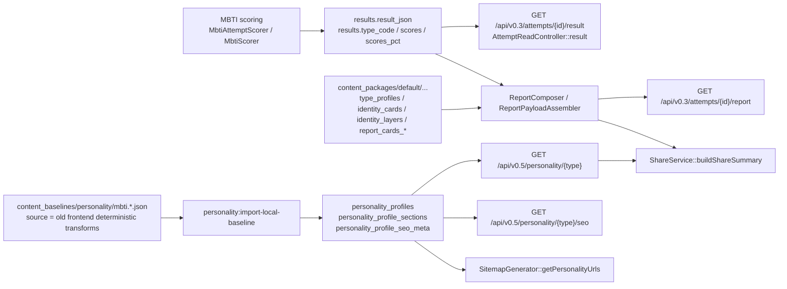

# MBTI 结果页文案现状审计（As-Is）

## 0. 审计边界

- 审计时间：2026-03-16
- 审计方式：只读扫描，不修改业务代码、测试、脚本和配置
- 说明：本仓库内未发现用户所说“附件”文件本体；以下“目标结构”判断，基于任务中明确点名的模块集合推断，包括 `lettersIntro`、`traitOverview.dimensions`、分层 `career/growth/relationships`、`premium teaser`、`share/seo/og` 同源化 等
- 结论先行：当前仓库存在两套并行但不一致的 MBTI 文案权威源
  - `v0.3 report`：以 `content_packages` 的 32 型内容包为权威，完整保留 `-A/-T`
  - `v0.5 personality/seo/sitemap`：以 `PersonalityProfile` CMS 为权威，当前只覆盖 16 个基础型
  - `share`：混合两者，并在 CMS fallback 处把 `-A/-T` 抹平成 4 字母基础型

## 1. 当前结果页文案来源总图

## 2. 所有结果页渲染入口

### 2.1 当前仓库内实际扫描到的入口

| 面 | 入口文件 | 作用 | 当前文案来源 | A/T |
| --- | --- | --- | --- | --- |
| 结果页结果接口 | `backend/app/Http/Controllers/API/V0_3/AttemptReadController.php` | `/api/v0.3/attempts/{id}/result` | `results.result_json` 原样返回，加上 `type_code/scores/scores_pct` 兼容字段 | 保留 |
| 报告接口 | `backend/app/Http/Controllers/API/V0_3/AttemptReadController.php` | `/api/v0.3/attempts/{id}/report` | `ReportComposer` 组装 `content_packages` 中的权威内容 | 保留 |
| 分享接口 | `backend/app/Services/V0_3/ShareService.php` | `/api/v0.3/attempts/{id}/share`、`/api/v0.3/shares/{id}` | `result_json` + `report` 快照 + `PersonalityProfile` fallback 混合 | 输出保留，fallback 丢失 |
| 公共人格页 API | `backend/app/Http/Controllers/API/V0_5/Cms/PersonalityController.php` | `/api/v0.5/personality/{type}` | `personality_profiles` + `personality_profile_sections` | 当前不支持变体 |
| SEO API | `backend/app/Http/Controllers/API/V0_5/Cms/PersonalityController.php` | `/api/v0.5/personality/{type}/seo` | `seo_meta` + `profile.title/excerpt/subtitle` fallback | 当前不支持变体 |
| sitemap | `backend/app/Services/SEO/SitemapGenerator.php` | 人格详情页与列表页 sitemap | `personality_profiles` 公共已发布记录 | 当前不支持变体 |
| 前端 sitemap | `fap-web/app/sitemap.ts` | Next sitemap 入口 | 目前返回空数组 | 无 |
| 前端 robots | `fap-web/app/robots.ts` | robots + sitemap 地址 | 静态配置 | 无 |

### 2.2 未扫描到的关键前端面

- 当前仓库快照内未发现真正的 React/Next 结果页路由、结果页组件、分享页组件、OG 动态图生成代码
- 任务要求扫描 `app/**`、`components/**`、`lib/**`、`content/**`、`tests/**`、`next-sitemap.config.js`
  - 本仓库根目录未发现这些前端目录对应的 MBTI 结果页实现
  - `next-sitemap.config.js` 未发现
- 这意味着：
  - 当前可确认的“结果页文案系统”主体实际在后端 API 与内容包/CMS
  - 前端真实渲染面大概率在未纳入本仓库的前端代码中，或尚未接入

## 3. 所有 share / seo / og / premium 相关入口

### 3.1 Share

- `backend/routes/api.php`
  - `GET|POST /api/v0.3/attempts/{id}/share`
  - `GET /api/v0.3/shares/{id}`
- `backend/app/Services/V0_3/ShareService.php`
  - `buildShareSummary()` 是当前分享文案汇总器
  - 文案来源优先级：
    - `result.result_json`
    - `report.profile`
    - `report.identity_card`
    - `report.layers.identity`
    - `public PersonalityProfile` fallback
  - 关键问题：`resolvePublicProfile()` 会调用 `baseTypeCode()`，通过正则去掉 `-A/-T`

### 3.2 SEO / OG / Metadata

- `backend/app/Services/Cms/PersonalityProfileSeoService.php`
  - `title`：`seo_title`，否则 `profile.title`
  - `description`：`seo_description`，否则 `excerpt`，否则 `subtitle`
  - `og/twitter`：分别 fallback 到 SEO 字段或 title/description
  - `jsonld`：基于 `type_code`、`scale_code`、canonical 生成
- `backend/app/Services/SEO/SitemapGenerator.php`
  - `getPersonalityUrls()` 只看 `personality_profiles` 中已发布且 indexable 的记录

### 3.3 Premium teaser

- `backend/app/Services/Report/ReportGatekeeperTeaserTrait.php`
  - 当前只有“对锁定 section 做 blur/truncate”的通用门控逻辑
  - 没有独立作者可维护的 `premium teaser` 字段族
- `backend/app/Services/Report/ReportGatekeeper.php`
  - 负责 `cta.visible`、`cta.kind` 等付费门控信号

## 4. 当前 simple version 断点列表

以下判定标准按用户要求写死。

| 判定项 | 当前证据 | 判定 |
| --- | --- | --- |
| 只有 1 段泛化 summary，缺少模块化结构 | `content_baselines/personality/mbti.*.json` 的 `core_snapshot`、`work_style`、`relationships` 多为单段文本；`v0.5 personality` 直接暴露这些 section | 命中 simple version |
| 没有 `lettersIntro` | `PersonalityProfileSection::SECTION_KEYS` 与 Filament `sectionDefinitions()` 均无该字段；`report` 也无标准同名模块 | 命中 |
| 没有 `traitOverview.dimensions` | 当前只有 `scores_pct`、`axis_states`，以及 share 里的简单 `dimensions[]` 数值摘要；没有统一的维度叙事结构 | 命中 |
| `career / growth / relationships` 只有短句，没有分层 blocks | `v0.5` 仅有 `career_fit` cards 与 `relationships` rich_text；`growth_edges` 仅 bullets。`v0.3 report` 虽有 cards，但未形成统一公共 schema | 命中 |
| premium teaser 缺失或只剩占位 | 当前只有 paywall blur，没有独立 teaser 文案承载位 | 命中 |
| `-A/-T` 被抹平为 4 字母基础类型 | `PersonalityProfile::TYPE_CODES` 仅 16 型；`PersonalityBaselineNormalizer` 只接受 16 型；`ShareService::baseTypeCode()` 会降级 | 命中 |
| SEO / OG / share 文案没有跟随主结果页结构升级 | SEO 走 CMS，share 走混合，report 走内容包，三者不同源 | 命中 |
| 前后端字段名不统一，存在本地 fallback 文案 | `result_json`、`report.profile`、`identity_card`、`PersonalityProfile`、`seo_meta` 命名各自为政，且 `content_baselines` 明确来自旧前端 transforms | 命中 |

## 5. 当前 authoritative source 判定

### 5.1 运行时 32 型结果/报告权威源

权威链路：

- `backend/app/Services/Score/MbtiAttemptScorer.php`
- `backend/app/Domain/Score/MbtiScorer.php`
- `backend/app/Services/Assessment/Drivers/MbtiDriver.php`
- `backend/app/Services/Report/Composer/ReportPayloadAssembler*.php`
- `content_packages/default/CN_MAINLAND/zh-CN/MBTI-CN-v0.3/`
  - `type_profiles.json`
  - `report_identity_cards.json`
  - `identity_layers.json`
  - `report_cards_traits.json`
  - `report_cards_career.json`
  - `report_cards_growth.json`
  - `report_cards_relationships.json`
  - `report_recommended_reads.json`

判定：

- 这是当前唯一真正支持 32 个 `type_code` 变体并保持 `-A/-T` 的完整文案系统
- 也是最接近“后端结果页生成规则”的现存权威实现

### 5.2 公共人格页 / SEO / sitemap 权威源

权威链路：

- `content_baselines/personality/mbti.en.json`
- `content_baselines/personality/mbti.zh-CN.json`
- `backend/app/Console/Commands/PersonalityImportLocalBaseline.php`
- `backend/app/PersonalityCms/Baseline/*`
- `personality_profiles` / `personality_profile_sections` / `personality_profile_seo_meta`

判定：

- 这是当前公共 `personality` 页面、SEO、OG、sitemap 的权威源
- 但它只覆盖 16 基础型，且源头明确写着来自旧前端 deterministic transforms，不是当前 report engine 的 32 型权威内容

### 5.3 share 权威源

判定：

- 当前没有单一权威源
- `share` 是一个混合拼装器
  - 结果数值与 `type_code` 来自 `Result`
  - 主标题/副标题/摘要来自 `report` 与 `PersonalityProfile` fallback 混合
  - CMS fallback 又会把 `-A/-T` 抹平
- 因此 share 目前不能被视作正式上线级的统一权威面

## 6. As-Is 总结

- 当前仓库不是“没有内容”，而是“有两套内容权威，各自覆盖不同 surface”
- `report` 已经不是简单版，但它没有沉淀成统一的、可供结果页/分享/SEO/OG 共用的结构化 schema
- `personality` / SEO / sitemap 仍是简单版体系，并且以 16 型为主
- 想让“结果页文案能正式上线”，核心不是前端润色，而是把公共人格页、share、SEO、OG、sitemap 与 `report` 的 32 型权威内容收口到一套可导入、可回放、可测试的后端 schema 与 serializer
