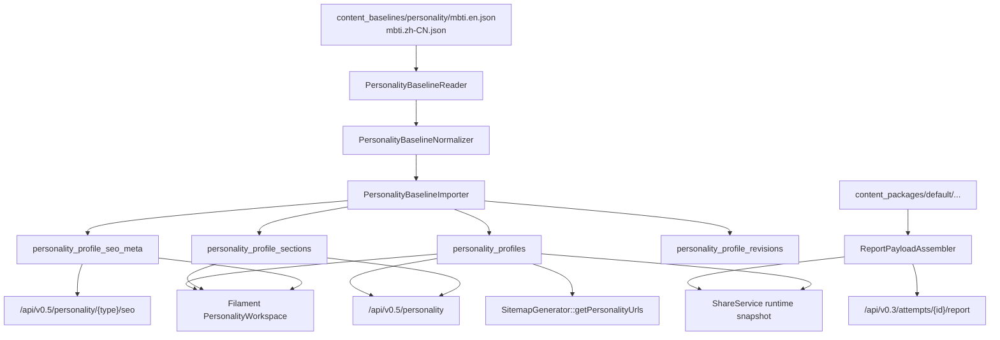

# MBTI 结果页文案后端权威映射（Backend Authority Map）

## 0. 结论

- 当前后端并不存在唯一的 MBTI 结果页文案权威面
- 实际上存在三条链路：
  - `results/result_json`：结果存储层，负责数值与基础结果，不是完整文案 authority
  - `v0.3 report`：32 型、带 `-A/-T`、内容包驱动的深度报告 authority
  - `v0.5 personality/seo/sitemap`：16 型、CMS/基线导入驱动的公共页面 authority

## 1. 后端结果页权威字段清单

| 字段族 | 当前权威来源 | 读取链路 | `-A/-T` | 备注 |
| --- | --- | --- | --- | --- |
| `type_code` | `results.type_code` | `AttemptReadController::result/report/share` | 保留 | runtime 真正的变体身份 |
| `scores_json` / `scores_pct` / `axis_states` | `results` 表 | `result`、`report`、`share` | 保留 | 5 轴，包含 `AT` |
| `report.profile.type_name/tagline/rarity/keywords/short_summary` | `content_packages/.../type_profiles.json` | `ReportPayloadAssembler` | 保留 | 32 型 |
| `report.identity_card.*` | `content_packages/.../report_identity_cards.json` | `ReportPayloadAssembler` | 保留 | 已有 `share_text`、视觉 token |
| `report.layers.identity.*` | `content_packages/.../identity_layers.json` + `IdentityLayerBuilder` | `ReportPayloadAssembler` | 保留 | 当前最接近结果页“人格介绍层” |
| `report.sections.traits/career/growth/relationships.cards[]` | `content_packages/.../report_cards_*.json` + 卡片选择器 | `ReportPayloadAssembler` | 保留 | 已是模块化 cards，但不是公共 API 标准 schema |
| `report.recommended_reads` | `content_packages/.../report_recommended_reads.json` | `ReportPayloadAssembler` | 保留 | 报告内扩展阅读 |
| `profile.title/subtitle/excerpt/...` | `personality_profiles` | `PersonalityController` / `SeoService` | 不保留 | 只支持 16 型 |
| `sections[]` | `personality_profile_sections` | `PersonalityController::show` | 不保留 | 泛化 section key |
| `seo_meta.*` | `personality_profile_seo_meta` | `PersonalityProfileSeoService` | 不保留 | 与 report 无直接耦合 |
| `share.title/subtitle/summary/tagline/tags` | `ShareService` 运行时拼装 | `ShareController` | 部分保留 | fallback 到 CMS 时丢失变体语义 |
| personality sitemap | `personality_profiles` | `SitemapGenerator::getPersonalityUrls()` | 不保留 | 只发 16 型公开页 |

## 2. `type code` 规范与 `-A/-T` 保留规则

### 2.1 当前 runtime 规范

实际 runtime 规范来自评分器，而不是 CMS：

- `backend/app/Services/Score/MbtiAttemptScorer.php`
- `backend/app/Domain/Score/MbtiScorer.php`

当前 runtime 产物是五轴结果：

- 基础四字母：`[EI][SN][TF][JP]`
- 变体后缀：`-A` 或 `-T`
- 规范格式：

```text
^[EI][SN][TF][JP]-(A|T)$
```

### 2.2 当前能保留 `-A/-T` 的链路

- `results.type_code`
- `result_json.type_code`
- `report` 内容包读取
- `identity_layers.json`、`type_profiles.json`、`report_identity_cards.json`
- `tests/Feature/Report/MbtiReportContentEnhancementContractTest.php`

### 2.3 当前会抹平 `-A/-T` 的链路

| 位置 | 行为 |
| --- | --- |
| `backend/app/Models/PersonalityProfile.php` | `TYPE_CODES` 只有 16 个基础型 |
| `backend/app/PersonalityCms/Baseline/PersonalityBaselineNormalizer.php` | 导入时只允许基础型 |
| `backend/app/Services/V0_3/ShareService.php` | `baseTypeCode()` 会去掉 `-A/-T` 再查公共 profile |
| `backend/app/Services/SEO/SitemapGenerator.php` | 只基于 `personality_profiles` 发 personality URL |
| `backend/app/Filament/Ops/Resources/PersonalityProfileResource/Support/PersonalityWorkspace.php` | V1 workspace 仍按基础型人格页组织 |

### 2.4 规范建议

正式上线时应写死以下规则：

- 主身份码：始终使用五轴完整码，例如 `ENFJ-T`
- 基础型：只作为派生字段 `base_type_code`
- `slug`：
  - 公共 URL 可继续保留基础型 `enfj`
  - 但数据层必须保留 `variant = T/A`
- fallback：
  - 可以从 `ENFJ-T` 回退到 `ENFJ`
  - 但只能作为“明确记录的降级策略”，不能把基础型当成主 source

## 3. `profile / sections / seo_meta` 实际来源

## 3.1 `report.profile`

来源：

- `content_packages/default/.../type_profiles.json`

字段：

- `type_code`
- `type_name`
- `tagline`
- `rarity`
- `keywords`
- `short_summary`

特点：

- 32 型完整
- 但字段仍偏“概览层”，不够承接附件式结构化结果页

## 3.2 `report.sections`

来源：

- `report_cards_traits.json`
- `report_cards_career.json`
- `report_cards_growth.json`
- `report_cards_relationships.json`
- `report_section_policies.json`

特点：

- 已有 cards、bullets、tips、module_code、access_level
- 更像“报告卡片引擎”
- 适合生成深度内容，不适合作为公共结果页统一 schema 直接透出

## 3.3 `PersonalityProfile.sections`

来源：

- `content_baselines/personality/mbti.*.json`
- `PersonalityBaselineImporter`

固定 key：

- `hero`
- `core_snapshot`
- `strengths`
- `growth_edges`
- `work_style`
- `relationships`
- `communication`
- `stress_and_recovery`
- `career_fit`
- `faq`
- `related_content`

特点：

- 泛化 CMS 结构
- 只能容纳“简单人格页”
- 没有 `lettersIntro`、`traitOverview`、`premium_teaser` 等目标模块

## 3.4 `seo_meta`

来源：

- `personality_profile_seo_meta`
- 由 `PersonalityProfileSeoService` 输出

特点：

- 当前是公共 personality 页的 SEO authority
- 但不是与 report 同源
- fallback 基于 `title/excerpt/subtitle`，无法表达更丰富的结果页结构升级

## 4. import / baseline / seed / workspace / public api 关系图



### 4.1 baseline 与 seed 的关系

- 当前人格页基线不是 seeder 驱动，而是命令导入：
  - `php artisan personality:import-local-baseline`
- `tests/Feature/PersonalityCms/PersonalityBaselineImportTest.php` 已验证：
  - dry-run
  - create
  - upsert
  - revision
- 但它验证的是 16 型 `v1` baseline，不是 32 型结果页 schema

### 4.2 workspace 与 public api 的关系

- Filament workspace 当前是 `PersonalityProfile` 的编辑壳
- `sectionDefinitions()` 直接定义了人格页可以编辑哪些 section
- public API 只是把 DB 中 profile/sections/seo_meta 原样序列化出去
- 这套壳目前还没有能力表达“附件级结构化结果页”

## 5. 当前 authority map 的关键断层

### 5.1 断层一：runtime 报告 authority 与 public profile authority 不同源

- 32 型权威内容在 `content_packages`
- 公共人格页 authority 在 `personality_profiles`
- 两者既不共 schema，也不共 import 来源

### 5.2 断层二：share 在两套 authority 中间拼装

- share 不是第三套正式内容源
- 它只是运行时聚合器
- 因此不应继续把 share 作为未来结果页/SEO 的来源

### 5.3 断层三：基础型 CMS 正在把变体人格压扁

- 这会直接影响：
  - 标题、副标题
  - summary
  - SEO title/description
  - sitemap URL 粒度
  - public profile 运营口径

## 6. Authority Map 结论

正式上线方案必须明确以下分工：

- `Result / report engine`
  - 继续负责 runtime 数值、5 轴、付费门控、深度 cards
- `Personality public authority`
  - 必须升级为 32 型、结构化结果页 schema 的公共权威读模型
- `share / seo / og / sitemap`
  - 必须统一改成消费同一套公共 authority serializer

如果不先做这一步收口，任何前端“接附件文案”的做法都会重新制造第三套 source of truth。
