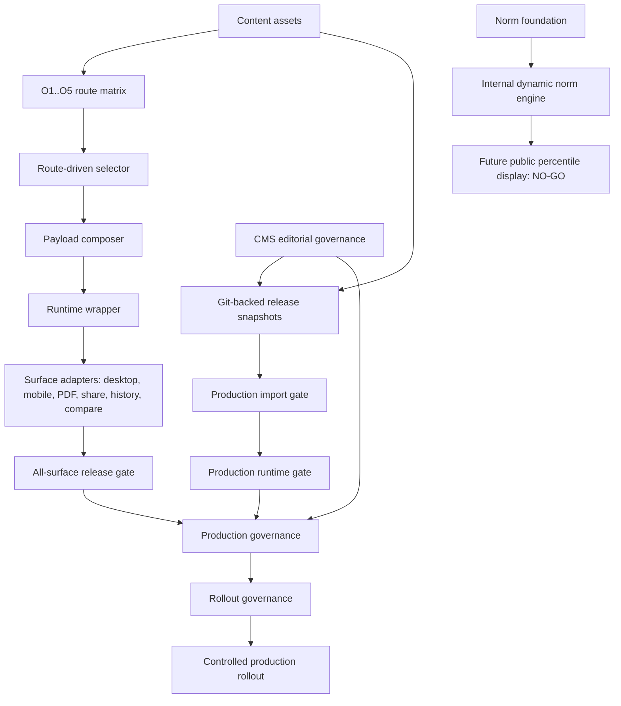

# Big Five V2 Platform Architecture & Governance Summary

Source repo: `/Users/rainie/Desktop/GitHub/fap-api`  
Source HEAD: `0814af350c5119994ff65fe7e965e68bc3decb35`  
Mode: scan + summarize  
Scope: documentation only, no repo changes

## 1. Executive Summary

Big Five V2 has completed its platform foundation. The current system includes:

- Runtime platform
- Route-driven selector/composer/runtime
- All-surface public pilot
- Production governance
- Rollout governance
- Dynamic norms foundation
- Dynamic norm engine, internal-only
- CMS/editorial governance

The architecture is now production-grade as a governed platform, but production rollout remains controlled and disabled by default. The repository contains production governance, release snapshots, import/runtime gates, all-surface gates, rollout gates, telemetry policy, alert/dashboard policy, rollback drills, approval/audit evidence, and dry-run go/no-go reports. This means the platform is ready to be operated through a controlled rollout process, not automatically launched.

Two strategic constraints remain explicit:

- `public percentile display = NO-GO`
- `production rollout = governance-ready but controlled`

The runtime source of truth is Git-backed release snapshots, validated through import gates and runtime gates. CMS is not a runtime owner. Dynamic norms are internally usable for snapshots, recomputation, segmented aggregation, drift monitoring, and internal percentile resolution, but public percentile claims remain blocked pending statistical trust and governance approval.

## 2. System Evolution Timeline

| Phase | Summary | Result |
|---|---|---|
| P0 staging import | Established staging-only Big Five V2 asset import handoff, source authority, module mapping, anti-target terms, validation checklists. | Staging content foundation established without runtime ownership. |
| O59 preview | Built canonical O59 core body preview, source trace, rendered preview QA, must-render and must-not-render contracts. | First canonical preview case became parseable, renderable, and QA-bound. |
| Selector consistency | Added asset loaders, selector-ready assets, registry asset resolver, selector asset contract/validator. | Assets became selectable through structured refs rather than raw body copy. |
| Golden Cases | Added route-driven golden fixtures across profile families and selector QA. | Regression coverage expanded beyond O59. |
| Pilot runtime | Added route-driven selector input builder, deterministic selector, payload composer, runtime wrapper, pilot access/runtime gates, observability. | Controlled pilot and public pilot surfaces could run fail-closed. |
| All-surface public pilot | Added adapters/contracts for desktop, mobile, PDF, share card, history, compare. | Public pilot readiness expanded across surfaces with rendered QA. |
| Production governance | Added production policy schema, immutable release snapshots, import gate, runtime gate, all-surface release gate, approval/audit evidence, dry-run go/no-go report. | Production governance layer completed without enabling rollout. |
| Rollout governance | Added production rollout policy, freeze controls, allowlist/percentage gate, telemetry, alerts/dashboard policy, rollback/kill-switch drills, real-user dry-run, rollout go/no-go. | Real rollout process became governed, observable, reversible, and disabled by default. |
| Norm foundation | Added norm eligibility, append-only observation schema, capture writer, anonymization/privacy layer, aggregation dry-run, feasibility report. | Norm data collection foundation completed without display. |
| Norm engine | Added immutable norm snapshots, recomputation engine, segmented aggregation, drift detection, internal percentile resolver, public percentile governance report. | Dynamic norm engine exists for internal use; public percentile remains NO-GO. |
| CMS governance | Added read-only asset index, draft/review/version model, RBAC/approval, preview system, release publish linkage, rollback/audit, Git-backed sync policy. | CMS became an editorial governance layer, not a runtime owner. |

## 3. Runtime Architecture

The Big Five V2 runtime architecture is route-driven and gate-controlled.

Main runtime components:

- `RouteMatrix`: parses O1..O5 sharded route matrices and resolves route rows.
- `Routing`: maps projection scores into route input and selector input.
- `Selector`: deterministic selector and coupling resolver produce selected asset refs only.
- `ContentAssets`: loads and validates Git-backed content asset packages.
- `Composer`: composes V2 payload from selected refs and resolved assets.
- `RuntimeWrapper`: attaches V2 payload only when gate conditions pass.
- `Surface adapters`: produce safe payloads for PDF, share, history, and compare.

The runtime does not let frontend synthesize Big Five V2 prose. Selector output is refs only. Body content comes from governed assets and content lookup, then passes payload validation. Invalid payloads fail closed and are omitted rather than exposed.

Production runtime is controlled by config and governance:

- `production_runtime_enabled` defaults false.
- `production_rollout_enabled` defaults false.
- `production_rollout_percentage` defaults 0.
- `production_rollout_max_percentage` defaults 0.
- Emergency disable and disabled release snapshot lists exist.

### Runtime Source Of Truth

Git-backed release snapshots are the runtime source of truth:

```text
Git-backed assets
→ release snapshot
→ import gate
→ runtime gate
→ rollout gate
→ controlled runtime exposure
```

CMS is not the runtime owner. CMS can prepare, review, approve, preview, export, and audit editorial work, but cannot directly mutate runtime payloads or publish to runtime.

## 4. Content Asset Architecture

The Big Five V2 content asset architecture is package-based, Git-backed, and QA-governed.

Major asset classes:

- Canonical core body assets, including O59 canonical.
- Canonical profile assets.
- Trait band assets.
- Facet assets.
- Coupling assets.
- Supplemental coupling assets.
- Scenario/action assets.
- Route matrix assets.
- Selector-ready assets.
- Governance packages.
- QA packages.

The B5-CONTENT train established the structured content foundation:

- Content factory specs define schema, mapping QA, safety boundary policy, ready-for-pilot templates, section standards, and generation/import rules.
- Master catalog packages track package inventory, dependency graph, readiness matrix, gap register, import priority, and next-batch planning.
- Route matrix packages define the 3,125 route combinations split by O1..O5 shards.
- Selector-ready assets provide normalized registry refs for runtime selection.

### Coupling Architecture

Coupling assets model cross-domain trait interactions. The deterministic selector resolves coupling candidates from route rows and selected slots. Supplemental coupling assets fill expanded coverage while preserving staging/governance flags and avoiding unsafe public claims.

### Scenario Architecture

Scenario/action assets encode domain-specific guidance contexts. These remain asset-backed and selector-routed, rather than generated by frontend fallback prose.

### Profile Architecture

Canonical profile assets and route-driven profile families support multiple Big Five signatures. The route matrix and golden cases verify that profile family selection remains consistent, source-backed, and safe for public rendering.

## 5. Route Matrix / Selector System

The route matrix is organized by O1..O5 shards and covers 3,125 score-band combinations. Runtime route input is derived from projected Big Five domain scores, band-mapped, then used to look up route rows.

Selector flow:

```text
projection scores
→ band mapping
→ route matrix lookup
→ selector input
→ deterministic selector
→ coupling resolver
→ selected asset refs
→ content lookup
→ composer
```

Key guarantees:

- Selector outputs refs only.
- Unknown route rows fail closed.
- Missing selected refs fail closed.
- Suppression is explicit and test-covered.
- Coupling resolution is allowlisted and registry-backed.
- Public payloads filter internal trace and runtime flags.
- Frontend fallback prose is rejected.

The selector is not a prose generator. It is a deterministic resolver from route context to asset references.

## 6. Governance Architecture

Production governance is layered around evidence, immutability, and fail-closed behavior.

Major governance packages:

- Production governance policy schema.
- Immutable release snapshot.
- Production import gate.
- Production runtime gate.
- All-surface release gate.
- Approval/audit evidence.
- Release evidence archive.
- Production dry-run go/no-go report.
- Public surface policy.

Core governance requirements:

- `production_use_allowed=false`
- `ready_for_production=false`
- `production_rollout_enabled=false`
- Release snapshots are immutable and reproducible.
- Import gate validates manifest, SHA256, snapshot, rendered QA, all-surface pass evidence, approval evidence, and production-use flags.
- Runtime gate requires approved release snapshot, import gate pass, explicit rollout config, rollback support, emergency disable, and fail-closed behavior.
- All-surface release gate validates desktop, mobile, PDF, share card, history, and compare.

Governance separates readiness from activation. The platform can be ready for controlled operation while production rollout remains disabled.

## 7. Rollout Governance

Rollout governance adds the controls required for real-user exposure without enabling it by default.

Implemented controls:

- Rollout policy and freeze controls.
- Allowlist-only rollout.
- Percentage rollout support.
- Tenant, locale, scale, and form scoping.
- Blast radius limits.
- Emergency disable.
- Rollout config validation.
- Structured rollout telemetry.
- Alerts and dashboard policy.
- Rollback and kill-switch drills.
- Real-user rollout dry-run.
- Production rollout go/no-go report.

Rollout remains default-off:

- `production_rollout_enabled=false`
- `rollout_allowed=false`
- `production_decision=NO_GO`
- Human production rollout approval is required.

The rollout layer is designed for controlled phases:

1. Keep disabled and review evidence.
2. Internal allowlist with zero percentage.
3. Invite-only tenant-scoped rollout.
4. Low-percentage ramp with blast radius limit.
5. Hold and review before broader rollout candidacy.

## 8. Dynamic Norms Foundation

Dynamic norms foundation supports future norm accumulation and internal analysis without public percentile display.

Foundation components:

- Norm eligibility policy.
- Append-only `BigFiveNormObservation` model/schema.
- Observation capture writer.
- Anonymization/privacy layer.
- DSAR/delete and retention policy framing.
- Small-cell suppression policy.
- Aggregation dry-run.
- Norm feasibility go/no-go report.

Key guarantees:

- Observations are append-only.
- Raw user identifiers are not exposed.
- Capture is eligibility-aware and fail-closed.
- Fixtures/staging/internal attempts can be excluded.
- Public percentile display remains disabled.
- No runtime percentile prose is generated.

## 9. Dynamic Norm Engine

The internal Dynamic Norm Engine now exists, but it is not publicly attached.

Internal engine components:

- Immutable norm snapshots.
- Snapshot lineage and rollback linkage.
- Norm recomputation engine.
- Internal percentile recomputation.
- Segmented aggregation by locale, region, age, gender, occupation.
- Minimum thresholds and sparse segment rejection.
- Drift detection and alerts.
- Rebuild evidence.
- Internal-only percentile resolver.
- Public percentile governance report.

The internal percentile resolver is fail-closed for:

- Stale snapshot.
- Sparse segment.
- Active drift alert.
- Missing snapshot lineage.
- Snapshot hash mismatch.
- Missing internal percentile data.

Public percentile display remains NO-GO because representative sample review, live drift history, public interpretation governance, threshold evidence, and explicit public display approval are still required.

## 10. CMS / Editorial Governance

CMS/editorial governance is complete as a governance layer, not as runtime ownership.

Implemented CMS governance:

- Read-only editorial asset index.
- Draft/review/version workflow.
- Editorial RBAC.
- Approval and rejection flow.
- Runtime-consistent preview service.
- Release publish linkage.
- Rollback/audit workflow.
- Git-backed synchronization policy.

CMS may manage:

- Editorial drafts.
- Review decisions.
- Approval audits.
- Preview requests.
- Release candidate exports.
- Rollback audits.

CMS must not manage:

- Runtime payload ownership.
- Release snapshot mutation.
- Import gate override.
- Runtime gate override.
- Scoring logic.
- Production rollout enablement.

The coexistence model is:

```text
CMS draft/review/export
→ Git-backed release candidate
→ immutable release snapshot
→ import gate
→ runtime gate
→ rollout gate
```

## 11. Surface Matrix

| Surface | Runtime Status | QA Status | Rollout Status | Governance Status |
|---|---|---|---|---|
| Desktop | Public pilot ready | Pass | Controlled, production disabled | All-surface gate pass |
| Mobile | Public pilot ready | Pass | Controlled, production disabled | All-surface gate pass |
| PDF | Adapter ready | Pass | Controlled, production disabled | All-surface gate pass |
| Share card | Adapter ready | Pass | Controlled, production disabled | All-surface gate pass |
| History | Adapter ready | Pass | Controlled, production disabled | All-surface gate pass |
| Compare | Adapter ready | Pass | Controlled, production disabled | All-surface gate pass |

Every surface has rendered QA, metadata leak checks, fail-closed coverage, must-render evidence, and must-not-render evidence in the all-surface gate package.

## 12. Current System Verdict

| Layer | Status |
|---|---|
| Runtime platform | GO |
| Production governance | GO |
| Rollout governance | GO, controlled |
| Dynamic norms foundation | GO |
| Dynamic norm engine | GO internal-only |
| CMS/editorial governance | GO |
| Public percentile display | NO-GO |
| Production rollout | Governance-ready, controlled NO-GO by default |

## 13. Remaining Open Items

Current open items are strategic and operational, not core platform foundation gaps:

- Public percentile display.
- Real production rollout scaling.
- Long-term norm accumulation.
- Future recommendation/reputation systems.

Public percentile display should remain blocked until minimum sample thresholds, segment stability, drift history, governance review, public copy review, and release approval are all satisfied.

Production rollout should remain controlled until an approved rollout window, operator assignments, incident ownership, allowlist scope, monitoring review, and rollback ownership are recorded.

## 14. Recommended Next Strategic Phase

Big Five V2 has moved from platform engineering into:

```text
operations + data governance phase
```

Recommended priorities:

- Controlled production rollout.
- Observation accumulation.
- Runtime telemetry observation.
- Percentile stability observation.
- Rollout incident rehearsal.
- Operator ownership and release calendar discipline.
- Ongoing all-surface rendered QA checks.

This phase should prioritize measured operational confidence over new platform surface area.

## 15. Dependency Graph



Core dependency rule:

```text
runtime
→ governance
→ rollout
→ norms
→ CMS coexistence
```

Operationally, CMS feeds release candidate work into Git-backed snapshots. Norms feed internal evidence and future percentile readiness. Neither CMS nor norms bypass runtime governance.

## 16. Hard Boundaries

Must not happen without a future explicit approval train:

- Enable public percentile display.
- Introduce fake percentile claims.
- Attach public norm engine to result runtime.
- Let CMS directly mutate runtime payloads.
- Let CMS bypass release snapshots/import gates/runtime gates.
- Enable production rollout automatically.
- Change scoring.
- Modify `BigFivePublicProjectionService`.
- Generate frontend Big Five V2 prose fallback.
- Expose internal metadata, selector basis, source reference, runtime use, production flags, review notes, QA notes, raw identifiers, or `[object Object]`.

## 17. Validation Commands

Backend:

```bash
cd /Users/rainie/Desktop/GitHub/fap-api/backend
php artisan route:list --no-ansi
php artisan migrate --pretend --no-ansi
php artisan test --filter=BigFiveResultPageV2 --no-ansi
php artisan test --filter=ProductionGovernance --no-ansi
git diff --check
```

Optional smoke:

```bash
curl -sS http://localhost:8000/api/v0.3/health
curl -sS http://localhost:8000/api/v0.3/flags
```

Frontend, if touched in a future phase:

```bash
cd /Users/rainie/Desktop/GitHub/fap-web
pnpm exec vitest run tests/contracts/*big5*rendered*.test.tsx
pnpm exec vitest run tests/contracts/*big5*pilot*.test.tsx
pnpm test:contract
pnpm typecheck
git diff --check
```

## 18. Final Strategic Verdict

Big Five V2 platform foundation is complete.

The runtime platform, content asset architecture, selector/composer/runtime flow, all-surface public pilot, production governance, rollout governance, dynamic norms foundation, internal dynamic norm engine, and CMS/editorial governance now form a coherent production-grade platform.

Public percentile display is still NO-GO.

Production rollout should remain controlled.

The next phase is operations plus data governance: controlled exposure, telemetry observation, incident readiness, observation accumulation, drift history, and percentile stability evidence.
