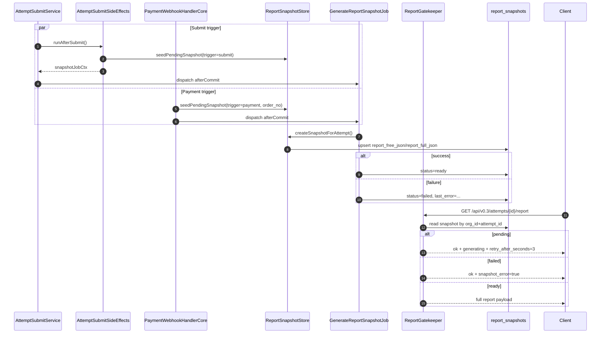

# Report Snapshot v2（异步快照生成与读取链路）

## 1. 真理源
- `app/Services/Report/ReportSnapshotStore.php`
- `app/Jobs/GenerateReportSnapshotJob.php`
- `app/Services/Attempts/AttemptSubmitSideEffects.php`
- `app/Internal/Commerce/PaymentWebhookHandlerCore.php`
- `app/Services/Report/ReportGatekeeper.php`

## 2. 数据结构与状态
- report_snapshots 核心字段
- status: pending|ready|failed
- last_error / report_free_json / report_full_json

字段真值（migration + model 对齐）：
- 主键语义：`attempt_id` 唯一（模型主键为 attempt_id，非自增）
- 关键列：
  - `org_id`, `attempt_id`, `order_no`
  - `scale_code`, `pack_id`, `dir_version`, `scoring_spec_version`
  - `report_engine_version`, `snapshot_version`
  - `report_json`, `report_free_json`, `report_full_json`
  - `status`（默认 ready，运行中会写 pending）
  - `last_error`, `created_at`, `updated_at`

## 3. 生成入口 A（submit 后）
- seedPendingSnapshot(trigger=submit)
- afterCommit dispatch GenerateReportSnapshotJob

代码链路：
1. `AttemptSubmitService::submit()` 事务成功后调用 `AttemptSubmitSideEffects::runAfterSubmit()`。
2. side effect 内执行 `ReportSnapshotStore::seedPendingSnapshot(org, attempt, null, meta)`。
3. 返回 `snapshotJobCtx` 后，`AttemptSubmitService` 调度 `GenerateReportSnapshotJob(...)->afterCommit()`。

## 4. 生成入口 B（payment webhook 后）
- report_unlock post-commit seedPendingSnapshot
- dispatch GenerateReportSnapshotJob(trigger=payment, order_no)

代码链路：
1. `PaymentWebhookHandlerCore::handle()` 完成订单推进与 post-commit side effects。
2. `runWebhookPostCommitSideEffects(kind=report_unlock)` 调用 `seedPendingSnapshot`。
3. 生成 `snapshot_job_ctx`，随后 dispatch `GenerateReportSnapshotJob(org, attempt, "payment", order_no)`。

## 5. Job 执行语义
- tries=3, backoff=[5,10,20]
- ready/failed 状态落库规则

执行细节：
- Job 仅处理 `report_snapshots` 中非 ready 记录。
- `ReportSnapshotStore::createSnapshotForAttempt()` 成功：更新 `status=ready, last_error=null`。
- 失败：更新 `status=failed`，`last_error` 截断写入（最多 1024 字符），并抛异常供队列重试。

## 6. 读取链路（ReportGatekeeper）
- paid/full 优先读 snapshot
- pending 返回 generating + retry_after_seconds=3
- failed 返回 snapshot_error=true

规则：
- 条件：`shouldUseSnapshot = hasFullAccess && modulesCoverOffered(...)`。
- `pending` 响应：`ok=true`，`meta.generating=true`，`meta.retry_after_seconds=3`。
- `failed` 响应：`ok=true`，`meta.snapshot_error=true`，`meta.retry_after_seconds=3`。
- `ready` 响应：优先 `report_full_json`，回退 `report_json`。

## 7. ReportLookup 关系澄清
- /api/v0.2/lookup/* 只做 attempt/order 定位并返回 report_api，不直接读 snapshot
- 真正消费 snapshot 的是 /api/v0.3/attempts/{id}/report（Gatekeeper）
- v0.2 legacy report 仍走 legacy report_jobs 链路（需显式标注）

补充说明：
- `LookupController` 的 `/lookup/ticket|device|order` 输出的是 `result_api/report_api` 定位信息。
- `GET /api/v0.2/attempts/{attemptId}/report` 由 `LegacyReportController` + `LegacyReportService` 处理，核心依赖 `report_jobs` 与 `GenerateReportJob`，不是 `report_snapshots`。

## 8. 存储真相
- Snapshot payload 存于 DB（report_snapshots JSON/text-json 列）
- 当前链路不把 snapshot payload 持久化到 S3

说明：
- 代码中仅出现 `DB::table('report_snapshots')` 的读写与 JSON encode/decode。
- 当前快照链路未实现“snapshot payload to object storage”步骤；S3 相关仅见于其他历史链路（如 legacy report cache 读写），不属于本链路。

## 9. Mermaid 时序图（必须）

