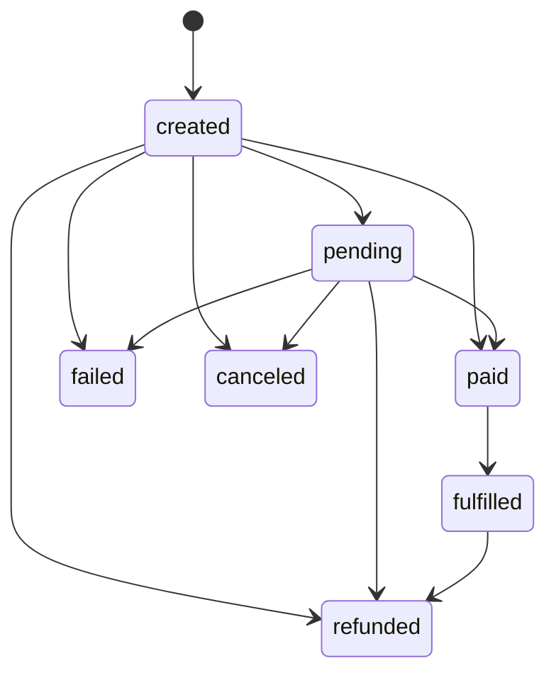

# 订单状态机（OrderManager 真值版）

## 1. 真理源
- `app/Services/Commerce/OrderManager.php`
- `app/Services/Commerce/Webhook/Order/OrderStateMachine.php`

## 2. 状态集合（当前有效）
`created, pending, paid, fulfilled, failed, canceled, refunded`

说明：`OrderManager::isTransitionAllowed()` 是唯一迁移真值。

## 3. allowTransition 真值矩阵
- `created -> pending|paid|failed|canceled|refunded`
- `pending -> paid|failed|canceled|refunded`
- `paid -> fulfilled`
- `fulfilled -> refunded`

未列出的迁移全部非法，返回 `ORDER_STATUS_INVALID`。

## 4. Webhook 推进规则
`OrderStateMachine::advance()` 规则：
- refund 事件: `-> refunded`
- 非 refund: `transitionToPaidAtomic -> fulfilled`

语义细节：
- `transitionToPaidAtomic` 先做有锁读取；若已 `paid|fulfilled`，返回 `already_paid=true` 幂等成功。
- 完成 paid 后再推进 fulfilled，支付成功与权益完成拆分为两步状态推进。

## 5. 并发与幂等
- lockForUpdate + compare-and-update
- ORDER_STATUS_CHANGED / ORDER_STATUS_INVALID 语义

实现细节：
- `transitionToPaidAtomic` 与 `transition` 都使用“where 当前状态”更新，防并发覆写。
- 并发竞争下若状态已被其他请求推进：
  - 若当前状态已达到目标（如已 paid/fulfilled），按幂等成功返回。
  - 否则返回 `ORDER_STATUS_CHANGED`。
- 非法迁移（不满足矩阵）返回 `ORDER_STATUS_INVALID`。

## 6. 历史误差纠正
- `gifted` 不是当前代码真值状态，标为 Deprecated Historical Note。
- 旧文档中的 `created -> gifted -> fulfilled` 不是现行状态机路径。

## 7. Mermaid 状态图（必须）

