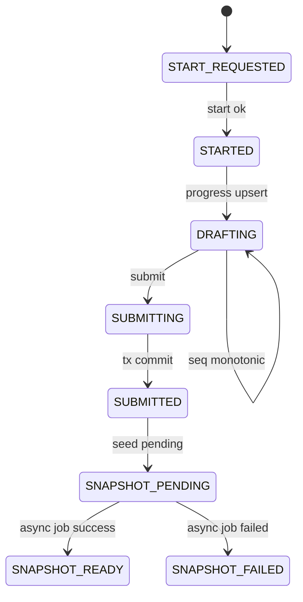
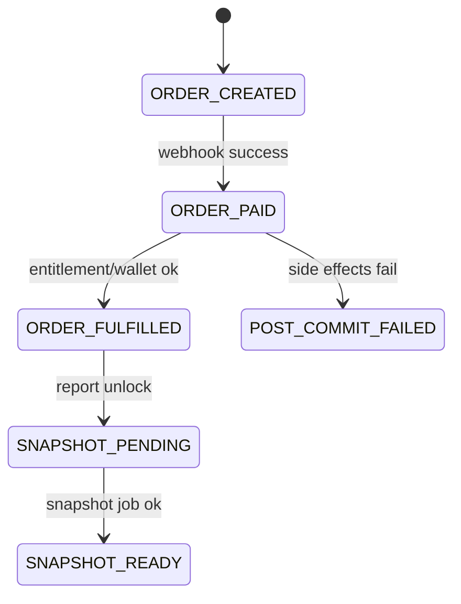
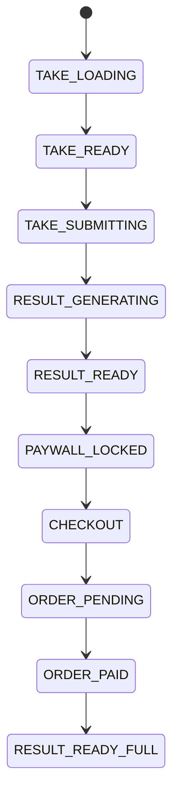

# FAP 双仓库深度研究主报告（超深版）

- 报告版本：v2.0（扩写版）
- 研究日期：2026-02-25（UTC+8）
- 研究对象：`/Users/rainie/Desktop/GitHub/fap-api` + `/Users/rainie/Desktop/GitHub/fap-web`
- 对标对象：Truity、16Personalities、123test
- 报告定位：长期稳定运营级（产品 + 工程 + 商业化 + 合规 + 增长）深度诊断与执行路线图
- 证据体系：P0（代码/脚本/命令/测试）> P1（仓库文档）> P2（外部公开资料）

---

## 0. 结论先行（给管理层与负责人先看）

### 0.1 一句话判断

FAP 当前已经不是“能跑起来”的测评项目，而是接近“可长期运营”的平台雏形：在身份注入、组织隔离、作答幂等、支付幂等、报告快照异步化、CI 主链门禁上具备明显工程化优势；真正的核心差距不在功能可用性，而在“规模化运营资产沉淀速度”与“契约治理系统化程度”。

### 0.2 经营视角判断

1. 从业务闭环看：`landing/test -> take -> submit -> result -> pay -> unlock -> report/pdf/share -> resend/lookup` 已形成闭环，且有真实验收脚本覆盖。
2. 从营收可靠性看：支付 Webhook 已实现“锁 + 事务 + 去重 + 状态机 + 后置履约 + 异步快照”链式防护，具备抗重复投递与抗乱序的基础能力。
3. 从技术债风险看：系统并非“代码少、能力弱”，而是“能力强、复杂度高”，复杂度主要集中在 `AttemptSubmitService`、`PaymentWebhookHandlerCore`、`ReportGatekeeper`、`SelfCheckContentEngineCore` 等超大文件与多代兼容路径并存。
4. 从战略短板看：公开方法学、品牌信任资产、SEO 工厂化、B2B 产品化、合规叙事外化，仍明显落后于 Truity / 16Personalities / 123test 的长期运营层级。

### 0.3 综合评分（100）

| 维度 | 权重 | 得分 | 核心判断 |
|---|---:|---:|---|
| 产品闭环与转化设计 | 20 | 16 | 闭环完整，跨量表一致性与漏斗精细化仍需增强 |
| 量表/内容与解释系统 | 20 | 17 | 内容包机制成熟，公开方法学资产不足 |
| 商业化与支付履约 | 15 | 13 | 幂等与履约较强，支付体验产品化可再提升 |
| 工程可靠性与可扩展性 | 20 | 18 | CI 主链扎实，复杂度与耦合需要持续治理 |
| 安全与合规 | 15 | 12 | 安全边界较好，外部合规页面/制度化仍有缺口 |
| 增长/SEO/留存运营 | 10 | 7 | 基建具备，规模化增长资产沉淀不足 |
| **总分** | **100** | **83** | **稳定运营雏形，距头部仍有 1~2 个阶段** |

### 0.4 关键建议总纲（执行导向）

1. 把“契约治理”提升到第一优先级：错误包统一、状态协议统一、shared schema 生成类型、route spec 自动导出。
2. 把“支付后履约可观测”提升到 SLO 级：checkout->paid->unlock->snapshot_ready 全链路可追踪、可报警、可复盘。
3. 把“复杂度治理”作为 180 天主线工程：拆分 webhook / submit 超大服务，建立边界测试与行为等价护栏。
4. 把“信任资产公开化”作为增长战略的先导：方法学页、限制声明、隐私与用途边界、可访问性声明、版本日志公开。
5. 把“增长工程化”从一次性动作升级为流水线：模板化 SEO、结构化数据、内容节奏、漏斗实验、留存触达。

---

## 1. 研究目标、边界与方法

### 1.1 研究目标

本次研究不是代码审美评审，也不是简单列问题，而是回答以下经营与工程联合问题：

1. 当前双仓库是否具备“长期稳定运营能力”。
2. 现有体系与 Truity/16Personalities/123test 的差距本质是什么。
3. 哪些改造项最具 ROI，如何按 90/180 天落地，如何验证是否真的提升。

### 1.2 研究边界

1. `fap-api/backend/*`：路由、中间件、控制器、服务、迁移、脚本、测试、配置、文档。
2. `fap-web/*`：页面路由、take/result/orders 主链、API 客户端、埋点、同意机制、发布脚本、测试。
3. 外部对标采用公开页面，不包含私有经营数据。

### 1.3 证据与结论规则

1. 高风险结论必须至少两条独立证据。
2. 涉及稳定性/安全/营收链路的结论必须可复现实验或命令。
3. 外部证据全部标注抓取日期（2026-02-25）。
4. 结论权重：P0 > P1 > P2；P2 仅作映射，不替代本地代码事实。

### 1.4 本轮关键命令实跑摘要（P0）

1. `php artisan route:list`：共 122 条路由，`/api/v0.3` 主业务，`/api/v0.4` 组织评估扩展，`/api/v0.2` 统一 410 退役兜底。
2. `php artisan migrate`：`Nothing to migrate`，当前迁移状态一致。
3. `bash scripts/ci_verify_mbti.sh`：完整通过（退出码 0），包含 DB 初始化、内容门禁、MBTI E2E、事件验收、迁移安全、webhook/attempt 回归门禁。
4. `pnpm test:contract`（fap-web）：12 tests 通过。
5. `pnpm test:a11y`（fap-web）：5 tests 通过。

---

## 2. 双仓库总体架构与协作模型

### 2.1 协作边界

根据 web 仓库文档，当前架构明确采用“前后端职责切分”模型：

1. `fap-web` 负责 SEO 页面渲染、内容展示、运营体验、路由编排、埋点采集入口。
2. `fap-api` 负责测评业务权威判定：出题、提交、评分、报告生成、支付履约、权益发放、事件入库。
3. 协作契约主干为 `/api/v0.3/*`。

这种切分是正确方向。风险点不在边界定义，而在“边界是否持续同步”：只要 API 契约与前端类型漂移，长期成本会指数化上升。

### 2.2 规模指标（2026-02-25 实测）

#### fap-api

1. `backend` 代码体量显著，服务域广：Assessment/Attempts/Commerce/Content/Report/Rules/Overrides 等并存。
2. migrations：147 个，说明演进频繁且长期维护。
3. 测试：285 个 php 测试文件，Feature 覆盖明显高于 Unit，符合业务平台项目特征。
4. 核心脚本：`ci_verify_mbti.sh`、`verify_mbti.sh`、`security_gate.sh`、大量 `prXX_verify` 验收脚本。

#### fap-web

1. `app` 页面与 `lib` 客户端并重，属于“运营站 + 应用站”混合形态。
2. tests 分层：`e2e` + `contracts` + `a11y`。
3. 前端大文件主要集中在 take/result 交互页和 API 契约文件，符合产品现状。

### 2.3 架构成熟度判断

成熟度不是由“是否微服务”决定，而由“关键风险是否可控”决定。以该标准评估，FAP 当前成熟度体现在：

1. 关键写入链路（submit/webhook）具备幂等与锁保护。
2. 关键读链路（report）具备门禁与异步快照状态机。
3. 关键运维链路具备 CI 主链与脚本化验收。
4. 关键产品链路具备前端降级与恢复策略。

不足在于：治理层（契约统一、复杂度拆分、公开信任资产）仍偏“项目驱动”，尚未完全制度化。

---

## 3. fap-api 深度解剖

## 3.1 路由与版本治理

`backend/routes/api.php` 是系统事实入口，呈现出三层版本策略：

1. `v0.2`：统一 `410 API_VERSION_DEPRECATED`。
2. `v0.3`：当前主业务域（attempts/orders/scales/shares/orgs/webhooks）。
3. `v0.4`：组织评估场景扩展（assessments）。

关键观察：

1. Webhook 被明确作为“公共入口”独立于 token/org context，避免误耦合导致支付回调不可达。
2. submit 路由强制走 `FmTokenAuth`，而 start/progress 在匿名链路可运行，符合漏斗设计。
3. org 管理能力放在 token+org context+role middleware 下，隔离策略明确。

风险与建议：

1. 路由定义清晰，但文档容易漂移；应强制 route spec 自动导出并 CI diff。
2. v0.3/v0.4 并行时，需要统一错误包与 request_id 约束，降低跨版本前端分支复杂度。

## 3.2 鉴权与上下文注入

### 3.2.1 FmTokenAuth 的安全增益

当前实现并非仅验证 token 字符串，而是执行完整注入链：

1. Bearer 格式 + `fm_uuid` 正则校验。
2. `token_hash` 查询优先，兼容 legacy `token` 并自动回填 hash。
3. revoked/expired 拒绝。
4. 注入 `fm_user_id` 和 `user_id`。
5. 注入后执行 `assertInjectedUserIdentity` 防回归。
6. 注入 `org_id/org_role/anon_id` 并绑定 `OrgContext`。

这条链路的工程价值在于：

1. 将“身份真相”从业务层上移到中间件层。
2. 把“错误身份”尽早拒绝，防止业务层出现隐式绕过。
3. 注入后一致性断言可有效阻断历史回归。

### 3.2.2 Optional Token 的产品价值

`FmTokenOptional` 允许匿名请求继续执行，但若带 token 则增强上下文，这对以下页面至关重要：

1. share 访问与点击上报。
2. 弱登录状态下的内容页行为统计。
3. 多来源流量下的渐进身份绑定。

### 3.2.3 ResolveOrgContext 的组织隔离价值

`ResolveOrgContext` 把 header/query/token/attr 的 org 解析统一化，关键好处：

1. 组织隔离逻辑集中，不分散到每个 controller。
2. 成员角色从 membership service 获取，避免前端自报角色。
3. admin/system 与 public/member 路径分离，便于做最小权限。

## 3.3 Attempt 生命周期（start/progress/submit）

### 3.3.1 Start：把业务风险前置

`AttemptStartService` 实际承担风控入口而非“建记录”动作：

1. rollout gate：支持按量表开关与灰度。
2. Big5 retake policy：冷却 + 30 天次数限制。
3. CLINICAL/SDS consent 版本哈希校验。
4. 解析 question_count、pack version、manifest hash 写入快照。
5. 自动创建 draft token（恢复能力）。
6. 记录事件与 telemetry。

这意味着“是否允许开始测评”已是运营策略控制点。

### 3.3.2 Progress：弱网与恢复设计

`AttemptProgressService` 体现了移动端友好度：

1. `attempt_drafts` + cache 双存储。
2. `seq` 防乱序。
3. owner/resume token 双重访问控制。
4. 过期返回 410 `RESUME_EXPIRED`。

建议：对 progress 还可补“冲突可视化指标”，例如 `seq_out_of_order_rate`。

### 3.3.3 Submit：核心复杂链路

`AttemptSubmitService` 当前是高风险复杂点，同时也是能力中枢：

1. ownership query + org scope。
2. consent on submit 二次校验（临床/抑郁量表）。
3. merge draft + request answers。
4. digest 幂等冲突处理：相同 digest 幂等、不同 digest 409。
5. transaction + `lockForUpdate`。
6. 评分、version snapshot、quality/norm snapshot 写入。
7. post-commit side effects。
8. `GenerateReportSnapshotJob->afterCommit()`。

评估：该服务将业务正确性托底做得较强，但维护成本偏高，建议 180 天内拆分成：

1. `SubmitOwnershipGuard`
2. `SubmitInputCanonicalizer`
3. `SubmitScoringOrchestrator`
4. `SubmitPersistenceTx`
5. `SubmitPostCommitDispatcher`

并以“行为等价测试 + contract golden”保障拆分安全。

## 3.4 报告门禁与异步快照

### 3.4.1 Gatekeeper 的平台价值

`ReportGatekeeper` 统一控制：

1. entitlement 判断。
2. `locked/free/full` 变体。
3. modules_allowed/offered/preview。
4. crisis 情况下 offers 清空（避免不当商业化）。
5. snapshot pending/failed/ready 状态转译给前端。

### 3.4.2 Snapshot 状态机

`ReportSnapshotStore` + `GenerateReportSnapshotJob` 实现：

1. `seed_pending`：支付后立即可见“生成中”状态。
2. `ready`：完整快照可读。
3. `failed`：保留 `last_error` + backoff 重试。

设计收益：

1. submit 和 webhook 写链路低延迟化。
2. report 读取链路更稳定。
3. 可用显式状态做前端友好提示。

建议增强：

1. 对外返回 `schema_version`、`generated_at`，强化前端缓存与兼容。
2. 给 `retry_after_seconds` 加统一语义约束文档。

## 3.5 商业化与支付履约

### 3.5.1 订单层

`OrderManager` 已具备：

1. provider scoped idempotency。
2. order status transition 原子化。
3. ownership read 防越权。
4. paid/fulfilled/refund 状态语义。

### 3.5.2 Webhook 层

`PaymentWebhookHandlerCore` 关键防护较完整：

1. `Cache::lock` 控并发。
2. 事务内 `insertOrIgnore` 事件去重。
3. `provider + provider_event_id` 唯一处理。
4. signature guard。
5. provider mismatch 拒绝。
6. paid/refund 路径分流。
7. report_unlock 时 owner/scale 校验后发放权益。
8. post-commit 事件、钱包、快照、PDF、通知。

风险与改造重点：

1. 文件超大，变更回归成本高。
2. 推荐按 `precheck -> order transition -> entitlement -> post-commit` 拆层。
3. 强化“重放仿真测试集”，覆盖乱序/重复/签名失败/跨 provider 冲突。

## 3.6 数据层与迁移演进

147 条迁移显示系统高速演化，优点是持续迭代，风险是迁移治理复杂。当前优点：

1. migration safety tests 较完善。
2. 具备 schema baseline verify。
3. 关键表索引与约束在持续补齐。

建议：

1. 建立迁移冷热分级与窗口制度。
2. 热表变更必须附性能回归证据。
3. 迁移审计看板化（失败率、回滚耗时、热点表冲击）。

## 3.7 测试与脚本体系

从仓库事实看，fap-api 并非“单测驱动”，而是“验收脚本 + feature 回归 + SRE gate”混合体系：

1. `ci_verify_mbti.sh` 作为主链。
2. `verify_mbti.sh` 作为链路验收。
3. payment/attempt/migration/security 多专项 gate。
4. test 目录覆盖 commerce/content/v0_3/v0_4/psychometrics。

优点：贴近业务真实风险；不足：脚本数量多、认知成本高。建议做脚本分层索引与统一入口。

---

## 4. fap-web 深度解剖

## 4.1 路由、中间件、noindex 策略

### 4.1.1 敏感页保护

`middleware.ts` 与 `next.config.mjs` 双重 noindex：

1. `/result`、`/orders`、`/share`、`/api`、`/og`、take 页均打 noindex。
2. 静态资源路径被排除，避免副作用。

这对长期 SEO 质量与隐私保护都非常关键。

### 4.1.2 匿名身份连续性

中间件将 `x-anon-id` 与 cookie 协调，显著提升：

1. 跨页面漏斗连续性。
2. 匿名到登录转换的可追踪性。
3. 后端 ownership 判定成功率。

## 4.2 API 客户端与错误模型

`lib/api-client.ts` 的优点：

1. timeout + AbortController。
2. locale 自动注入。
3. token 自动注入。
4. ApiError 结构化（status/errorCode/message/details/requestId）。

建议：

1. 与 API 错误 contract 完全对齐到 `code/message/details/request_id` 统一字段名。
2. 将 fallback error code 映射抽成共享常量，避免页面间偏差。

## 4.3 v0_3 契约层

`lib/api/v0_3.ts` 集中定义了 questions/start/submit/report/order/share 等类型与调用，属于“契约聚合层”。

优势：

1. 前端主链基本经过统一调用层。
2. `Idempotency-Key` 已在 checkout 入口支持。

不足：

1. 类型仍主要手写，易与后端漂移。
2. 报告状态字段在多页面消费时存在命名差异风险。

建议：

1. 从 OpenAPI/JSON Schema 生成 TS 类型。
2. 把 `pending/ready/failed/retry_after_seconds` 语义固化成单一枚举。

## 4.4 Take 页面工程质量

### 4.4.1 Big5TakeClient

能力点：

1. rollout 前置 gate。
2. 问题加载失败分类上报。
3. start 重试、429 处理。
4. submit 前缺题拦截。
5. submit 超时可重试。
6. 分阶段 loading overlay + 埋点。

这说明前端不是“提交按钮 + API 请求”粗糙实现，而是对弱网、异常和反馈节奏有细化设计。

### 4.4.2 ClinicalTakeClient

能力点：

1. consent snapshot 必须存在才能提交。
2. submit 成功后 session cache。
3. submit/start 错误分类上报 + Sentry。
4. submit overlay 相位埋点。

## 4.5 Result/Order 页面稳定性

### 4.5.1 ResultClient

1. `generating` 轮询与退避。
2. 报告加载失败上报与捕获。
3. checkout 入口带 idempotency key。
4. unlock 成功埋点与本地恢复。
5. 临床量表与一般量表分流渲染。

### 4.5.2 OrdersClient

1. backoff 轮询数组 + 总超时。
2. `paid` 自动跳转 result。
3. 失败/取消/退款分支明确。
4. 手动刷新与客服兜底。

## 4.6 Tracking 与 Consent 边界

`tracking/events.ts` + `/api/track` + `consent/store.ts` 组合具备以下优点：

1. event whitelist 控字段。
2. forbidden fragments 防敏感字段泄漏。
3. payload 大小限制与 eventName 校验。
4. consent 三态（unknown/granted/denied）本地持久化。

建议：

1. `denied` 时做更严格的“静默模式审计”，保证无旁路上报。
2. 将事件 schema lint 纳入 pre-merge gate。

## 4.7 发布治理

`release_gate.sh` + checklist + rollback smoke 构成制度化发布能力：

1. 禁止敏感文件/构建产物入库。
2. 发布前必须 contract + e2e + UAT。
3. 要求 10 分钟回滚演练。

这是“长期运营稳定性”的关键特征，明显优于多数中小测评站点。

---

## 5. 端到端链路与状态机

## 5.1 尝试生命周期状态机



关键防护点：

1. `seq` 防乱序。
2. submit digest 幂等。
3. snapshot 异步化。
4. report gatekeeper 对 pending/failed 的可解释状态反馈。

## 5.2 支付履约状态机



关键风险点：

1. `ORDER_PAID` 到 `SNAPSHOT_READY` 的时间窗口（用户感知最敏感）。
2. post-commit 失败处理与补偿机制。

建议 SLO：

1. `checkout_success -> paid` p95。
2. `paid -> unlock` p95。
3. `unlock -> snapshot_ready` p95。

## 5.3 前端体验状态机



建议：以状态机为中心统一文案、埋点和错误码映射，减少页面间行为漂移。

---

## 6. 内容包、量表引擎与报告体系

## 6.1 内容包机制

FAP 的核心竞争力之一是内容包（pack）机制，它将：

1. 题目。
2. 规则。
3. 报告模板。
4. 常模/质量策略。
5. SEO/landing 元信息。

统一纳入可版本化资产。

这使系统具备“多量表扩展”能力，而非仅 MBTI 单点实现。

## 6.2 常模与质量

从 Big5/SDS/EQ/Clinical 代码与测试可见，系统已经建立：

1. norm version snapshot。
2. quality level 输出。
3. crisis alert 与商业化隔离。

下一步建议：

1. 对外公开方法页：版本、样本、限制、更新日志。
2. 对内固化 psychometrics gate：上线前必须通过质量阈值。

## 6.3 报告生成

报告体系具备以下特性：

1. variant（free/full）分层。
2. modules 级别可控。
3. snapshot 缓存与异步生成。
4. PDF 交付链路。

建议增强：

1. `report schema_version` 强约束。
2. 生成时间与来源可追踪字段。
3. 解释文案版本号与效果反馈闭环。

---

## 7. 商业化能力评估

## 7.1 优势

1. 幂等化设计深入订单和 webhook 主链。
2. 订单 ownership 防越权。
3. entitlement 发放前做 owner 与量表匹配校验。
4. 退款反向处理链路存在测试覆盖。

## 7.2 关键短板

1. `Idempotency-Key` 未完全强制，仍存在边界重复请求风险。
2. 支付完成后用户感知路径（pending->ready）仍有优化空间。
3. 企业化商业能力尚未产品化（sandbox、developer docs、团队版方案）。

## 7.3 经营级建议

1. 必要强制：订单/checkout 必带 idempotency key。
2. 可观测优先：建立支付履约漏斗看板与阈值告警。
3. 转化提升：减少支付后等待焦虑（状态解释 + 主动通知 + 恢复入口）。

---

## 8. 稳定性、安全、合规与风控

## 8.1 稳定性

稳定性基础已较扎实：

1. healthz + 依赖状态。
2. queue runbook。
3. rollback smoke runbook。
4. CI 主链覆盖关键风险点。

建议增加：

1. SLO 明确化与错误预算制度。
2. 统一 incident 分级与复盘模板。

## 8.2 安全

现状优势：

1. token 注入防回归。
2. org isolation 中间件。
3. webhook signature + provider mismatch guard。
4. tracking 白名单 + payload 限制。

高风险项：

1. 巨型服务改动导致非预期权限/状态回归。
2. 事件字段扩展时的敏感信息泄露风险。

## 8.3 合规

当前代码侧已体现“临床场景谨慎商业化”意识，但外部合规资产仍需强化：

1. 非医疗、非招聘、非诊断边界声明需要网站公开统一。
2. 数据生命周期与删除请求应可审计化。
3. 可访问性声明建议补齐。

---

## 9. 可观测性、CI/CD 与运维机制

## 9.1 可观测性

API 文档已有 healthz、延迟、错误率、队列指标建议阈值。建议进一步经营化：

1. 业务指标和技术指标同屏。
2. 以 attempt/order 为主键串联日志、事件、告警。
3. 发布版本标记自动注入观测系统。

## 9.2 CI/CD

FAP 目前 CI 更像“业务回归流水线”而不仅是 lint/test：

1. 内容自检。
2. MBTI 主链验收。
3. 事件验收脚本。
4. migration safety。
5. webhook/attempt regression。

建议：

1. fast/slow 两级 pipeline，降低 PR 等待。
2. 对 flaky case 建立隔离清单与治理目标。

## 9.3 运维

已有 go-live checklist、queue runbook、rollback drill，说明团队已进入制度化运营阶段。下一步建议：

1. 建立值班轮值与月度演练 KPI。
2. 把“演练记录”纳入发布门禁证据。

---

## 10. 对标研究（Truity / 16Personalities / 123test）

> 抓取日期：2026-02-25（官方公开页面）

## 10.1 Truity

公开信号（官方页面）显示其长期运营特征：

1. TypeFinder 明确题量与耗时（约 130 题、约 15 分钟）。
2. 免费基础结果 + 付费深度报告的经典双层商业模型。
3. About 页面公开长期用户规模（百万级）。
4. 提供技术文档页面，公开方法与可靠性口径。
5. 提供 API 兴趣入口，体现 B2B 产品化意图。

对 FAP 启发：

1. 不只是“有报告”，而是“有公开可信方法学”。
2. 不只是“能卖”，而是“商业化规则与科学解释并存”。

## 10.2 16Personalities

公开信号：

1. 语言与地区覆盖广，全球化资产明显。
2. 条款中有用途边界（非医疗、非招聘决策）表达。
3. 隐私与可访问性政策结构完整。
4. 产品形态涵盖个人与团队方向。

对 FAP 启发：

1. 国际化不仅是翻译，而是政策、可访问性、用户边界的系统工程。
2. “信任页面”本身就是增长资产。

## 10.3 123test

公开信号：

1. 长期运营历史（早期成立 + 高完成量级）。
2. 多测评矩阵与免费入口。
3. 明确 B2B 能力（API/Online Assessment/White Label）。
4. 对测试边界与免责声明表达明确。

对 FAP 启发：

1. 规模化收入往往来自 B2C + B2B 双轮。
2. 多量表矩阵和稳定分发体系是持续增长关键。

## 10.4 对标差距总结

FAP 与头部差距的本质不是技术底盘，而是运营资产与公开信任系统：

1. 公开方法学资产不足。
2. 合规/用途边界页面体系不足。
3. SEO 与内容分发工厂化不足。
4. B2B 产品化与开发者入口不足。

---

## 11. 差距矩阵（能力-风险-投入-收益）

| 差距项 | 当前状态 | 风险等级 | 投入 | 收益 | 优先级 |
|---|---|---:|---:|---:|---:|
| API 错误包统一 | 局部统一 | 高 | 中 | 高 | P0 |
| 报告状态协议统一 | 前后端仍有差异 | 高 | 中 | 高 | P0 |
| checkout 强制幂等键 | 部分入口支持 | 高 | 低 | 高 | P0 |
| Webhook 核心拆分 | 巨型核心类 | 高 | 中高 | 高 | P0 |
| Submit 服务拆分 | 巨型服务 | 高 | 中高 | 高 | P0 |
| route spec 自动导出 | 缺系统化 | 中 | 低 | 高 | P1 |
| shared schema codegen | 缺 | 中 | 中 | 高 | P1 |
| 支付履约可观测看板 | 局部 | 中 | 中 | 高 | P1 |
| 方法学公开中心 | 缺 | 中 | 中 | 高 | P1 |
| 合规公开页面体系 | 部分 | 高 | 中 | 高 | P1 |
| SEO 工厂化模板 | 部分文档 | 中 | 中 | 中高 | P1 |
| B2B API 产品化 | 弱 | 中 | 中高 | 高 | P2 |

---

## 12. 改进清单（30+ 可执行项）

### 12.1 契约与类型（10 项）

1. 统一 API 错误包字段：`code/message/details/request_id`。
2. 对 `/api/v0.3` 全路由执行错误包一致性测试。
3. 报告状态字段统一：`pending/ready/failed/retry_after_seconds`。
4. 报告响应增加 `schema_version`。
5. 报告响应增加 `generated_at`。
6. orders/checkout 强制 `Idempotency-Key`。
7. webhook 事件标准字段统一：`provider_event_id/order_id/status/processed_at`。
8. route spec 自动导出并纳入 CI。
9. 从 schema 生成 TS 类型替换手写关键类型。
10. 前后端状态枚举单源化。

### 12.2 核心链路可靠性（8 项）

11. 拆分 `PaymentWebhookHandlerCore`。
12. 拆分 `AttemptSubmitService`。
13. 增加 webhook 重放/乱序仿真集。
14. 增加 submit 幂等冲突行为 golden tests。
15. 建立 `unlock->snapshot_ready` SLO 告警。
16. 把 post-commit failure 纳入重试补偿队列。
17. 把 snapshot failed 的用户提示标准化。
18. 加强 queue backlog 指标告警。

### 12.3 安全与合规（7 项）

19. tracking schema lint 阻断敏感字段。
20. 合规页面统一（用途边界/非医疗/非招聘）。
21. 数据删除请求全链路审计化。
22. 建立季度隐私与安全审计节奏。
23. 组织权限回归测试扩大到新增 API。
24. 统一 request_id 透传规范。
25. 可访问性声明页面上线并验收。

### 12.4 增长与运营（7 项）

26. 结构化数据模板化注入。
27. landing canonical/noindex 规则 CI 检测。
28. 漏斗看板（questions/start/submit/report/checkout/paid）。
29. 支付后恢复路径优化（邮件+订单页+结果页联动）。
30. 方法学公开中心上线。
31. 量表版本日志公开。
32. B2B landing + API sandbox + 询盘流程。

### 12.5 组织与流程（4 项）

33. 跨域 owner 机制（API/Web/Commerce/SRE）。
34. 月度回滚演练 KPI 化。
35. incident 复盘模板标准化。
36. 技术债账本 + 里程碑关闭机制。

---

## 13. 90/180 天路线图（摘要版）

### 13.1 90 天（稳态与契约）

目标：减少线上不确定性和联调摩擦。

1. 完成契约统一与 route spec gate。
2. 强制关键幂等键。
3. 上线支付履约链路看板。
4. 完成 webhook/submit 拆分第一阶段。
5. 发布最小合规公开页面。

### 13.2 180 天（增长与平台化）

目标：建立规模化增长与对外能力。

1. 方法学公开中心 + 版本日志。
2. SEO 工厂化 + 结构化数据流水线。
3. B2B landing + sandbox + 询盘闭环。
4. 国际化合规清单化。
5. 经营看板（业务+技术）统一。

---

## 14. KPI 与验收标准

## 14.1 技术 KPI

1. submit 失败率（按状态组）。
2. report generating 超时率。
3. unlock->snapshot_ready p95。
4. webhook 重复事件处理时延 p95。
5. 契约漂移缺陷/月。
6. CI 平均耗时与 flaky 率。

## 14.2 业务 KPI

1. 免费->付费转化。
2. 订单完成率。
3. 支付后流失率。
4. 自然流量（非品牌）增长。
5. 结果页二次访问与分享率。

## 14.3 验收命令（最小集）

```bash
cd /Users/rainie/Desktop/GitHub/fap-api/backend
php artisan route:list
php artisan migrate
bash scripts/ci_verify_mbti.sh

cd /Users/rainie/Desktop/GitHub/fap-web
pnpm test:contract
pnpm test:a11y
```

## 14.4 关键 curl 场景（可直接复现）

### 尝试开始

```bash
curl -X POST "http://127.0.0.1:1827/api/v0.3/attempts/start" \
  -H "Content-Type: application/json" \
  -H "X-FAP-Locale: zh-CN" \
  -H "X-Anon-Id: anon_demo_001" \
  -d '{
    "scale_code": "BIG5_OCEAN",
    "region": "CN_MAINLAND",
    "locale": "zh-CN",
    "client_platform": "web",
    "client_version": "report-v2",
    "channel": "web"
  }'
```

### 进度保存

```bash
curl -X PUT "http://127.0.0.1:1827/api/v0.3/attempts/{attempt_id}/progress" \
  -H "Content-Type: application/json" \
  -H "X-Anon-Id: anon_demo_001" \
  -d '{
    "seq": 1,
    "cursor": "q_10",
    "duration_ms": 120000,
    "answers": [
      {"question_id":"Q1","code":"A"},
      {"question_id":"Q2","code":"C"}
    ]
  }'
```

### 提交作答

```bash
curl -X POST "http://127.0.0.1:1827/api/v0.3/attempts/submit" \
  -H "Content-Type: application/json" \
  -H "Authorization: Bearer <FM_TOKEN>" \
  -H "X-Anon-Id: anon_demo_001" \
  -d '{
    "attempt_id": "{attempt_id}",
    "duration_ms": 300000,
    "answers": [
      {"question_id":"Q1","code":"A"},
      {"question_id":"Q2","code":"C"}
    ]
  }'
```

### 获取报告

```bash
curl "http://127.0.0.1:1827/api/v0.3/attempts/{attempt_id}/report" \
  -H "Authorization: Bearer <FM_TOKEN>" \
  -H "X-Anon-Id: anon_demo_001"
```

### 创建订单与查单

```bash
curl -X POST "http://127.0.0.1:1827/api/v0.3/orders/checkout" \
  -H "Content-Type: application/json" \
  -H "Authorization: Bearer <FM_TOKEN>" \
  -H "Idempotency-Key: chk_{attempt_id}_big5" \
  -H "X-Anon-Id: anon_demo_001" \
  -d '{"attempt_id":"{attempt_id}","sku":"BIG5_UNLOCK"}'

curl "http://127.0.0.1:1827/api/v0.3/orders/{order_no}" \
  -H "X-Anon-Id: anon_demo_001"
```

### Webhook 重放幂等验证

```bash
curl -X POST "http://127.0.0.1:1827/api/v0.3/webhooks/payment/stripe" \
  -H "Content-Type: application/json" \
  -d '{"provider_event_id":"evt_demo_001","order_no":"ord_demo_001","event_type":"payment_succeeded"}'

# 重放同一 provider_event_id
curl -X POST "http://127.0.0.1:1827/api/v0.3/webhooks/payment/stripe" \
  -H "Content-Type: application/json" \
  -d '{"provider_event_id":"evt_demo_001","order_no":"ord_demo_001","event_type":"payment_succeeded"}'
```

---

## 15. 关键风险总览（摘要）

> 详版见《风险登记册》独立文件。

1. 契约漂移风险：多版本与手写类型并存。
2. 超大服务风险：webhook/submit 复杂度高。
3. 履约感知风险：支付后 ready 延迟影响体验。
4. 合规叙事风险：外部边界说明不够体系化。
5. 增长资产风险：SEO 与方法学公开不足。

---

## 16. 最终判断

1. FAP 具备进入长期运营阶段的工程底盘。
2. 当前主要矛盾已从“功能可用”转向“治理与规模化”。
3. 若按本报告路线执行，6 个月内可显著缩小与头部平台在运营成熟度上的差距。
4. 若不做治理，复杂度将成为未来增长与稳定性的主要阻力。

---

## 17. 外部参考链接（抓取日期：2026-02-25）

### Truity

1. https://www.truity.com/test/type-finder-personality-test-new
2. https://www.truity.com/about-us
3. https://www.truity.com/page/technical-documentation
4. https://www.truity.com/test-api
5. https://www.truity.com/privacy-policy

### 16Personalities

1. https://www.16personalities.com/free-personality-test
2. https://www.16personalities.com/country-profiles
3. https://www.16personalities.com/terms
4. https://www.16personalities.com/terms/privacy
5. https://www.16personalities.com/accessibility-statement

### 123test

1. https://www.123test.com/about/
2. https://www.123test.com/personality-test/
3. https://www.123test.com/using-our-tests/
4. https://www.123test.com/disclaimer/


---

## 18. 附录A：API 路由全量盘点（122 条，P0）

以下清单用于契约治理与回归基线，来源：`php artisan route:list --json`。

| Method | URI | Name | Action |
|---|---|---|---|
|GET|HEAD|/||Closure|
|GET|HEAD|POST|PUT|PATCH|DELETE|OPTIONS|admin||Illuminate\Routing\RedirectController|
|GET|HEAD|admin/{path}||Closure|
|GET|HEAD|api/healthz|healthz|App\Http\Controllers\HealthzController@show|
|GET|HEAD|api/user||Closure|
|GET|HEAD|POST|PUT|PATCH|DELETE|OPTIONS|api/v0.2/{any?}||Closure|
|POST|api/v0.3/attempts/start||App\Http\Controllers\API\V0_3\AttemptWriteController@start|
|POST|api/v0.3/attempts/submit||App\Http\Controllers\API\V0_3\AttemptWriteController@submit|
|PUT|api/v0.3/attempts/{attempt_id}/progress||App\Http\Controllers\API\V0_3\AttemptProgressController@upsert|
|GET|HEAD|api/v0.3/attempts/{attempt_id}/progress||App\Http\Controllers\API\V0_3\AttemptProgressController@show|
|GET|HEAD|api/v0.3/attempts/{id}|api.v0_3.attempts.show|App\Http\Controllers\API\V0_3\AttemptReadController@show|
|GET|HEAD|api/v0.3/attempts/{id}/report|api.v0_3.attempts.report|App\Http\Controllers\API\V0_3\AttemptReadController@report|
|GET|HEAD|api/v0.3/attempts/{id}/report.pdf|api.v0_3.attempts.report_pdf|App\Http\Controllers\API\V0_3\AttemptReadController@reportPdf|
|GET|HEAD|api/v0.3/attempts/{id}/result|api.v0_3.attempts.result|App\Http\Controllers\API\V0_3\AttemptReadController@result|
|GET|HEAD|api/v0.3/attempts/{id}/share||App\Http\Controllers\API\V0_3\ShareController@getShare|
|POST|api/v0.3/auth/phone/send_code||App\Http\Controllers\API\V0_3\AuthPhoneController@sendCode|
|POST|api/v0.3/auth/phone/verify||App\Http\Controllers\API\V0_3\AuthPhoneController@verify|
|POST|api/v0.3/auth/wx_phone||App\Http\Controllers\API\V0_3\AuthWxPhoneController|
|GET|HEAD|api/v0.3/boot||App\Http\Controllers\API\V0_3\BootController@show|
|GET|HEAD|api/v0.3/claim/report||App\Http\Controllers\API\V0_3\ClaimController@report|
|GET|HEAD|api/v0.3/experiments||App\Http\Controllers\API\V0_3\BootController@experiments|
|GET|HEAD|api/v0.3/flags||App\Http\Controllers\API\V0_3\BootController@flags|
|GET|HEAD|api/v0.3/me/attempts||App\Http\Controllers\API\V0_3\MeController@attempts|
|POST|api/v0.3/orders||App\Http\Controllers\API\V0_3\CommerceController@createOrder|
|POST|api/v0.3/orders/checkout||App\Http\Controllers\API\V0_3\CommerceController@checkout|
|POST|api/v0.3/orders/lookup||App\Http\Controllers\API\V0_3\CommerceController@lookup|
|POST|api/v0.3/orders/stub||Closure|
|GET|HEAD|api/v0.3/orders/{order_no}||App\Http\Controllers\API\V0_3\CommerceController@getOrder|
|POST|api/v0.3/orders/{order_no}/resend||App\Http\Controllers\API\V0_3\CommerceController@resend|
|POST|api/v0.3/orders/{provider}||App\Http\Controllers\API\V0_3\CommerceController@createOrder|
|POST|api/v0.3/orgs||App\Http\Controllers\API\V0_3\OrgsController@store|
|POST|api/v0.3/orgs/invites/accept||App\Http\Controllers\API\V0_3\OrgInvitesController@accept|
|GET|HEAD|api/v0.3/orgs/me||App\Http\Controllers\API\V0_3\OrgsController@me|
|GET|HEAD|api/v0.3/orgs/{org_id}/big5/audits||App\Http\Controllers\API\V0_3\BigFiveOpsController@audits|
|GET|HEAD|api/v0.3/orgs/{org_id}/big5/audits/{audit_id}||App\Http\Controllers\API\V0_3\BigFiveOpsController@audit|
|POST|api/v0.3/orgs/{org_id}/big5/norms/activate||App\Http\Controllers\API\V0_3\BigFiveOpsController@activateNorms|
|POST|api/v0.3/orgs/{org_id}/big5/norms/drift-check||App\Http\Controllers\API\V0_3\BigFiveOpsController@driftCheckNorms|
|POST|api/v0.3/orgs/{org_id}/big5/norms/rebuild||App\Http\Controllers\API\V0_3\BigFiveOpsController@rebuildNorms|
|GET|HEAD|api/v0.3/orgs/{org_id}/big5/releases||App\Http\Controllers\API\V0_3\BigFiveOpsController@releases|
|GET|HEAD|api/v0.3/orgs/{org_id}/big5/releases/latest||App\Http\Controllers\API\V0_3\BigFiveOpsController@latest|
|GET|HEAD|api/v0.3/orgs/{org_id}/big5/releases/latest/audits||App\Http\Controllers\API\V0_3\BigFiveOpsController@latestAudits|
|POST|api/v0.3/orgs/{org_id}/big5/releases/publish||App\Http\Controllers\API\V0_3\BigFiveOpsController@publish|
|POST|api/v0.3/orgs/{org_id}/big5/releases/rollback||App\Http\Controllers\API\V0_3\BigFiveOpsController@rollback|
|GET|HEAD|api/v0.3/orgs/{org_id}/big5/releases/{release_id}||App\Http\Controllers\API\V0_3\BigFiveOpsController@release|
|POST|api/v0.3/orgs/{org_id}/invites||App\Http\Controllers\API\V0_3\OrgInvitesController@store|
|GET|HEAD|api/v0.3/orgs/{org_id}/wallets||App\Http\Controllers\API\V0_3\OrgWalletController@wallets|
|GET|HEAD|api/v0.3/orgs/{org_id}/wallets/{benefit_code}/ledger||App\Http\Controllers\API\V0_3\OrgWalletController@ledger|
|GET|HEAD|api/v0.3/scales||App\Http\Controllers\API\V0_3\ScalesController@index|
|GET|HEAD|api/v0.3/scales/lookup||App\Http\Controllers\API\V0_3\ScalesLookupController@lookup|
|GET|HEAD|api/v0.3/scales/sitemap-source||App\Http\Controllers\API\V0_3\ScalesSitemapSourceController@index|
|GET|HEAD|api/v0.3/scales/{scale_code}||App\Http\Controllers\API\V0_3\ScalesController@show|
|GET|HEAD|api/v0.3/scales/{scale_code}/questions||App\Http\Controllers\API\V0_3\ScalesController@questions|
|GET|HEAD|api/v0.3/shares/{id}||App\Http\Controllers\API\V0_3\ShareController@getShareView|
|POST|api/v0.3/shares/{shareId}/click||App\Http\Controllers\API\V0_3\ShareController@click|
|GET|HEAD|api/v0.3/skus|api.v0_3.skus|App\Http\Controllers\API\V0_3\CommerceController@listSkus|
|POST|api/v0.3/webhooks/payment/{provider}|api.v0_3.webhooks.payment|App\Http\Controllers\API\V0_3\Webhooks\PaymentWebhookController@handle|
|GET|HEAD|api/v0.4/boot||App\Http\Controllers\API\V0_4\BootController@show|
|POST|api/v0.4/orgs/{org_id}/assessments||App\Http\Controllers\API\V0_4\AssessmentController@store|
|POST|api/v0.4/orgs/{org_id}/assessments/{id}/invite||App\Http\Controllers\API\V0_4\AssessmentController@invite|
|GET|HEAD|api/v0.4/orgs/{org_id}/assessments/{id}/progress||App\Http\Controllers\API\V0_4\AssessmentController@progress|
|GET|HEAD|api/v0.4/orgs/{org_id}/assessments/{id}/summary||App\Http\Controllers\API\V0_4\AssessmentController@summary|
|GET|HEAD|filament/exports/{export}/download|filament.exports.download|Filament\Actions\Exports\Http\Controllers\DownloadExport|
|GET|HEAD|filament/imports/{import}/failed-rows/download|filament.imports.failed-rows.download|Filament\Actions\Imports\Http\Controllers\DownloadImportFailureCsv|
|GET|HEAD|livewire/livewire.js||Livewire\Mechanisms\FrontendAssets\FrontendAssets@returnJavaScriptAsFile|
|GET|HEAD|livewire/livewire.min.js.map||Livewire\Mechanisms\FrontendAssets\FrontendAssets@maps|
|GET|HEAD|livewire/preview-file/{filename}|livewire.preview-file|Livewire\Features\SupportFileUploads\FilePreviewController@handle|
|POST|livewire/update|livewire.update|Livewire\Mechanisms\HandleRequests\HandleRequests@handleUpdate|
|POST|livewire/upload-file|livewire.upload-file|Livewire\Features\SupportFileUploads\FileUploadController@handle|
|GET|HEAD|ops|filament.ops.pages.dashboard|App\Filament\Ops\Pages\OpsDashboard|
|GET|HEAD|ops/admin-approvals|filament.ops.resources.admin-approvals.index|App\Filament\Ops\Resources\AdminApprovalResource\Pages\ListAdminApprovals|
|GET|HEAD|ops/admin-approvals/{record}|filament.ops.resources.admin-approvals.view|App\Filament\Ops\Resources\AdminApprovalResource\Pages\ViewAdminApproval|
|GET|HEAD|ops/admin-users|filament.ops.resources.admin-users.index|App\Filament\Ops\Resources\AdminUserResource\Pages\ListAdminUsers|
|GET|HEAD|ops/admin-users/create|filament.ops.resources.admin-users.create|App\Filament\Ops\Resources\AdminUserResource\Pages\CreateAdminUser|
|GET|HEAD|ops/admin-users/{record}/edit|filament.ops.resources.admin-users.edit|App\Filament\Ops\Resources\AdminUserResource\Pages\EditAdminUser|
|GET|HEAD|ops/audit-logs|filament.ops.resources.audit-logs.index|App\Filament\Ops\Resources\AuditLogResource\Pages\ListAuditLogs|
|GET|HEAD|ops/benefit-grants|filament.ops.resources.benefit-grants.index|App\Filament\Ops\Resources\BenefitGrantResource\Pages\ListBenefitGrants|
|GET|HEAD|ops/benefit-grants/{record}|filament.ops.resources.benefit-grants.view|App\Filament\Ops\Resources\BenefitGrantResource\Pages\ViewBenefitGrant|
|GET|HEAD|ops/content-pack-releases|filament.ops.resources.content-pack-releases.index|App\Filament\Ops\Resources\ContentPackReleaseResource\Pages\ListContentPackReleases|
|GET|HEAD|ops/content-pack-releases/{record}|filament.ops.resources.content-pack-releases.view|App\Filament\Ops\Resources\ContentPackReleaseResource\Pages\ViewContentPackRelease|
|GET|HEAD|ops/content-pack-versions|filament.ops.resources.content-pack-versions.index|App\Filament\Ops\Resources\ContentPackVersionResource\Pages\ListContentPackVersions|
|GET|HEAD|ops/content-pack-versions/create|filament.ops.resources.content-pack-versions.create|App\Filament\Ops\Resources\ContentPackVersionResource\Pages\CreateContentPackVersion|
|GET|HEAD|ops/content-pack-versions/{record}/edit|filament.ops.resources.content-pack-versions.edit|App\Filament\Ops\Resources\ContentPackVersionResource\Pages\EditContentPackVersion|
|GET|HEAD|ops/content-releases|filament.ops.resources.content-releases.index|App\Filament\Ops\Resources\ContentPackReleaseResource\Pages\ListContentPackReleases|
|GET|HEAD|ops/content-releases/{record}|filament.ops.resources.content-releases.view|App\Filament\Ops\Resources\ContentPackReleaseResource\Pages\ViewContentPackRelease|
|GET|HEAD|ops/delivery-tools|filament.ops.pages.delivery-tools|App\Filament\Ops\Pages\DeliveryTools|
|GET|HEAD|ops/deploys|filament.ops.resources.deploys.index|App\Filament\Ops\Resources\DeployResource\Pages\ListDeployEvents|
|GET|HEAD|ops/global-search|filament.ops.pages.global-search|App\Filament\Ops\Pages\GlobalSearchPage|
|GET|HEAD|ops/go-live-gate|filament.ops.pages.go-live-gate|App\Filament\Ops\Pages\GoLiveGatePage|
|GET|HEAD|ops/health-checks|filament.ops.pages.health-checks|App\Filament\Ops\Pages\HealthChecks|
|GET|HEAD|ops/login|filament.ops.auth.login|Filament\Pages\Auth\Login|
|POST|ops/logout|filament.ops.auth.logout|Filament\Http\Controllers\Auth\LogoutController|
|GET|HEAD|ops/order-lookup|filament.ops.pages.order-lookup|App\Filament\Ops\Pages\OrderLookup|
|GET|HEAD|ops/orders|filament.ops.resources.orders.index|App\Filament\Ops\Resources\OrderResource\Pages\ListOrders|
|GET|HEAD|ops/orders/{record}|filament.ops.resources.orders.view|App\Filament\Ops\Resources\OrderResource\Pages\ViewOrder|
|GET|HEAD|ops/organizations|filament.ops.resources.organizations.index|App\Filament\Ops\Resources\OrganizationResource\Pages\ListOrganizations|
|GET|HEAD|ops/organizations-import|filament.ops.pages.organizations-import|App\Filament\Ops\Pages\OrganizationsImportPage|
|GET|HEAD|ops/organizations/create|filament.ops.resources.organizations.create|App\Filament\Ops\Resources\OrganizationResource\Pages\CreateOrganization|
|GET|HEAD|ops/organizations/{record}/edit|filament.ops.resources.organizations.edit|App\Filament\Ops\Resources\OrganizationResource\Pages\EditOrganization|
|GET|HEAD|ops/payment-events|filament.ops.resources.payment-events.index|App\Filament\Ops\Resources\PaymentEventResource\Pages\ListPaymentEvents|
|GET|HEAD|ops/payment-events/{record}|filament.ops.resources.payment-events.view|App\Filament\Ops\Resources\PaymentEventResource\Pages\ViewPaymentEvent|
|GET|HEAD|ops/permissions|filament.ops.resources.permissions.index|App\Filament\Ops\Resources\PermissionResource\Pages\ListPermissions|
|GET|HEAD|ops/permissions/create|filament.ops.resources.permissions.create|App\Filament\Ops\Resources\PermissionResource\Pages\CreatePermission|
|GET|HEAD|ops/permissions/{record}/edit|filament.ops.resources.permissions.edit|App\Filament\Ops\Resources\PermissionResource\Pages\EditPermission|
|GET|HEAD|ops/queue-monitor|filament.ops.pages.queue-monitor|App\Filament\Ops\Pages\QueueMonitor|
|GET|HEAD|ops/roles|filament.ops.resources.roles.index|App\Filament\Ops\Resources\RoleResource\Pages\ListRoles|
|GET|HEAD|ops/roles/create|filament.ops.resources.roles.create|App\Filament\Ops\Resources\RoleResource\Pages\CreateRole|
|GET|HEAD|ops/roles/{record}/edit|filament.ops.resources.roles.edit|App\Filament\Ops\Resources\RoleResource\Pages\EditRole|
|GET|HEAD|ops/scale-registries|filament.ops.resources.scale-registries.index|App\Filament\Ops\Resources\ScaleRegistryResource\Pages\ListScaleRegistries|
|GET|HEAD|ops/scale-registries/create|filament.ops.resources.scale-registries.create|App\Filament\Ops\Resources\ScaleRegistryResource\Pages\CreateScaleRegistry|
|GET|HEAD|ops/scale-registries/{record}/edit|filament.ops.resources.scale-registries.edit|App\Filament\Ops\Resources\ScaleRegistryResource\Pages\EditScaleRegistry|
|GET|HEAD|ops/scale-slugs|filament.ops.resources.scale-slugs.index|App\Filament\Ops\Resources\ScaleSlugResource\Pages\ListScaleSlugs|
|GET|HEAD|ops/scale-slugs/create|filament.ops.resources.scale-slugs.create|App\Filament\Ops\Resources\ScaleSlugResource\Pages\CreateScaleSlug|
|GET|HEAD|ops/scale-slugs/{record}/edit|filament.ops.resources.scale-slugs.edit|App\Filament\Ops\Resources\ScaleSlugResource\Pages\EditScaleSlug|
|GET|HEAD|ops/secure-link|filament.ops.pages.secure-link|App\Filament\Ops\Pages\SecureLink|
|GET|HEAD|ops/select-org|filament.ops.pages.select-org|App\Filament\Ops\Pages\SelectOrgPage|
|GET|HEAD|ops/skus|filament.ops.resources.skus.index|App\Filament\Ops\Resources\SkuResource\Pages\ListSkus|
|GET|HEAD|ops/two-factor-challenge|filament.ops.pages.two-factor-challenge|App\Filament\Ops\Pages\TwoFactorChallenge|
|GET|HEAD|ops/webhook-monitor|filament.ops.pages.webhook-monitor|App\Filament\Ops\Pages\WebhookMonitor|
|GET|HEAD|sitemap.xml||App\Http\Controllers\SitemapController@index|
|GET|HEAD|storage/{path}|storage.local|Closure|
|GET|HEAD|tenant||Closure|
|GET|HEAD|up||Closure|

### 18.1 路由统计摘要

```text
total_routes=122
method=GET|HEAD, count=93
method=GET|HEAD|POST|PUT|PATCH|DELETE|OPTIONS, count=2
method=POST, count=26
method=PUT, count=1
```

### 18.2 v0.3 / v0.4 / v0.2 明细（关键演进证据）

```text
[v0.3]
POST	api/v0.3/attempts/start	App\Http\Controllers\API\V0_3\AttemptWriteController@start
POST	api/v0.3/attempts/submit	App\Http\Controllers\API\V0_3\AttemptWriteController@submit
PUT	api/v0.3/attempts/{attempt_id}/progress	App\Http\Controllers\API\V0_3\AttemptProgressController@upsert
GET|HEAD	api/v0.3/attempts/{attempt_id}/progress	App\Http\Controllers\API\V0_3\AttemptProgressController@show
GET|HEAD	api/v0.3/attempts/{id}	App\Http\Controllers\API\V0_3\AttemptReadController@show
GET|HEAD	api/v0.3/attempts/{id}/report	App\Http\Controllers\API\V0_3\AttemptReadController@report
GET|HEAD	api/v0.3/attempts/{id}/report.pdf	App\Http\Controllers\API\V0_3\AttemptReadController@reportPdf
GET|HEAD	api/v0.3/attempts/{id}/result	App\Http\Controllers\API\V0_3\AttemptReadController@result
GET|HEAD	api/v0.3/attempts/{id}/share	App\Http\Controllers\API\V0_3\ShareController@getShare
POST	api/v0.3/auth/phone/send_code	App\Http\Controllers\API\V0_3\AuthPhoneController@sendCode
POST	api/v0.3/auth/phone/verify	App\Http\Controllers\API\V0_3\AuthPhoneController@verify
POST	api/v0.3/auth/wx_phone	App\Http\Controllers\API\V0_3\AuthWxPhoneController
GET|HEAD	api/v0.3/boot	App\Http\Controllers\API\V0_3\BootController@show
GET|HEAD	api/v0.3/claim/report	App\Http\Controllers\API\V0_3\ClaimController@report
GET|HEAD	api/v0.3/experiments	App\Http\Controllers\API\V0_3\BootController@experiments
GET|HEAD	api/v0.3/flags	App\Http\Controllers\API\V0_3\BootController@flags
GET|HEAD	api/v0.3/me/attempts	App\Http\Controllers\API\V0_3\MeController@attempts
POST	api/v0.3/orders	App\Http\Controllers\API\V0_3\CommerceController@createOrder
POST	api/v0.3/orders/checkout	App\Http\Controllers\API\V0_3\CommerceController@checkout
POST	api/v0.3/orders/lookup	App\Http\Controllers\API\V0_3\CommerceController@lookup
POST	api/v0.3/orders/stub	Closure
GET|HEAD	api/v0.3/orders/{order_no}	App\Http\Controllers\API\V0_3\CommerceController@getOrder
POST	api/v0.3/orders/{order_no}/resend	App\Http\Controllers\API\V0_3\CommerceController@resend
POST	api/v0.3/orders/{provider}	App\Http\Controllers\API\V0_3\CommerceController@createOrder
POST	api/v0.3/orgs	App\Http\Controllers\API\V0_3\OrgsController@store
POST	api/v0.3/orgs/invites/accept	App\Http\Controllers\API\V0_3\OrgInvitesController@accept
GET|HEAD	api/v0.3/orgs/me	App\Http\Controllers\API\V0_3\OrgsController@me
GET|HEAD	api/v0.3/orgs/{org_id}/big5/audits	App\Http\Controllers\API\V0_3\BigFiveOpsController@audits
GET|HEAD	api/v0.3/orgs/{org_id}/big5/audits/{audit_id}	App\Http\Controllers\API\V0_3\BigFiveOpsController@audit
POST	api/v0.3/orgs/{org_id}/big5/norms/activate	App\Http\Controllers\API\V0_3\BigFiveOpsController@activateNorms
POST	api/v0.3/orgs/{org_id}/big5/norms/drift-check	App\Http\Controllers\API\V0_3\BigFiveOpsController@driftCheckNorms
POST	api/v0.3/orgs/{org_id}/big5/norms/rebuild	App\Http\Controllers\API\V0_3\BigFiveOpsController@rebuildNorms
GET|HEAD	api/v0.3/orgs/{org_id}/big5/releases	App\Http\Controllers\API\V0_3\BigFiveOpsController@releases
GET|HEAD	api/v0.3/orgs/{org_id}/big5/releases/latest	App\Http\Controllers\API\V0_3\BigFiveOpsController@latest
GET|HEAD	api/v0.3/orgs/{org_id}/big5/releases/latest/audits	App\Http\Controllers\API\V0_3\BigFiveOpsController@latestAudits
POST	api/v0.3/orgs/{org_id}/big5/releases/publish	App\Http\Controllers\API\V0_3\BigFiveOpsController@publish
POST	api/v0.3/orgs/{org_id}/big5/releases/rollback	App\Http\Controllers\API\V0_3\BigFiveOpsController@rollback
GET|HEAD	api/v0.3/orgs/{org_id}/big5/releases/{release_id}	App\Http\Controllers\API\V0_3\BigFiveOpsController@release
POST	api/v0.3/orgs/{org_id}/invites	App\Http\Controllers\API\V0_3\OrgInvitesController@store
GET|HEAD	api/v0.3/orgs/{org_id}/wallets	App\Http\Controllers\API\V0_3\OrgWalletController@wallets
GET|HEAD	api/v0.3/orgs/{org_id}/wallets/{benefit_code}/ledger	App\Http\Controllers\API\V0_3\OrgWalletController@ledger
GET|HEAD	api/v0.3/scales	App\Http\Controllers\API\V0_3\ScalesController@index
GET|HEAD	api/v0.3/scales/lookup	App\Http\Controllers\API\V0_3\ScalesLookupController@lookup
GET|HEAD	api/v0.3/scales/sitemap-source	App\Http\Controllers\API\V0_3\ScalesSitemapSourceController@index
GET|HEAD	api/v0.3/scales/{scale_code}	App\Http\Controllers\API\V0_3\ScalesController@show
GET|HEAD	api/v0.3/scales/{scale_code}/questions	App\Http\Controllers\API\V0_3\ScalesController@questions
GET|HEAD	api/v0.3/shares/{id}	App\Http\Controllers\API\V0_3\ShareController@getShareView
POST	api/v0.3/shares/{shareId}/click	App\Http\Controllers\API\V0_3\ShareController@click
GET|HEAD	api/v0.3/skus	App\Http\Controllers\API\V0_3\CommerceController@listSkus
POST	api/v0.3/webhooks/payment/{provider}	App\Http\Controllers\API\V0_3\Webhooks\PaymentWebhookController@handle

[v0.4]
GET|HEAD	api/v0.4/boot	App\Http\Controllers\API\V0_4\BootController@show
POST	api/v0.4/orgs/{org_id}/assessments	App\Http\Controllers\API\V0_4\AssessmentController@store
POST	api/v0.4/orgs/{org_id}/assessments/{id}/invite	App\Http\Controllers\API\V0_4\AssessmentController@invite
GET|HEAD	api/v0.4/orgs/{org_id}/assessments/{id}/progress	App\Http\Controllers\API\V0_4\AssessmentController@progress
GET|HEAD	api/v0.4/orgs/{org_id}/assessments/{id}/summary	App\Http\Controllers\API\V0_4\AssessmentController@summary

[v0.2]
GET|HEAD|POST|PUT|PATCH|DELETE|OPTIONS	api/v0.2/{any?}	Closure
```

## 19. 附录B：迁移与测试资产清单（P0）

### 19.1 fap-api 迁移清单（147）

```text
count=     147 /tmp/fap_api_migrations_list.txt
database/migrations/0001_01_01_000000_create_users_table.php
database/migrations/0001_01_01_000001_create_cache_table.php
database/migrations/0001_01_01_000002_create_jobs_table.php
database/migrations/2025_12_13_231207_create_results_table.php
database/migrations/2025_12_14_084436_create_attempts_table.php
database/migrations/2025_12_14_091106_create_events_table.php
database/migrations/2025_12_15_165419_add_v021_fields_to_results_table.php
database/migrations/2025_12_15_171546_create_shares_table.php
database/migrations/2025_12_17_165938_create_events_table.php
database/migrations/2025_12_21_101327_add_answers_fields_to_attempts_table.php
database/migrations/2025_12_28_064425_add_region_locale_to_attempts_table.php
database/migrations/2026_01_17_040640_add_ticket_code_to_attempts_table.php
database/migrations/2026_01_17_164755_add_result_json_to_attempts_table.php
database/migrations/2026_01_18_134019_create_fm_tokens_table.php
database/migrations/2026_01_18_999999_add_share_id_to_events_table.php
database/migrations/2026_01_19_111914_add_phone_fields_to_users_table.php
database/migrations/2026_01_19_111915_add_user_id_to_attempts_table.php
database/migrations/2026_01_19_170606_add_email_fields_to_users_table.php
database/migrations/2026_01_19_170607_create_email_outbox_table.php
database/migrations/2026_01_19_180001_create_identities_table.php
database/migrations/2026_01_20_090001_add_attempt_id_to_email_outbox_table.php
database/migrations/2026_01_20_090002_create_lookup_events_table.php
database/migrations/2026_01_21_090000_create_norms_tables.php
database/migrations/2026_01_22_000001_create_validity_feedbacks_table.php
database/migrations/2026_01_22_090010_create_orders_table.php
database/migrations/2026_01_22_090020_create_benefit_grants_table.php
database/migrations/2026_01_22_090030_create_payment_events_table.php
database/migrations/2026_01_24_162556_add_user_id_to_fm_tokens_table.php
database/migrations/2026_01_26_090000_create_report_jobs_table.php
database/migrations/2026_01_26_110000_create_content_pack_versions_table.php
database/migrations/2026_01_26_110100_create_content_pack_releases_table.php
database/migrations/2026_01_27_210000_pr9_add_observability_columns_to_events.php
database/migrations/2026_01_27_210100_create_ops_deploy_events.php
database/migrations/2026_01_27_210200_create_ops_healthz_snapshots.php
database/migrations/2026_01_27_210300_create_views_pr9.php
database/migrations/2026_01_27_210350_refresh_views_pr9.php
database/migrations/2026_01_28_090000_create_admin_users_table.php
database/migrations/2026_01_28_090010_create_roles_table.php
database/migrations/2026_01_28_090020_create_permissions_table.php
database/migrations/2026_01_28_090030_create_role_user_table.php
database/migrations/2026_01_28_090040_create_permission_role_table.php
database/migrations/2026_01_28_090050_create_audit_logs_table.php
database/migrations/2026_01_28_110000_add_psychometrics_snapshot_to_attempts.php
database/migrations/2026_01_28_110100_create_scale_norms_versions_table.php
database/migrations/2026_01_28_110200_create_attempt_quality_table.php
database/migrations/2026_01_28_120000_create_ai_insights_table.php
database/migrations/2026_01_28_120100_create_ai_insight_feedback_table.php
database/migrations/2026_01_28_130000_create_integrations_tables.php
database/migrations/2026_01_28_130100_create_ingest_batches_table.php
database/migrations/2026_01_28_130200_create_sleep_samples_table.php
database/migrations/2026_01_28_130300_create_health_samples_table.php
database/migrations/2026_01_28_130400_create_screen_time_samples_table.php
database/migrations/2026_01_28_130500_create_idempotency_keys_table.php
database/migrations/2026_01_28_140000_create_user_agent_settings.php
database/migrations/2026_01_28_140100_create_memories_table.php
database/migrations/2026_01_28_140200_create_embeddings_index.php
database/migrations/2026_01_28_140300_create_embeddings_table.php
database/migrations/2026_01_28_140400_create_agent_triggers.php
database/migrations/2026_01_28_140500_create_agent_decisions.php
database/migrations/2026_01_28_140600_create_agent_messages.php
database/migrations/2026_01_28_140700_create_agent_feedback.php
database/migrations/2026_01_29_000001_create_organizations_table.php
database/migrations/2026_01_29_000002_create_organization_members_table.php
database/migrations/2026_01_29_000003_create_organization_invites_table.php
database/migrations/2026_01_29_000004_add_org_id_to_attempts_results_events_report_jobs.php
database/migrations/2026_01_29_090000_create_scales_registry_table.php
database/migrations/2026_01_29_090010_create_scale_slugs_table.php
database/migrations/2026_01_29_120000_v03_attempts_results_fields.php
database/migrations/2026_01_29_140000_create_report_snapshots_table.php
database/migrations/2026_01_29_200000_create_skus_table.php
database/migrations/2026_01_29_200010_create_orders_table.php
database/migrations/2026_01_29_200020_create_payment_events_table.php
database/migrations/2026_01_29_200030_create_benefit_wallets_table.php
database/migrations/2026_01_29_200040_create_benefit_wallet_ledgers_table.php
database/migrations/2026_01_29_200050_create_benefit_consumptions_table.php
database/migrations/2026_01_29_200060_create_benefit_grants_table.php
database/migrations/2026_01_30_120001_create_feature_flags_table.php
database/migrations/2026_01_30_120002_create_experiment_assignments_table.php
database/migrations/2026_01_30_120003_add_experiments_json_to_events_table.php
database/migrations/2026_01_30_120100_create_attempt_drafts_table.php
database/migrations/2026_01_30_120110_create_attempt_answer_sets_table.php
database/migrations/2026_01_30_120120_create_attempt_answer_rows_table.php
database/migrations/2026_01_30_120130_create_archive_audits_table.php
database/migrations/2026_01_30_120140_add_resume_expires_at_to_attempts_table.php
database/migrations/2026_01_31_090000_create_assessments_table.php
database/migrations/2026_01_31_090010_create_assessment_assignments_table.php
database/migrations/2026_01_31_090020_expand_organization_members_role.php
database/migrations/2026_02_02_090000_add_sku_fields_to_orders_payment_events.php
database/migrations/2026_02_04_090000_add_idempotency_refunds_to_orders_benefit_grants.php
database/migrations/2026_02_05_090000_add_assessment_driver_to_scales_registry_table.php
database/migrations/2026_02_05_090000_add_processing_fields_to_payment_events_table.php
database/migrations/2026_02_05_090010_add_unique_index_to_skus_table.php
database/migrations/2026_02_07_180000_add_webhook_hardening_fields_to_integrations_table.php
database/migrations/2026_02_07_190000_scope_order_idempotency_key_by_provider.php
database/migrations/2026_02_08_000001_add_provider_composite_unique_to_payment_events.php
database/migrations/2026_02_08_030000_create_queue_dlq_replays_table.php
database/migrations/2026_02_08_040000_create_migration_index_audits_table.php
database/migrations/2026_02_08_050000_scope_payment_event_uniqueness_by_provider.php
database/migrations/2026_02_08_060000_make_failed_jobs_uuid_nullable.php
database/migrations/2026_02_10_090000_add_reason_to_payment_events_table.php
database/migrations/2026_02_10_120000_add_payload_forensics_columns_to_payment_events_table.php
database/migrations/2026_02_10_140000_create_integration_user_bindings_table.php
database/migrations/2026_02_10_140100_add_auth_audit_fields_to_ingest_batches_table.php
database/migrations/2026_02_10_150000_add_status_and_last_error_to_report_snapshots.php
database/migrations/2026_02_10_160000_create_migration_backfills_table.php
database/migrations/2026_02_10_160100_add_idx_idempo_payload.php
database/migrations/2026_02_10_160200_add_benefit_grants_composite_indexes.php
database/migrations/2026_02_10_160300_add_payment_events_status_time_index.php
database/migrations/2026_02_10_999999_add_business_indexes.php
database/migrations/2026_02_11_090100_add_idx_idempotency_keys_provider_recorded_hash.php
database/migrations/2026_02_11_100200_add_org_id_to_audit_logs_table.php
database/migrations/2026_02_11_120300_add_payload_digest_to_payment_events.php
database/migrations/2026_02_12_000000_add_replay_indexes.php
database/migrations/2026_02_12_000001_converge_hotpath_schema.php
database/migrations/2026_02_12_000010_converge_fm_tokens_schema.php
database/migrations/2026_02_12_000011_converge_integrations_schema.php
database/migrations/2026_02_12_000012_converge_attempts_hot_columns.php
database/migrations/2026_02_12_010000_add_run_id_to_idempotency_keys.php
database/migrations/2026_02_13_000001_converge_core_schema_baseline.php
database/migrations/2026_02_13_020000_add_identity_unique_to_idempotency_keys.php
database/migrations/2026_02_14_235000_add_is_active_to_organization_members_table.php
database/migrations/2026_02_15_000100_add_org_id_to_payment_events_table.php
database/migrations/2026_02_15_000200_add_order_no_to_benefit_grants_table.php
database/migrations/2026_02_15_000300_create_admin_approvals_table.php
database/migrations/2026_02_15_000400_add_probe_fields_to_content_pack_releases_table.php
database/migrations/2026_02_15_100500_expand_organizations_operable_fields.php
database/migrations/2026_02_15_100600_create_admin_user_totp_tables.php
database/migrations/2026_02_15_100700_add_reason_result_to_audit_logs.php
database/migrations/2026_02_15_100800_add_ops_global_search_indexes.php
database/migrations/2026_02_15_100900_create_payment_reconcile_snapshots_table.php
database/migrations/2026_02_15_101000_create_data_lifecycle_requests_table.php
database/migrations/2026_02_15_135009_add_preferred_locale_to_admin_users_table.php
database/migrations/2026_02_15_160000_add_i18n_seo_content_fields_to_scales_registry.php
database/migrations/2026_02_15_160100_add_i18n_template_fields_to_email_outbox.php
database/migrations/2026_02_16_000100_add_report_free_full_json_to_report_snapshots.php
database/migrations/2026_02_16_000200_add_meta_json_to_orders_and_benefit_grants.php
database/migrations/2026_02_22_000100_create_norm_sources_table.php
database/migrations/2026_02_22_000110_alter_scale_norms_versions_add_group_fields.php
database/migrations/2026_02_22_000120_create_scale_norm_stats_table.php
database/migrations/2026_02_22_001000_alter_content_pack_releases_add_hash_evidence.php
database/migrations/2026_02_23_000100_create_big5_psychometrics_reports_table.php
database/migrations/2026_02_23_000100_create_content_pack_activations_table.php
database/migrations/2026_02_23_000101_add_packs2_columns_to_content_pack_releases_table.php
database/migrations/2026_02_23_000200_create_scale_quality_daily_stats_table.php
database/migrations/2026_02_24_000100_create_norms_build_artifacts_table.php
database/migrations/2026_02_24_000200_create_eq60_psychometrics_reports_table.php
database/migrations/2026_02_26_000100_create_sds_psychometrics_reports_table.php
```

### 19.2 fap-api 测试清单（285）

```text
count=     285 /tmp/fap_api_tests_list.txt
tests/Architecture/AttemptSubmitServiceConstructorLimitTest.php
tests/Architecture/NoEnvUsageOutsideConfigTest.php
tests/Architecture/NoFailOpenThrowableCatchTest.php
tests/Architecture/NoRuntimeSchemaIntrospectionTest.php
tests/Concerns/SignedBillingWebhook.php
tests/Feature/Admin/AuditLogOrgScopeTest.php
tests/Feature/Api/ValidationErrorContractTest.php
tests/Feature/ApiErrorContractMiddlewareTest.php
tests/Feature/ApiExceptionRendererTest.php
tests/Feature/ApiValidationErrorContractTest.php
tests/Feature/AppServiceProviderContentStoreIsolationTest.php
tests/Feature/Approvals/ApprovalFlowTest.php
tests/Feature/Architecture/MiddlewareNoThrowableReturnTrueTest.php
tests/Feature/Architecture/NoErrorKeyInApiResponsesTest.php
tests/Feature/Architecture/NoRuntimeSchemaProbingInHotPathTest.php
tests/Feature/Architecture/ServiceLayerBoundaryTest.php
tests/Feature/Architecture/V0_3TraitReferenceTest.php
tests/Feature/AssetCollectorOrgIsolationTest.php
tests/Feature/Attempts/Big5RetakeCooldownTest.php
tests/Feature/Attempts/BigFiveAttemptStartMinCompiledPathTest.php
tests/Feature/Attempts/BigFiveHistoryCompareTest.php
tests/Feature/ClinicalCombo68/ClinicalComboBlockSelectionEngineTest.php
tests/Feature/ClinicalCombo68/ClinicalComboConsentGateTest.php
tests/Feature/ClinicalCombo68/ClinicalComboConsentStartHashTest.php
tests/Feature/ClinicalCombo68/ClinicalComboConsentSubmitTest.php
tests/Feature/ClinicalCombo68/ClinicalComboCrisisGateTest.php
tests/Feature/ClinicalCombo68/ClinicalComboCrisisStopsUpsellTest.php
tests/Feature/ClinicalCombo68/ClinicalComboDataDeletionFlowTest.php
tests/Feature/ClinicalCombo68/ClinicalComboDataRedactionTest.php
tests/Feature/ClinicalCombo68/ClinicalComboGoldenCasesTest.php
tests/Feature/ClinicalCombo68/ClinicalComboLayoutSatisfiabilityTest.php
tests/Feature/ClinicalCombo68/ClinicalComboMaskedDepressionTest.php
tests/Feature/ClinicalCombo68/ClinicalComboOptionSetMappingTest.php
tests/Feature/ClinicalCombo68/ClinicalComboQuestionsApiTest.php
tests/Feature/ClinicalCombo68/ClinicalComboQuestionsLocaleSplitTest.php
tests/Feature/ClinicalCombo68/ClinicalComboQuestionsMetaComplianceTest.php
tests/Feature/ClinicalCombo68/ClinicalComboReportLocaleTest.php
tests/Feature/ClinicalCombo68/ClinicalComboReportPaywallTest.php
tests/Feature/ClinicalCombo68/ClinicalComboReverseScoringTest.php
tests/Feature/ClinicalCombo68/ClinicalComboScoreSmokeTest.php
tests/Feature/ClinicalCombo68/ClinicalComboServerTimeQualityTest.php
tests/Feature/ClinicalCombo68/Concerns/BuildsClinicalComboScorerInput.php
tests/Feature/Commerce/BigFiveModulesUnlockFlowTest.php
tests/Feature/Commerce/BigFiveUnlockDeliveryPipelineTest.php
tests/Feature/Commerce/BigFiveWebhookIdempotencyTest.php
tests/Feature/Commerce/ClinicalCombo68UnlockFlowTest.php
tests/Feature/Commerce/ClinicalCombo68WebhookIdempotencyTest.php
tests/Feature/Commerce/CommerceReconcileCommandTest.php
tests/Feature/Commerce/Eq60UnlockFlowTest.php
tests/Feature/Commerce/Eq60WebhookIdempotencyTest.php
tests/Feature/Commerce/ManualGrantCreatesAuditTrailTest.php
tests/Feature/Commerce/ModuleEntitlementGrantTest.php
tests/Feature/Commerce/OfferModulesContractTest.php
tests/Feature/Commerce/OrderPricingTest.php
tests/Feature/Commerce/PaymentEventUniquenessAcrossProvidersTest.php
tests/Feature/Commerce/PaymentWebhookIdempotencyTest.php
tests/Feature/Commerce/PaymentWebhookProcessorAtomicityTest.php
tests/Feature/Commerce/PaymentWebhookProcessorLockKeyTest.php
tests/Feature/Commerce/PaymentWebhookStripeSignatureTest.php
tests/Feature/Commerce/PaymentWebhookTrustBoundaryTest.php
tests/Feature/Commerce/RefundRevokesEntitlementTest.php
tests/Feature/Commerce/Sds20UnlockFlowTest.php
tests/Feature/Commerce/Sds20WebhookIdempotencyTest.php
tests/Feature/Commerce/Webhook/PaymentWebhookProcessorContractTest.php
tests/Feature/Commerce/WebhookIdempotencyStillHoldsAfterReprocessTest.php
tests/Feature/Compliance/Big5DisclaimerAcceptanceTest.php
tests/Feature/Compliance/BigFiveDataDeletionCommandTest.php
tests/Feature/Compliance/BigFiveDataDeletionFlowTest.php
tests/Feature/Console/TenantIsolationTest.php
tests/Feature/Content/Big5ComplianceLintTest.php
tests/Feature/Content/Big5DurationSpoofDoesNotChangeQualityTest.php
tests/Feature/Content/BigFiveDisclaimerContractTest.php
tests/Feature/Content/BigFiveGoldenCasesTest.php
tests/Feature/Content/BigFiveNormResolverBandsTest.php
tests/Feature/Content/BigFiveNormResolverTest.php
tests/Feature/Content/BigFiveNormsCoverageGateTest.php
tests/Feature/Content/BigFivePackIntegrityTest.php
tests/Feature/Content/BigFivePaywallFlagModesTest.php
tests/Feature/Content/BigFiveQuestionsCompiledDeterminismTest.php
tests/Feature/Content/BigFiveQuestionsCompiledSizeBudgetTest.php
tests/Feature/Content/BigFiveQuestionsLocaleSplitTest.php
tests/Feature/Content/BigFiveQuestionsMinCompiledContractTest.php
tests/Feature/Content/BigFiveQuestionsMinCompiledEvidenceContractTest.php
tests/Feature/Content/BigFiveQuestionsMinReadPathTest.php
tests/Feature/Content/BigFiveReportBlocksContractTest.php
tests/Feature/Content/BigFiveReportCoverageMatrixTest.php
tests/Feature/Content/BigFiveRolloutGateTest.php
tests/Feature/Content/BigFiveValidityItemsTest.php
tests/Feature/Content/ContentPackCoverageMatrixTest.php
tests/Feature/Content/ContentPackLintTest.php
tests/Feature/Content/ContentStoreContractTest.php
tests/Feature/Content/Eq60ContentGateTest.php
tests/Feature/Content/Eq60GoldenCasesTest.php
tests/Feature/Content/Packs2DualWritePublishTest.php
tests/Feature/Content/PacksPublishBig5Test.php
tests/Feature/Content/PacksPublishSds20Test.php
tests/Feature/Content/PacksRollbackBig5Test.php
tests/Feature/Content/TemplateLintInPackTest.php
tests/Feature/DeprecatedApiVersionContractTest.php
tests/Feature/ErrorContractConsistencyTest.php
tests/Feature/ExampleTest.php
tests/Feature/FmTokenOptionalAuthMiddlewareTest.php
tests/Feature/FmTokenOrgOverrideIsolationTest.php
tests/Feature/HealthzExposureTest.php
tests/Feature/HealthzRateLimitTest.php
tests/Feature/HighIdorOwnership404Test.php
tests/Feature/HighlightBuilderBlindspotIdTemplatesDocTest.php
tests/Feature/HighlightBuilderBuildFromStoreTest.php
tests/Feature/LegacyMbti/ReportPayloadGoldenMasterTest.php
tests/Feature/Migrations/EventsGuardedCreateRollbackDoesNotDropTableTest.php
tests/Feature/Migrations/MigrationsNoGuardedDropRollbackTest.php
tests/Feature/Migrations/MigrationsNoSilentCatchTest.php
tests/Feature/NoEmptyThrowableCatchTest.php
tests/Feature/Observability/BigFiveMetricsContractTest.php
tests/Feature/Observability/BigFiveTelemetrySummaryCommandTest.php
tests/Feature/Observability/BigFiveTelemetryTest.php
tests/Feature/Observability/ClinicalSdsTelemetryContractTest.php
tests/Feature/Observability/EventRecorderBig5RedactionTest.php
tests/Feature/Ops/BigFiveOpsReleaseFlowTest.php
tests/Feature/Ops/BigFiveOpsReleasesEndpointTest.php
tests/Feature/Ops/BigFiveOpsWriteEndpointsTest.php
tests/Feature/Ops/CurrentOrgSwitcherComponentTest.php
tests/Feature/Ops/LocaleSwitcherComponentTest.php
tests/Feature/Ops/SetOpsLocaleMiddlewareTest.php
tests/Feature/PaginationContractTest.php
tests/Feature/PaymentWebhookControllerTest.php
tests/Feature/Payments/StubProviderDisabledTest.php
tests/Feature/Payments/WebhookPayloadSizeLimitTest.php
tests/Feature/Payments/WebhookProviderMismatchTest.php
tests/Feature/Performance/Big5PerfBudgetTest.php
tests/Feature/Psychometrics/Big5BootstrapBuildTest.php
tests/Feature/Psychometrics/Big5NormsDriftCheckTest.php
tests/Feature/Psychometrics/Big5NormsRebuildCommandTest.php
tests/Feature/Psychometrics/Big5NormsRebuildDedupTest.php
tests/Feature/Psychometrics/Big5PsychometricsReportCommandTest.php
tests/Feature/Psychometrics/Big5RebuildFilterValidityTest.php
tests/Feature/Psychometrics/Big5RollingNormsCommandTest.php
tests/Feature/Psychometrics/Eq60NormsDriftCheckTest.php
tests/Feature/Psychometrics/Eq60NormsImportTest.php
tests/Feature/Psychometrics/Eq60PsychometricsReportTest.php
tests/Feature/Psychometrics/SdsNormsDriftCheckTest.php
tests/Feature/Psychometrics/SdsNormsRebuildCommandTest.php
tests/Feature/Psychometrics/SdsPsychometricsReportCommandTest.php
tests/Feature/Report/BigFivePdfDeliveryTest.php
tests/Feature/Report/Eq60PdfDeliveryTest.php
tests/Feature/Report/Eq60ReportPaywallTest.php
tests/Feature/Report/GenerateBigFiveReportPdfJobTest.php
tests/Feature/Report/ModulesGateReportTest.php
tests/Feature/Report/ReportLockedVariantLeakTest.php
tests/Feature/Report/ReportPdfCrossScaleDeliveryTest.php
tests/Feature/Report/ReportVariantGenerationTest.php
tests/Feature/ReportComposerTenantIsolationTest.php
tests/Feature/ReportGatekeeperIdentityBoundaryTest.php
tests/Feature/SEO/SitemapGeneratorTest.php
tests/Feature/SEO/SitemapXmlTest.php
tests/Feature/SRE/TransactionSlimmingTest.php
tests/Feature/Sds20/Concerns/BuildsSds20ScorerInput.php
tests/Feature/Sds20/Sds20ConsentRequiredTest.php
tests/Feature/Sds20/Sds20CrisisGateTest.php
tests/Feature/Sds20/Sds20CrisisStopsUpsellTest.php
tests/Feature/Sds20/Sds20DataRedactionTest.php
tests/Feature/Sds20/Sds20DtoDeterminismTest.php
tests/Feature/Sds20/Sds20DurationSpoofDoesNotChangeQualityTest.php
tests/Feature/Sds20/Sds20FactorScoringTest.php
tests/Feature/Sds20/Sds20GoldenCasesTest.php
tests/Feature/Sds20/Sds20MaskLogicGateTest.php
tests/Feature/Sds20/Sds20PercentileNormsTest.php
tests/Feature/Sds20/Sds20QualityGateTest.php
tests/Feature/Sds20/Sds20QuestionsApiTest.php
tests/Feature/Sds20/Sds20ReportLocaleTest.php
tests/Feature/Sds20/Sds20ReportPaywallTest.php
tests/Feature/Sds20/Sds20ReverseScoringTest.php
tests/Feature/Sds20/Sds20ScoreSmokeTest.php
tests/Feature/Sds20/Sds20SomaticMaskGateTest.php
tests/Feature/Sds20/Sds20SubmitConsentGateTest.php
tests/Feature/SelfCheck/SelfCheckContractTest.php
tests/Feature/Storage/ArtifactStoreReadCompatibilityTest.php
tests/Feature/Storage/ReportPersistenceStopsTimestampBackupsTest.php
tests/Feature/Storage/StorageInventoryCommandTest.php
tests/Feature/Storage/StorageMigrateLegacyArtifactsCommandTest.php
tests/Feature/Storage/StoragePruneDoesNotDeleteCanonicalTest.php
tests/Feature/Storage/StoragePruneReleaseRetentionTest.php
tests/Feature/UuidRouteParamsMiddlewareTest.php
tests/Feature/V0_3/ArchiveColdDataCommandTest.php
tests/Feature/V0_3/AssetsBaseUrlFromCdnMapTest.php
tests/Feature/V0_3/AttemptContentPackErrorTest.php
tests/Feature/V0_3/AttemptControllerSplitSmokeTest.php
tests/Feature/V0_3/AttemptMemberViewerOwnershipTest.php
tests/Feature/V0_3/AttemptOwnershipAnd404Test.php
tests/Feature/V0_3/AttemptOwnershipTraitTest.php
tests/Feature/V0_3/AttemptProgressFlowTest.php
tests/Feature/V0_3/AttemptReportPaymentUnlockFlowTest.php
tests/Feature/V0_3/AttemptSubmitAuthTest.php
tests/Feature/V0_3/AttemptSubmitIdempotencyTest.php
tests/Feature/V0_3/AttemptSubmitRefactorParityTest.php
tests/Feature/V0_3/AttemptWriteSlimControllerTest.php
tests/Feature/V0_3/AttemptsStartSubmitTest.php
tests/Feature/V0_3/BillingWebhookMisconfiguredSecretTest.php
tests/Feature/V0_3/BillingWebhookReplayToleranceTest.php
tests/Feature/V0_3/BillingWebhookSignatureTest.php
tests/Feature/V0_3/CommerceOrderIdempotencyTest.php
tests/Feature/V0_3/CommerceOrderReadFallbackTest.php
tests/Feature/V0_3/CommerceOrgIdWriteIsolationTest.php
tests/Feature/V0_3/CommerceRefundWebhookTest.php
tests/Feature/V0_3/CommerceWalletConsumeOnSubmitTest.php
tests/Feature/V0_3/CommerceWebhookIdempotencyTest.php
tests/Feature/V0_3/CreditsConsumeOnAttemptSubmitTest.php
tests/Feature/V0_3/Eq60HistoryListTest.php
tests/Feature/V0_3/Eq60StartSubmitTest.php
tests/Feature/V0_3/Eq60SubmitQualityContractTest.php
tests/Feature/V0_3/EventExperimentsJsonTest.php
tests/Feature/V0_3/ExperimentStickyAssignmentTest.php
tests/Feature/V0_3/OrgContextMiddlewareTest.php
tests/Feature/V0_3/OrgInvitesFlowTest.php
tests/Feature/V0_3/OrgIsolationAttemptsTest.php
tests/Feature/V0_3/PaymentWebhookControllerTest.php
tests/Feature/V0_3/PaymentWebhookFailSafeTest.php
tests/Feature/V0_3/PaymentWebhookPayloadLimitTest.php
tests/Feature/V0_3/PaymentWebhookRouteWiringTest.php
tests/Feature/V0_3/ReportDirVersionTruthTest.php
tests/Feature/V0_3/ReportErrorContractTest.php
tests/Feature/V0_3/ReportPaywallTeaserTest.php
tests/Feature/V0_3/ReportQueryFootprintTest.php
tests/Feature/V0_3/ReportSnapshotB2BTest.php
tests/Feature/V0_3/ReportSnapshotB2CTest.php
tests/Feature/V0_3/ResolveAnonIdMiddlewareTest.php
tests/Feature/V0_3/ScalesListTest.php
tests/Feature/V0_3/ScalesLookupTest.php
tests/Feature/V0_3/WebhookPayloadSizeLimitTest.php
tests/Feature/V0_3/WebhookStatusPropagationTest.php
tests/Feature/V0_4/AssessmentsProgressSummaryTest.php
tests/Feature/V0_4/AssessmentsRbacIsolationTest.php
tests/Feature/V0_4/BootTest.php
tests/Feature/ViewCompiledPathTest.php
tests/Sre/MigrationHotTableNotNullGateTest.php
tests/Sre/MigrationPurityGateTest.php
tests/Sre/MigrationSafetyTest.php
tests/TestCase.php
tests/Unit/API/V0_3/Webhooks/PaymentWebhookStripeSignatureTest.php
tests/Unit/Analytics/Big5EventSchemaValidationTest.php
tests/Unit/Assessment/BigFiveDriverMinCompiledPathTest.php
tests/Unit/Assessment/BigFiveDriverNormsSnapshotTest.php
tests/Unit/Assessment/Eq60DriverScoringTest.php
tests/Unit/Assessment/Eq60ScorerCrossInsightTest.php
tests/Unit/Assessment/Eq60ScorerValidityTest.php
tests/Unit/Assessment/GenericScoringDriverTest.php
tests/Unit/Ci/ScaleImpactResolverTest.php
tests/Unit/Commerce/PaymentEventsProviderScopeGuardTest.php
tests/Unit/Commerce/PaymentWebhookLockBusyTest.php
tests/Unit/Content/ContentPackV2ResolverPathFallbackTest.php
tests/Unit/ExampleTest.php
tests/Unit/Http/PaymentWebhookStripeSignatureTest.php
tests/Unit/Legacy/Mbti/LegacyMbtiPackRepositoryTest.php
tests/Unit/Legacy/Mbti/LegacyMbtiReportAssetRepositoryTest.php
tests/Unit/Legacy/Mbti/LegacyMbtiReportPayloadBuilderTest.php
tests/Unit/Logging/RedactProcessorTest.php
tests/Unit/Migrations/CreateMigrationsMustConvergeTest.php
tests/Unit/Migrations/GuardedCreateMigrationsNoDropTest.php
tests/Unit/Migrations/MigrationNoSilentCatchTest.php
tests/Unit/Migrations/MigrationProtectedTablesNoDropTest.php
tests/Unit/Migrations/MigrationRollbackSafetyTest.php
tests/Unit/Migrations/MigrationSafetyTest.php
tests/Unit/Psychometrics/Big5/Big5StandardizerTest.php
tests/Unit/Psychometrics/Big5/NormGroupResolverTest.php
tests/Unit/Psychometrics/GenericLikertDriverTest.php
tests/Unit/Report/Composer/ReportOverridesMergerTest.php
tests/Unit/Report/Composer/ReportPackChainLoaderTest.php
tests/Unit/Security/SecurityGuardrailsTest.php
tests/Unit/SelfCheck/ManifestContractCheckTest.php
tests/Unit/SelfCheck/SelfCheckRunnerOrderTest.php
tests/Unit/Services/Analytics/EventPayloadLimiterTest.php
tests/Unit/Services/Assessment/Drivers/GenericLikertDriverReverseAndWeightTest.php
tests/Unit/Services/Assessment/Drivers/GenericLikertDriverTest.php
tests/Unit/Services/Assessment/GenericLikertDriverTest.php
tests/Unit/Services/Commerce/PaymentWebhookProcessorLockTest.php
tests/Unit/Services/Content/ContentPacksIndexManifestConsistencyTest.php
tests/Unit/Services/ContentLoaderMtimeCacheTest.php
tests/Unit/Services/ContentLoaderServiceMtimeTest.php
tests/Unit/Services/ContentPackResolverCacheTest.php
tests/Unit/Support/Database/SchemaIndexTest.php
tests/Unit/Support/Rbac/RbacServiceTest.php
tests/Unit/Support/SensitiveDataRedactorTest.php
tests/Unit/TagBuilderTest.php
tests/Unit/Template/BigFiveTemplateWhitelistTest.php
tests/Unit/Template/TemplateEngineTest.php
```

### 19.3 fap-web 测试清单（25）

```text
count=      25 /tmp/fap_web_tests_list.txt
tests/a11y/adaptive-option-group.a11y.test.tsx
tests/a11y/data-glyph.a11y.test.tsx
tests/a11y/likert.a11y.test.tsx
tests/contracts/big5.contract.test.ts
tests/contracts/clinical.contract.test.ts
tests/contracts/quiz-ux-flags.contract.test.ts
tests/contracts/tracking-whitelist.contract.test.ts
tests/e2e/big5-flow.spec.ts
tests/e2e/big5-negative.spec.ts
tests/e2e/clinical-combo-flow.spec.ts
tests/e2e/helpers/quiz-flow.ts
tests/e2e/home-visual.spec.ts
tests/e2e/mbti-regression.spec.ts
tests/e2e/navigation-shell.spec.ts
tests/e2e/result-loading.spec.ts
tests/e2e/sds-flow.spec.ts
tests/e2e/seo-og.spec.ts
tests/e2e/test-detail.spec.ts
tests/e2e/tests-list.spec.ts
tests/e2e/uat-matrix.spec.ts
tests/e2e/visual/home.visual.spec.ts
tests/e2e/visual/support.visual.spec.ts
tests/e2e/visual/test-detail.visual.spec.ts
tests/e2e/visual/tests-list.visual.spec.ts
tests/e2e/visual/visual-helpers.ts
```

### 19.4 fap-web app 页面清单（52）

```text
count=      52 /tmp/fap_web_app_files.txt
app/(localized)/[locale]/(app)/.DS_Store
app/(localized)/[locale]/(app)/history/big5/Big5HistoryClient.tsx
app/(localized)/[locale]/(app)/history/big5/compare/Big5CompareClient.tsx
app/(localized)/[locale]/(app)/history/big5/compare/page.tsx
app/(localized)/[locale]/(app)/history/big5/page.tsx
app/(localized)/[locale]/(app)/layout.tsx
app/(localized)/[locale]/(app)/quiz/[slug]/page.tsx
app/(localized)/[locale]/(app)/result/[id]/ResultClient.tsx
app/(localized)/[locale]/(app)/result/[id]/page.tsx
app/(localized)/[locale]/articles/[slug]/page.tsx
app/(localized)/[locale]/articles/page.tsx
app/(localized)/[locale]/attempts/[attemptId]/report/page.tsx
app/(localized)/[locale]/blog/[slug]/page.tsx
app/(localized)/[locale]/blog/page.tsx
app/(localized)/[locale]/business/page.tsx
app/(localized)/[locale]/help/page.tsx
app/(localized)/[locale]/layout.tsx
app/(localized)/[locale]/orders/.DS_Store
app/(localized)/[locale]/orders/[orderNo]/OrdersClient.tsx
app/(localized)/[locale]/orders/[orderNo]/page.tsx
app/(localized)/[locale]/orders/lookup/page.tsx
app/(localized)/[locale]/page.tsx
app/(localized)/[locale]/payment/stripe/cancel/page.tsx
app/(localized)/[locale]/payment/stripe/success/page.tsx
app/(localized)/[locale]/privacy/page.tsx
app/(localized)/[locale]/professions/[code]/page.tsx
app/(localized)/[locale]/professions/page.tsx
app/(localized)/[locale]/refund/page.tsx
app/(localized)/[locale]/share/[id]/ShareClient.tsx
app/(localized)/[locale]/share/[id]/page.tsx
app/(localized)/[locale]/support/page.tsx
app/(localized)/[locale]/terms/page.tsx
app/(localized)/[locale]/test/[slug]/page.tsx
app/(localized)/[locale]/test/[slug]/take/page.tsx
app/(localized)/[locale]/test/page.tsx
app/(localized)/[locale]/tests/[slug]/page.tsx
app/(localized)/[locale]/tests/[slug]/take/Big5TakeClient.tsx
app/(localized)/[locale]/tests/[slug]/take/ClinicalTakeClient.tsx
app/(localized)/[locale]/tests/[slug]/take/QuizTakeClient.tsx
app/(localized)/[locale]/tests/[slug]/take/page.tsx
app/(localized)/[locale]/tests/page.tsx
app/(localized)/[locale]/types/[code]/page.tsx
app/(localized)/[locale]/types/page.tsx
app/(root)/layout.tsx
app/(root)/page.tsx
app/.DS_Store
app/api/track/route.ts
app/favicon.ico
app/global-error.tsx
app/globals.css
app/og/[slug]/route.tsx
app/providers.tsx
```

## 20. 附录C：热点文件、复杂度与演进压力（P0）

### 20.1 fap-api 热点文件（按行数）

```text
    3185 app/Internal/SelfCheck/SelfCheckContentEngineCore.php
    2412 app/Internal/Legacy/Mbti/Report/LegacyMbtiReportPayloadBuilderV2Core.php
    1917 app/Internal/Commerce/PaymentWebhookHandlerCore.php
    1561 app/Services/Overrides/ReportOverridesApplier.php
    1331 app/Internal/Content/ContentStoreV2Core.php
    1237 app/Services/Content/Publisher/ContentPackPublisher.php
    1148 app/Services/Rules/RuleEngine.php
    1110 app/Services/Content/BigFiveContentLintService.php
    1002 app/Services/Report/ReportGatekeeper.php
     969 app/Http/Controllers/API/V0_3/BigFiveOpsController.php
     958 app/Services/Content/Eq60ContentLintService.php
     955 app/Services/Legacy/Mbti/Attempt/LegacyMbtiAttemptLifecycleService.php
     942 app/Services/Content/ClinicalComboContentLintService.php
     936 app/Services/Assessment/Scorers/Eq60ScorerV1NormedValidity.php
     933 app/Services/Report/BigFiveReportComposer.php
     869 app/Services/Content/Eq60ContentCompileService.php
     856 app/Services/Attempts/AttemptSubmitService.php
     796 app/Services/Content/ClinicalComboPackLoader.php
     756 app/Services/Assessment/Scorers/BigFiveScorerV3.php
     755 app/Services/Content/BigFiveContentCompileService.php
     733 app/Services/Report/Eq60ReportComposer.php
     731 app/Services/Report/HighlightsGenerator.php
     730 app/Services/Report/HighlightBuilder.php
     637 app/Services/Legacy/LegacyReportService.php
     609 app/Services/Score/MbtiAttemptScorer.php
     598 app/Console/Commands/StoragePrune.php
     597 app/Services/Assessment/Scorers/Sds20ScorerV2FactorLogic.php
     581 app/Services/RuleEngine/ReportRuleEngine.php
     570 app/Console/Commands/NormsBig5BootstrapBuild.php
     568 app/Http/Controllers/LookupController.php
     555 app/Console/Commands/NormsImport.php
     546 app/Services/Assessment/Scorers/ClinicalCombo68ScorerV1.php
     538 app/Services/Commerce/OrderManager.php
     526 app/Services/V0_3/ShareFlowService.php
     526 app/Services/Legacy/LegacyShareFlowService.php
     523 app/Services/Payments/PaymentService.php
     512 app/Services/Report/ReportSnapshotStore.php
     509 app/Services/Assessment/Drivers/GenericScoringDriver.php
     482 app/Services/Attempts/AttemptStartService.php
     480 app/Console/Commands/NormsBig5Rebuild.php
     465 app/Providers/AppServiceProvider.php
```

### 20.2 fap-web 热点文件（按行数）

```text
   16192 total
    1007 app/(localized)/[locale]/tests/[slug]/take/Big5TakeClient.tsx
     969 components/clinical/report/ClinicalReportClient.tsx
     841 lib/api/v0_3.ts
     822 app/(localized)/[locale]/tests/[slug]/take/ClinicalTakeClient.tsx
     661 app/(localized)/[locale]/(app)/result/[id]/ResultClient.tsx
     632 app/(localized)/[locale]/tests/[slug]/take/QuizTakeClient.tsx
     420 app/(localized)/[locale]/tests/[slug]/page.tsx
     300 app/(localized)/[locale]/orders/[orderNo]/OrdersClient.tsx
     295 app/(localized)/[locale]/(app)/history/big5/compare/Big5CompareClient.tsx
     286 components/clinical/report/CrisisOverlay.tsx
     267 lib/quiz/store.tsx
     222 components/quiz/matrix/MatrixQuestionTable.tsx
     203 lib/rollout/scaleRollout.ts
     201 lib/i18n/locales/en.ts
     200 lib/i18n/locales/zh.ts
     192 components/report/LockedInsightTeaser.tsx
     188 lib/big5/api.ts
     185 lib/big5/contracts/schemas.ts
     171 components/big5/report/BlockRenderer.tsx
     166 lib/clinical/contracts/schemas.ts
     164 lib/clinical/attemptStore.ts
     163 lib/api-client.ts
     161 lib/i18n/types.ts
     161 lib/clinical/api.ts
     161 app/(localized)/[locale]/(app)/history/big5/Big5HistoryClient.tsx
     158 lib/anon.ts
     157 components/assessment-cards/DataGlyph.tsx
     153 components/clinical/report/SdsFactorPanel.tsx
     151 lib/tracking/events.ts
     148 components/marketing/HighlightedTestsSection.tsx
     136 components/layout/SiteHeader.tsx
     135 components/quiz/immersive/AdaptiveOptionGroup.tsx
     135 app/(localized)/[locale]/tests/[slug]/take/page.tsx
     133 lib/big5/attemptStore.ts
     126 components/business/TestCard.tsx
     125 components/quiz/immersive/useAutoAdvanceFlow.ts
     117 app/(localized)/[locale]/share/[id]/ShareClient.tsx
     115 components/big5/quiz/LikertScale.tsx
     112 components/commerce/UnlockCTA.tsx
     105 components/support/OrderLookupForm.tsx
     105 app/(localized)/[locale]/privacy/page.tsx
```

### 20.3 最近变更热点（提交次数）

```text
 113 backend/routes/api.php
  68 backend/app/Http/Controllers/MbtiController.php
  44 backend/.env.example
  44 .github/workflows/selfcheck.yml
  39 backend/scripts/ci_verify_mbti.sh
  32 backend/app/Http/Middleware/FmTokenAuth.php
  31 .github/workflows/ci_verify_mbti.yml
  29 backend/app/Services/Commerce/PaymentWebhookProcessor.php
  29 backend/app/Http/Controllers/API/V0_3/Webhooks/PaymentWebhookController.php
  27 backend/app/Http/Controllers/API/V0_2/ShareController.php
  27 backend/app/Console/Kernel.php
  25 deploy.php
  25 backend/config/fap.php
  25 backend/app/Console/Commands/FapSelfCheck.php
  22 backend/database/seeders/ScaleRegistrySeeder.php
  22 backend/app/Services/Report/ReportGatekeeper.php
  21 backend/database/seeders/CiScalesRegistrySeeder.php
  21 backend/app/Providers/AppServiceProvider.php
  21 backend/app/Http/Controllers/EventController.php
  20 backend/app/Services/Report/ReportComposer.php
  19 content_packages/default/CN_MAINLAND/zh-CN/MBTI-CN-v0.2.1-TEST/report_recommended_reads.json
  19 backend/.gitignore
  18 backend/app/Services/Attempts/AttemptSubmitService.php
  18 .gitignore
  17 backend/app/Http/Controllers/API/V0_3/CommerceController.php
  16 backend/app/Services/Attempts/AttemptStartService.php
  15 backend/scripts/verify_mbti.sh
  15 backend/bootstrap/app.php
  14 backend/scripts/pr20_verify_report_paywall.sh
  14 backend/content_packs/BIG5_OCEAN/v1/compiled/questions.compiled.json
  14 backend/content_packs/BIG5_OCEAN/v1/compiled/policy.compiled.json
  14 backend/content_packs/BIG5_OCEAN/v1/compiled/norms.compiled.json
  14 backend/content_packs/BIG5_OCEAN/v1/compiled/manifest.json
  14 backend/content_packs/BIG5_OCEAN/v1/compiled/landing.compiled.json
  14 backend/content_packs/BIG5_OCEAN/v1/compiled/golden_cases.compiled.json
  14 backend/content_packs/BIG5_OCEAN/v1/compiled/facet_index.json
  14 backend/content_packs/BIG5_OCEAN/v1/compiled/domain_index.json
  14 backend/content_packs/BIG5_OCEAN/v1/compiled/copy.compiled.json
  14 backend/app/Support/ApiExceptionRenderer.php
  14 backend/app/Services/Report/SectionCardGenerator.php
---
  11 package.json
   9 lib/api/v0_3.ts
   9 app/(localized)/[locale]/tests/[slug]/take/QuizTakeClient.tsx
   8 tests/e2e/visual/home.visual.spec.ts-snapshots/home-en-chromium-linux.png
   8 tests/e2e/visual/home.visual.spec.ts-snapshots/home-en-chromium-darwin.png
   8 lib/i18n/types.ts
   8 lib/i18n/locales/zh.ts
   8 lib/i18n/locales/en.ts
   8 app/test/[slug]/page.tsx
   8 app/(localized)/[locale]/tests/[slug]/take/Big5TakeClient.tsx
   8 app/(localized)/[locale]/(app)/result/[id]/ResultClient.tsx
   7 velite.config.ts
   7 tests/e2e/mbti-regression.spec.ts
   7 pnpm-lock.yaml
   7 components/layout/SiteFooter.tsx
   7 app/tests/[slug]/page.tsx
   7 app/test/[slug]/take/page.tsx
   7 app/layout.tsx
   7 app/(localized)/[locale]/tests/[slug]/take/page.tsx
   7 app/(localized)/[locale]/tests/[slug]/page.tsx
   7 app/(localized)/[locale]/page.tsx
   7 README.md
   6 tests/e2e/visual/tests-list.visual.spec.ts-snapshots/tests-list-en-chromium-linux.png
   6 tests/e2e/sds-flow.spec.ts
   6 tests/e2e/clinical-combo-flow.spec.ts
   6 tests/e2e/big5-flow.spec.ts
   6 lib/tracking/events.ts
   6 lib/content.ts
   6 content/tests/personality-mbti-test.mdx
   6 components/layout/SiteHeader.tsx
   6 components/business/TestCard.tsx
   6 app/robots.ts
   6 app/globals.css
   6 app/(localized)/[locale]/tests/[slug]/take/ClinicalTakeClient.tsx
   6 .github/workflows/ci.yml
   6 .env.example
   5 tests/e2e/visual/tests-list.visual.spec.ts-snapshots/tests-list-en-chromium-darwin.png
   5 tests/e2e/uat-matrix.spec.ts
   5 tests/e2e/big5-negative.spec.ts
   5 next.config.mjs
```

## 21. 附录D：实跑证据原文摘录（P0）

### 21.1 `php artisan migrate`

```text

   INFO  Nothing to migrate.  

```

### 21.2 `pnpm test:contract` 与 `pnpm test:a11y`（fap-web）

```text
 WARN  Unsupported engine: wanted: {"node":">=20 <21"} (current: {"node":"v24.11.1","pnpm":"10.28.1"})

> fap-web@0.1.0 test:contract /Users/rainie/Desktop/GitHub/fap-web
> vitest run tests/contracts -- --runInBand


 RUN  v3.2.4 /Users/rainie/Desktop/GitHub/fap-web

 ✓ tests/contracts/quiz-ux-flags.contract.test.ts (2 tests) 2ms
 ✓ tests/contracts/tracking-whitelist.contract.test.ts (1 test) 2ms
 ✓ tests/contracts/big5.contract.test.ts (5 tests) 6ms
 ✓ tests/contracts/clinical.contract.test.ts (4 tests) 7ms

 Test Files  4 passed (4)
      Tests  12 passed (12)
   Start at  08:45:46
   Duration  828ms (transform 121ms, setup 333ms, collect 204ms, tests 17ms, environment 1.75s, prepare 245ms)

 WARN  Unsupported engine: wanted: {"node":">=20 <21"} (current: {"node":"v24.11.1","pnpm":"10.28.1"})

> fap-web@0.1.0 test:a11y /Users/rainie/Desktop/GitHub/fap-web
> vitest run tests/a11y -- --runInBand


 RUN  v3.2.4 /Users/rainie/Desktop/GitHub/fap-web

 ✓ tests/a11y/adaptive-option-group.a11y.test.tsx (2 tests) 76ms
 ✓ tests/a11y/likert.a11y.test.tsx (1 test) 83ms
 ✓ tests/a11y/data-glyph.a11y.test.tsx (2 tests) 90ms

 Test Files  3 passed (3)
      Tests  5 passed (5)
   Start at  08:45:47
   Duration  899ms (transform 106ms, setup 153ms, collect 597ms, tests 249ms, environment 864ms, prepare 208ms)

```
